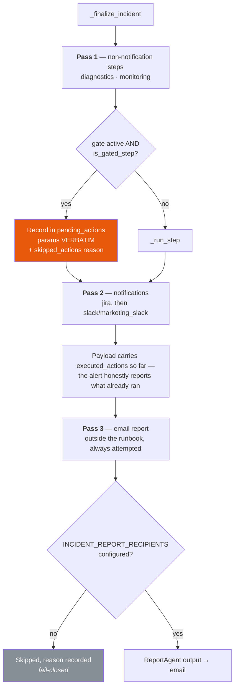
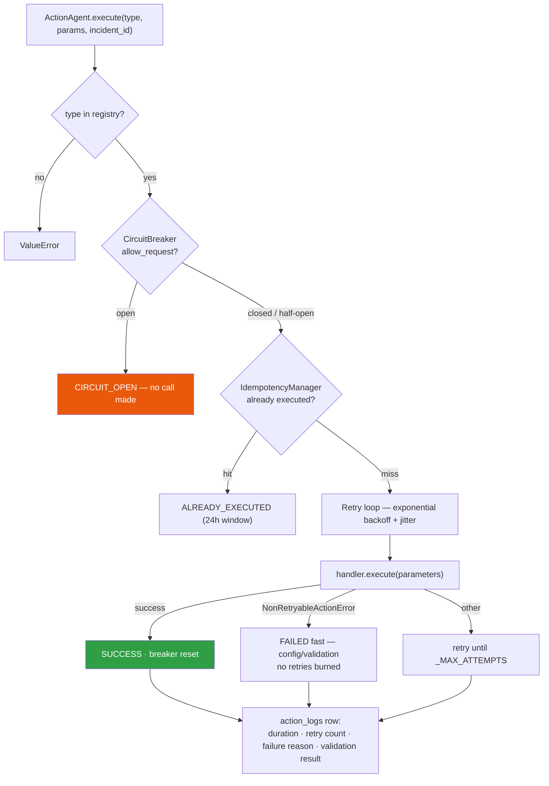
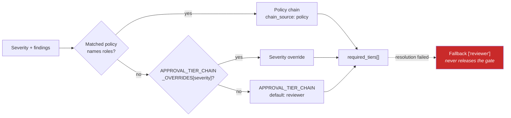
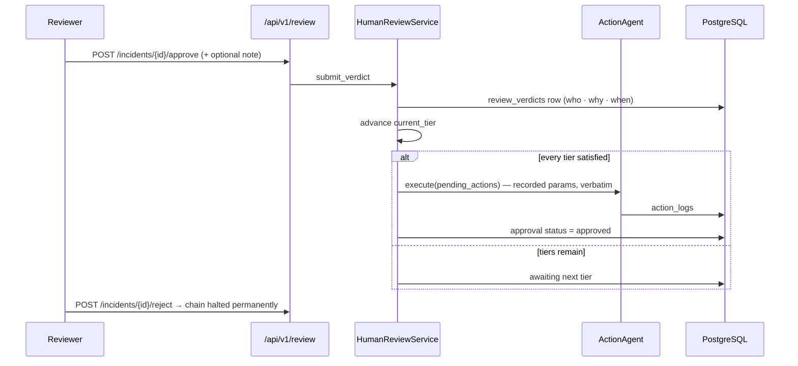

# AEAM — Action Pipeline

> How AEAM decides what to do, what it withholds, and what it actually executes.

---

## 1. The boundary

**AEAM diagnoses and notifies. It does not remediate.** Every executable action is safe and reversible by design — that is the catalog's entry condition, stated in `runbooks.py` and enforced by the fact that no destructive handler exists.

| Action | What it actually does |
|---|---|
| `jira` | Creates a ticket |
| `slack` / `marketing_slack` | Posts a message |
| `email` | Sends the investigation report |
| `diagnostics` | Writes a local diagnostic snapshot record |
| `monitoring` | Sets a local elevated-monitoring flag |
| `webhook` | Calls a configured endpoint *(registered, in no runbook)* |
| `sheets` | Appends to a spreadsheet *(registered, in no runbook)* |

`"Investigation Status: RESOLVED"` means the investigation concluded — not that the underlying problem was fixed. Recommendations like *"Optimize indexes"* are advisory text for a human; they are never executed.

---

## 2. Runbook catalog

`aeam/agents/orchestrator/runbooks.py` is a pure lookup table — no execution logic.

| `event_type` | `action_plan` |
|---|---|
| `DB_LATENCY`, `CPU_HIGH`, `MEMORY_HIGH`, `DISK_IO`, `NETWORK_ERROR`, `CACHE_MISS`, `QUEUE_BACKLOG`, `AUTH_FAILURE` | `jira, slack, diagnostics, monitoring` |
| `SALES_DROP`, `SALES_SPIKE` | `marketing_slack, jira, diagnostics` |
| `DEPLOYMENT_FAILURE` | `jira, slack, diagnostics` |
| **anything else — including `KPI_ANOMALY`** | `jira, slack, diagnostics` *(default)* |

Each runbook also carries `recommended_actions` — human-readable guidance that is **never executed automatically**.

**Aliases:** `marketing_slack → ("slack", {"channel": "#marketing-alerts"})`. One handler, distinct audit labelling.

---

## 3. Gating classification

```
NEVER_GATED_STEPS = {jira, slack, marketing_slack, email}
```

Everything else is gated. `is_gated_step()` defaults **unknown** steps to gated — a step nobody has classified is held for a human rather than executed on the assumption it is harmless.

**Why notifications are never gated:** withholding the Slack alert would suppress the very message that tells a reviewer an approval is waiting. Gating the notification would make the gate self-defeating.

---

## 4. Execution order at finalization



Non-notification steps run **first** so that the Slack and Jira messages can honestly state what already executed.

---

## 5. Per-action execution



| Mechanism | Detail |
|---|---|
| **Circuit breaker** | Per action type. 3 failures → open 60 s → half-open probe. |
| **Idempotency** | Redis key from `(incident_id, action_type, params)`, 24 h TTL. |
| **Retries** | Exponential backoff with jitter, `_MAX_ATTEMPTS` cap. Configuration and validation errors fail fast — retrying an invalid payload only wastes time. |
| **Audit** | Every attempt writes `action_logs` with `execution_duration_ms`, `retry_count`, `failure_reason`, `validation_result`. |
| **Never raises** | Handler failures return `{"status": "FAILED", …}`. The Orchestrator decides what to do. |

**Only actions that actually return `SUCCESS` are recorded as executed.** Every withheld, skipped or failed action is recorded with its reason. The Orchestrator never claims an action ran unless ActionAgent confirmed it.

---

## 6. Human approval

### When the gate arms

All three must hold:

1. A `HumanReviewService` is wired.
2. `HUMAN_APPROVAL_ENFORCED` is true (default).
3. The execution plan set `human_approval_required=True`.

The Orchestrator **never re-derives** that third judgement — it reads C7's already-computed flag from the findings entry.

### Chain resolution



### Release



**Parameters are stored verbatim** in `incident_approvals.pending_actions`, so an approval later runs exactly the withheld call — never a re-derived or re-planned one.

**A failure to record the approval is loud.** The gate has already withheld the actions, so an unrecorded approval means those actions are unreleasable until an operator intervenes — logged as such.

---

## 7. Execution planning — what produces the recommendations

`ExecutionPlanningEngine` (wrapped by `PlanningAgent`) synthesises every accumulated finding into one plan. It performs no retrieval, no detection, and calls no other engine.

**Evidence priority order:**

```
policy  >  memory  >  cross_dataset  >  adaptive  >  retrieval  >  runbook
```

Higher-priority evidence produces higher-confidence, more specific recommendations. When only lower-priority evidence exists, the plan says so explicitly — `lower_priority_justification` names what was unavailable and what was used instead.

**Approval is forced when** `evidence_quality` falls in `HUMAN_APPROVAL_QUALITY_LEVELS` (default `insufficient,low`), or when evidence conflicts are detected. Conflicts also cap confidence at `EXECUTION_PLAN_CONFLICT_CONFIDENCE_CAP`.

---

## 8. Configuration

| Setting | Default | Effect |
|---|---|---|
| `SLACK_BOT_TOKEN` | `""` | **No ActionAgent exists without it.** Every step records as skipped. |
| `JIRA_URL` / `JIRA_API_TOKEN` | `""` | Registers the Jira handler with its own circuit breaker |
| `INCIDENT_REPORT_RECIPIENTS` | `""` | **Fail-closed** — empty means no email is sent |
| `HUMAN_APPROVAL_ENFORCED` | `true` | Withholds gated steps. **Not** editable via the admin API |
| `APPROVAL_TIER_CHAIN` | `reviewer` | Ordered default chain |
| `APPROVAL_TIER_CHAIN_OVERRIDES` | `None` | `SEVERITY:tier1,tier2;…` |
| `HUMAN_APPROVAL_QUALITY_LEVELS` | `insufficient,low` | Evidence grades that force approval |

The approval settings are **deliberately absent** from the admin configuration registry. An approval gate that a single API call can switch off is not a governance control; changing it is a deployment-time act, auditable in the deployment record.

---

## 9. What an operator sees

For a gated incident, `audit_summary` records:

```json
"executed_actions": ["jira", "slack"],
"skipped_actions": [
  {"action": "diagnostics", "reason": "Withheld pending human approval (reviewer)."},
  {"action": "monitoring",  "reason": "Withheld pending human approval (reviewer)."},
  {"action": "email",       "reason": "No incident report recipients are configured…"}
]
```

Three different reasons, three different meanings — withheld by policy, withheld by policy, and not attempted due to configuration. The console renders each verbatim, so nothing is silently absent.
