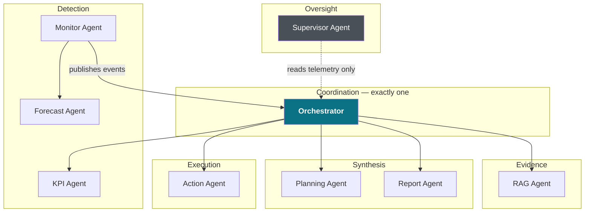

# AEAM — Agent Reference

> Eight roster agents and seven supporting engines. For each: purpose, inputs, outputs, dependencies, when it runs, who invokes it, and what happens when it fails.

---

## The mesh

**Roster membership is honest.** `container.agent_roster` lists only agents this process actually constructed — `monitor` and `action` are conditional on configuration, so the count varies by environment rather than being hardcoded.

---

## Orchestrator

`aeam/agents/orchestrator/orchestrator.py`

| | |
|---|---|
| **Purpose** | Drives the incident lifecycle `EVENT_RECEIVED → INVESTIGATING → DECIDING → COMPLETE`. The single coordinator. |
| **Inputs** | An `Event` from the EventBus; injected engines and agents. |
| **Outputs** | An `incidents` row, an approval record, a memory vector, action executions, metrics, spans. |
| **When** | Synchronously, on every published event. |
| **Invoked by** | `EventBus` `"ALL"` handler — the only registration in the process. |
| **On failure** | The exception propagates to `EventBus._invoke`, is captured, and re-raised as `HandlerError`. **The incident row is not written** — the investigation is lost. Every internal stage is individually wrapped, so a stage failure degrades only that stage. |

**Concurrency:** fully reentrant. All per-incident state lives on a stack-local `IncidentContext`. N threads may drive `handle_event` concurrently without cross-contamination.

**Constraints it holds:** no detection logic, no direct database writes (delegated to `LongTermMemory`), no external API calls (delegated to `ActionAgent`).

---

## Monitor Agent

`aeam/agents/monitor/monitor_agent.py`

| | |
|---|---|
| **Purpose** | The only autonomous detection loop. |
| **Inputs** | `CompositeKPISource.fetch_rows(selector)`; `CompositeRuleEngine.loaded_domains`. |
| **Outputs** | `metrics` rows; `KPI_ANOMALY` events published to the bus. |
| **Dependencies** | EventBus, deduplicator, rule engine, statistical detector, optional changepoint/seasonal detectors, ForecastAgent, pipeline, KPI source, LongTermMemory. |
| **When** | Every `MONITOR_INTERVAL_SECONDS` (300) in its own daemon thread — **only if `ENABLE_MONITOR_AGENT=true`. Default false.** |
| **Invoked by** | Its own thread; also directly by `run_simulation.py` and tests. |
| **On failure** | Heartbeat is recorded *before* the cycle body, so liveness survives a bad cycle. Cycle exceptions caught and logged; per-metric failures caught per metric; a forecast failure just drops the FORECAST signal. The loop never dies from a cycle error. |

**Severity derivation:** `≥2 signals → HIGH`, `1 → MEDIUM`, `0 → LOW`. Because RAG is routed only to `HIGH`/`CRITICAL`, a single-signal detection receives no document evidence.

---

## KPI Agent

`aeam/agents/kpi/kpi_agent.py`

| | |
|---|---|
| **Purpose** | Grounded statistical characterisation of *what* changed. Replaced the deleted `_run_kpi_investigation_placeholder`. |
| **Inputs** | Metric, current/expected value, event metadata, depth; history from `LongTermMemory` (limit 90). |
| **Outputs** | A findings entry, an evidence entry, a hypothesis at depth 1, and possibly `root_cause` + `confidence`. |
| **Dependencies** | `LongTermMemory` only. No LLM, no detector re-invocation, no rule engine. |
| **When** | Every investigation depth. |
| **On failure** | **Declared never-raise.** Returns a structured result with `analysis_failed` set. Disabled via flag records an explicit `not_consulted` entry. |

**It never invents a cause.** Its `root_cause` is always a literal statement of measured fact attributed to the detectors that produced it — "sales is 50.00% below its expected value (95.97 robust sigmas from its historical median)". Asserting *why* from a z-score would be fabricated traceability.

---

## Forecast Agent

`aeam/agents/forecast/forecast_agent.py`

| | |
|---|---|
| **Purpose** | Prophet time-series forecast and deviation detection. |
| **Inputs** | Metric name, actual value; history via `LongTermMemory`; models on disk. |
| **Outputs** | `{is_deviation, ...}` for MonitorAgent; `forecast_backtests` rows when backtesting is on. |
| **When** | Inside `MonitorAgent.process_kpi`, once per metric per cycle. **Never during an investigation** — `AdaptiveDetectionEngine` and `KPIAgent` read the already-computed `event.metadata["forecast"]`. |
| **On failure** | Caught inside `process_kpi`; the FORECAST signal is simply absent. With backtesting and a MAPE ceiling configured, a model failing its holdout is **refused** and the refusal recorded rather than served. |

**Consequence:** with `ENABLE_MONITOR_AGENT=false`, this agent never runs. That is why the console honestly reports it as unobserved.

---

## RAG Agent

`aeam/agents/rag/rag_agent.py`

| | |
|---|---|
| **Purpose** | Retrieve document evidence and produce chunk-cited causal hypotheses. |
| **Inputs** | `Event`, short-term memory (read-only). |
| **Outputs** | `{findings, confidence, memory_updates}`. The Orchestrator does all STM writing. |
| **Dependencies** | The six-stage retrieval stack, `RAGResponseValidator`, `IncidentEntityExtractor`, `LLMService`. |
| **When** | Once per depth, **only when the decision's agents include `"RAG"`** — i.e. `CRITICAL` or `HIGH`. Becomes a no-op once all query variants return zero chunks. |
| **On failure** | **Never raises.** Every failure mode returns a full-shaped dict with `error` set, and the Orchestrator records it as a `rag` finding regardless — so a failed pass is visible rather than silently absent. |

---

## Planning Agent

`aeam/agents/planning/planning_agent.py`

| | |
|---|---|
| **Purpose** | Promotion-by-composition of the C7 `ExecutionPlanningEngine`. Adds roster standing, heartbeat, metric label and span. |
| **Inputs** | Event fields, all accumulated findings, root cause, confidence, runbook recommendations. |
| **Outputs** | One execution plan: executive summary, ordered recommendations, supporting evidence, conflicts, risk, expected impact, confidence, evidence quality, `human_approval_required`. |
| **When** | Once per finalization. |
| **On failure** | Nothing caught here; the Orchestrator's wrapper produces a structured failure plan with `human_approval_required=True` — failing closed. |

`plan()` forwards kwargs unchanged and returns the engine's own object. There is no second code path that could drift.

---

## Report Agent

`aeam/agents/report/report_agent.py`

| | |
|---|---|
| **Purpose** | Human-readable investigation summary. |
| **Inputs** | Short-term memory. **Outputs** the detailed report used as the email body. |
| **When** | Once per finalization, before the email step. |
| **On failure** | Caught; body becomes `"Report generation failed: …"`. |

---

## Action Agent

`aeam/agents/action/action_agent.py`

| | |
|---|---|
| **Purpose** | The **sole** component permitted to call external APIs. |
| **Inputs** | `action_type`, parameters, `incident_id`. |
| **Outputs** | `{status, action_id, result}`; an `action_logs` row; a Redis idempotency record. |
| **Dependencies** | SecretManager, Redis, database, IdempotencyManager; handlers for slack, email, webhook, sheets, diagnostics, monitoring, and jira when configured. |
| **When** | Only from `Orchestrator._finalize_incident` and `HumanReviewService._execute_pending`. |
| **On failure** | Per-type circuit breaker (3 failures → open 60 s). Exponential backoff with jitter, except non-retryable configuration/validation errors which fail fast. Never raises on handler failure. |

**Its existence is conditional on `SLACK_BOT_TOKEN`.** Without one there is no ActionAgent at all, and every step records as skipped with `"ActionAgent not available."`

---

## Supervisor Agent

`aeam/agents/supervisor/supervisor_agent.py`

| | |
|---|---|
| **Purpose** | Read-only whole-mesh observation. |
| **Inputs** | Two callables — a roster reader and a bounded observability summariser — plus the heartbeat tracker and Prometheus collector objects. |
| **Outputs** | A report: per-agent observed state, anomalies, mesh-health score with its formula. |
| **When** | On read of `GET /api/v1/mesh/{health,roster,issues}`. No loop. |
| **On failure** | Observability failure → `None`, and the report names what it could not compute. Not wired → the API returns `supervisor_enabled: false` with the *same key set* as a live report. |

**Advisory only, enforced structurally.** It imports no `Orchestrator`, `ActionAgent`, `PlanningAgent`, `EventBus`, `RuleEngine` or LLM client, and has no `handle_event`/`execute`/`dispatch`/`coordinate`/`restart`/`plan` method. The absence *is* the enforcement.

**Metric-label resolution:** the roster names agents (`action`, `kpi`) while the metrics histogram is labelled by stage (`action:jira`, `kpi_analysis`). The Supervisor resolves these via an explicit alias/prefix map and **discloses the resolved label** in its response, so every figure stays traceable to the series it came from.

---

## Supporting engines

These are not roster agents — they are engines the Orchestrator calls directly.

| Engine | Purpose | Fails how |
|---|---|---|
| **DecisionEngine** | Severity → decision + agent routing; optional LLM augmentation | LLM exceptions propagate; callers wrap |
| **EvaluationEngine** | STOP / CONTINUE / ESCALATE from a 4-criterion score | Pure function, deterministic |
| **EnterpriseMemoryEngine** | Remember and recall incidents in a dedicated Qdrant collection | Write failure logged, never blocks finalization |
| **PolicyRegistry** | Match incidents against extracted policies (metric + semantic tiers) | Exception → empty matches |
| **CrossDatasetAnalyzer** | Correlate the incident metric against other activated datasets | Exception → structured `insufficient_data` |
| **GraphCorrelationEngine** | Bounded traversal of the persisted business graph | Exception → `available: false` with reason |
| **AdaptiveDetectionEngine** | Longer-horizon baseline and seasonality | Exception → structured insufficiency |
| **ExecutionPlanningEngine** | Synthesise findings into one ordered plan | Wrapped by the Orchestrator |
| **ExplainabilityEngine** | Decision graph, contradictions, assumptions | Exception → empty structured object |
| **AIEvaluationEngine** | Ten-component quality score | Exception → structured failure |
| **ObservabilityEngine** | Cross-incident rates and trends | Read failure surfaces as unavailable |
| **LearningAgent** | Isotonic confidence calibration | Construction failure → raw confidence with stated reason |
| **PolicyAgent** | Adopted compiled-rule overrides | Read failure → empty overrides (fresh-deployment posture) |

---

## Failure philosophy

Three distinct contracts, applied deliberately:

| Contract | Components | Rationale |
|---|---|---|
| **Never raises** | KPIAgent, RAGAgent, connectors, blob/scroll readers | An investigation must not die because one evidence source failed |
| **Fails closed** | JWT resolution, OIDC config, email recipients, execution planning | A security or egress decision must refuse rather than guess |
| **Fails loud** | Composition-root wiring errors (`NameError`, `AttributeError`, `ImportError`, `TypeError`) | A programming error in wiring must crash startup, not silently disable a feature |

That third contract exists because it was once violated: a missing import in the composition root was swallowed by a broad `except Exception` and silently disabled every metrics connector while health reported them enabled. The handler is now narrowed.
