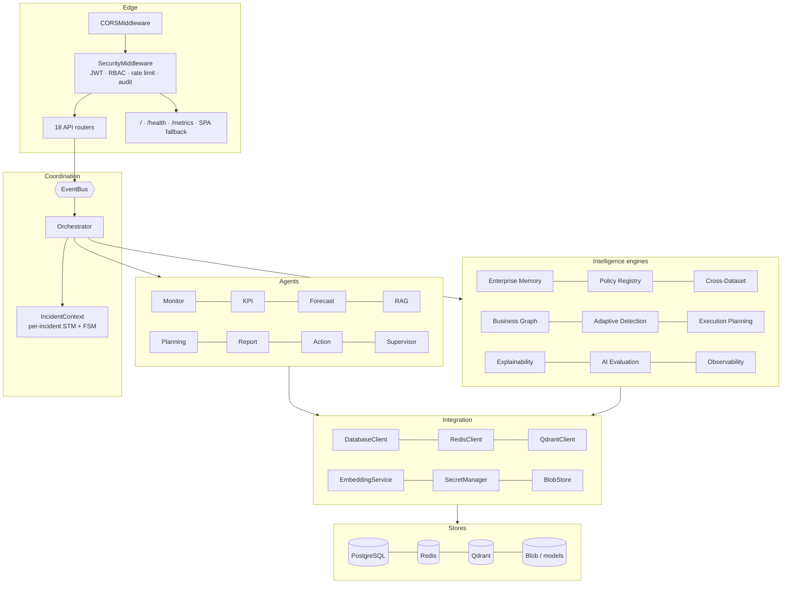
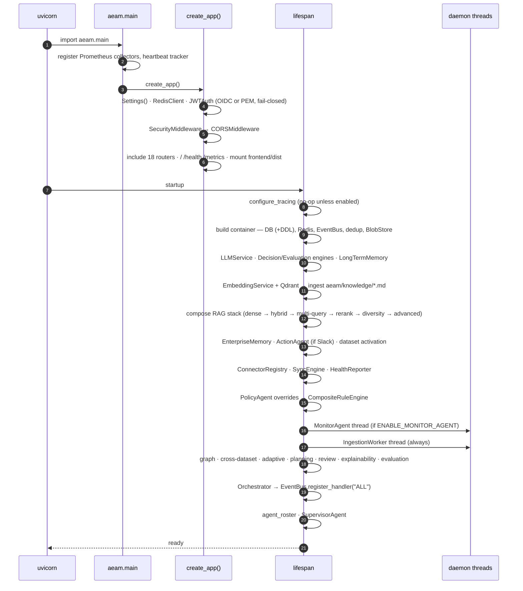
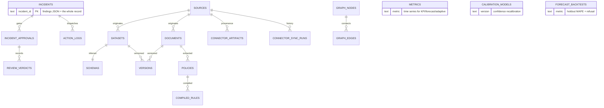
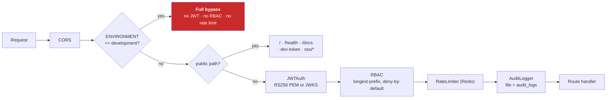

# AEAM — Architecture

> Describes the system **as implemented**. For a line-level trace of the running process, see [RUNTIME_ARCHITECTURE.md](RUNTIME_ARCHITECTURE.md).

---

## 1. Architectural style

AEAM is a **modular monolith**. One FastAPI process holds every agent, engine and worker as an ordinary Python object, wired once at startup in a single composition root ([`aeam/main.py`](aeam/main.py)).

**Why not microservices.** The investigation loop is synchronous and evidence-dense: a single incident touches memory recall, policy matching, cross-dataset correlation, graph traversal, adaptive baselining, retrieval, and planning — each reading state the others produced. Distributing that across services would replace direct function calls with network hops and turn a stack-local `IncidentContext` into a distributed transaction, for no gain in throughput at the volumes this system targets. The modularity that matters — clear seams, injected dependencies, no cross-agent reach-through — is enforced by composition instead.

**The consequence, stated plainly:** AEAM scales vertically. Horizontal scale-out is not implemented and is listed as future work.

---

## 2. Constitutional invariants

Four rules constrain the entire codebase. They are not aspirational; each is enforced structurally.

| Invariant | Enforcement |
|---|---|
| **One coordinator** | Only the Orchestrator coordinates. The Supervisor Agent — the one component that could plausibly become a second — imports no `Orchestrator`, `ActionAgent`, `PlanningAgent`, `EventBus`, `RuleEngine` or LLM client, and has no `handle_event`/`execute`/`dispatch`/`plan` method. Its inability to coordinate is the enforcement. |
| **Honesty over capability** | Absence, insufficiency and measured zero are three distinct states in every API response. `/health` probes rather than assumes. Metrics disclose their formula. Unmeasured durations report `not recorded`, never `0.0`. |
| **Deterministic before probabilistic** | Rules and statistics decide *whether* something is wrong. The LLM never triggers an investigation, never overrides a rule, and never outranks a chunk-cited cause. |
| **Advisory evidence** | Memory, policy, cross-dataset, graph and adaptive findings are appended as evidence and are never fed back into `RuleEngine`, `DecisionEngine` or `ActionAgent`. They inform; they do not decide. |

---

## 3. Layer map

---

## 4. Startup sequence

Everything is constructed at **import time** (`app = create_app()` at module bottom), then the lifespan wires ~40 ordered steps. Order is the dependency graph.

**What is actually running afterwards:** the ASGI loop, the IngestionWorker thread (always), and the MonitorAgent thread (only when flag-enabled). **There is no scheduler** — the APScheduler stub was removed in Phase E1 and never replaced. Connector syncs, graph builds and recalibrations are explicit operator acts.

---

## 5. Concurrency model

| Concern | Design |
|---|---|
| **Per-incident state** | Lives on a stack-local `IncidentContext` (own `ShortTermMemory`, own `IncidentStateMachine`). `handle_event` is fully reentrant. |
| **Shared collaborators** | Engines and agents are shared deliberately — read-only or individually thread-safe. |
| **BM25 index** | Rebuilt in place by the ingestion thread while request threads search it. Guarded by snapshot-and-swap under a lock: readers take one consistent view, scoring happens outside the lock. |
| **SQLite** | `busy_timeout` + WAL, because AEAM's own threads contend. PostgreSQL is unchanged. |
| **Action idempotency** | Redis key from `(incident_id, action_type, params)`, 24 h TTL. |
| **Event dedup** | Redis window, applied inside `process_kpi` before publish. |

---

## 6. Data architecture

**`incidents.findings` is the product.** Every stage — decision, memory, policy, cross-dataset, graph, adaptive, RAG, KPI, evaluation, execution plan, explainability, AI evaluation, human approval, audit summary — appends one entry to that JSON array. The console parses it client-side; Replay reconstructs from it; observability aggregates it. `audit_summary` is the contract other readers rely on.

**Two DDL sources, kept in lock-step:** `migrations/` (12 Alembic revisions — the production truth) and `DatabaseClient._create_tables_if_not_exist` (dev convenience). A test asserts they agree.

### Non-relational stores

| Store | Contents |
|---|---|
| Qdrant `aeam_documents` | Document chunks, 384-d |
| Qdrant `aeam_incident_memories` | Incident memory summaries, same model and client |
| Redis | Dedup windows · action idempotency · rate limits · `aeam:activated_datasets` |
| BlobStore | Content-addressed original bytes (local disk or S3) |
| Filesystem | Prophet artifacts · audit file sink |

---

## 7. Configuration architecture

149 settings in one Pydantic model with `extra="forbid"` — a typo'd variable aborts startup rather than being silently ignored.

**Two-tier override design.** The 21 Phase-D4 tunables are `X | None = None`. `None` means *unconfigured*, and the owning engine's own module constant is used. The literal lives exactly once, in the engine. `config_registry.py` imports each real default and exposes it to the admin API — so the Settings page shows the true default without ever duplicating it.

**Deliberately not admin-editable:** `HUMAN_APPROVAL_ENFORCED` and the approval-chain settings. An approval gate a single API call can switch off is not a governance control; changing it is a deployment act, auditable in the deployment record.

---

## 8. Security architecture

**Fail-closed contracts:**

- Non-development startup **aborts** without real JWT key material.
- `OIDC_ENABLED` without issuer/client-id/JWKS **aborts in every environment**, including development — a half-configured federation must never silently degrade.
- Unset `INCIDENT_REPORT_RECIPIENTS` **skips** the email rather than defaulting to an address.
- Composition-root programming errors (`NameError`, `AttributeError`, `ImportError`, `TypeError`) are **re-raised**, not absorbed into a log line.

**The development bypass is deliberate and total.** Every RBAC claim in this document is unenforced when `ENVIRONMENT=development`.

---

## 9. Observability architecture

| Signal | Implementation |
|---|---|
| **Metrics** | Prometheus collectors: incident counts, investigation duration, per-agent execution time, action success/failure, LLM calls/tokens/cost, retrieval volume, connector health, calibration quality. |
| **Tracing** | OpenTelemetry, off by default. One root span per investigation; every stage nests inside it. |
| **Cost** | Thread-local `IncidentCostScope` attributes LLM tokens, retrieval chunks and action outcomes to the incident that caused them. Persisted into `audit_summary.cost`. |
| **Heartbeats** | Thread workers prove liveness *before* their cycle body, so a failing cycle does not un-prove the thread is alive. |
| **Health** | `/health` really probes the database, Redis, queue, both workers, the BM25 index, Qdrant and the LLM posture. |

**Design rule:** a signal that degrades *quality* (BM25 staleness, Qdrant reachability, LLM posture) is disclosed but never flips overall status. A signal that indicates *unavailability* (database, Redis, dead worker thread) does.

---

## 10. Design trade-offs

| Decision | Chosen | Rejected | Why |
|---|---|---|---|
| Deployment | Modular monolith | Microservices | Evidence-dense synchronous loop; distribution buys nothing at target volume |
| Event bus | Synchronous, in-process | Kafka/RabbitMQ | `POST /trigger` returning after the investigation completes is honest; a queue would hide latency behind an ack |
| Detection | Deterministic first | LLM-driven | An LLM that can trigger investigations can hallucinate incidents |
| Retrieval | Hybrid + rerank | Dense-only | Dense misses exact identifiers (metric names, error codes); BM25 misses paraphrase. RRF needs no score calibration |
| Memory | Second Qdrant collection | Second store, or reuse of the document collection | Same model, same client, different namespace — composition rather than duplication |
| Root cause precedence | RAG > LLM > KPI | Latest writer wins | The most-validated source must win, not the last one to run |
| Approval gating | Consequential only | Everything | Gating notifications would suppress the message that tells a reviewer approval is waiting |
| Config defaults | Engine-owned, `None` = unconfigured | Duplicated in Settings | One literal, one place; the admin API imports it rather than restating it |
| Rule adoption | Restart-applied | Live reload | Reuses D4's documented posture instead of adding a second dynamic-config mechanism in the detection path |

---

## 11. Where to read next

| Question | Document |
|---|---|
| How does one investigation actually run? | [SYSTEM_FLOW.md](SYSTEM_FLOW.md) |
| What does each agent do and what happens if it fails? | [AGENT_REFERENCE.md](AGENT_REFERENCE.md) |
| How is evidence retrieved and validated? | [RAG_PIPELINE.md](RAG_PIPELINE.md) |
| How are actions executed and gated? | [ACTION_PIPELINE.md](ACTION_PIPELINE.md) |
| How does enterprise data get in? | [CONNECTORS.md](CONNECTORS.md) |
| Line-level implementation trace | [RUNTIME_ARCHITECTURE.md](RUNTIME_ARCHITECTURE.md) |
| Known defects and their triage | [TECHNICAL_REVIEW_BOARD.md](TECHNICAL_REVIEW_BOARD.md) |
