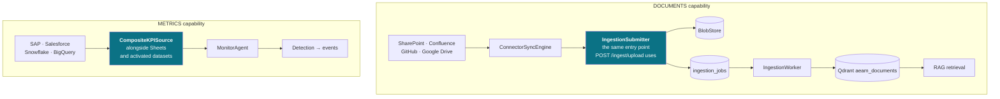
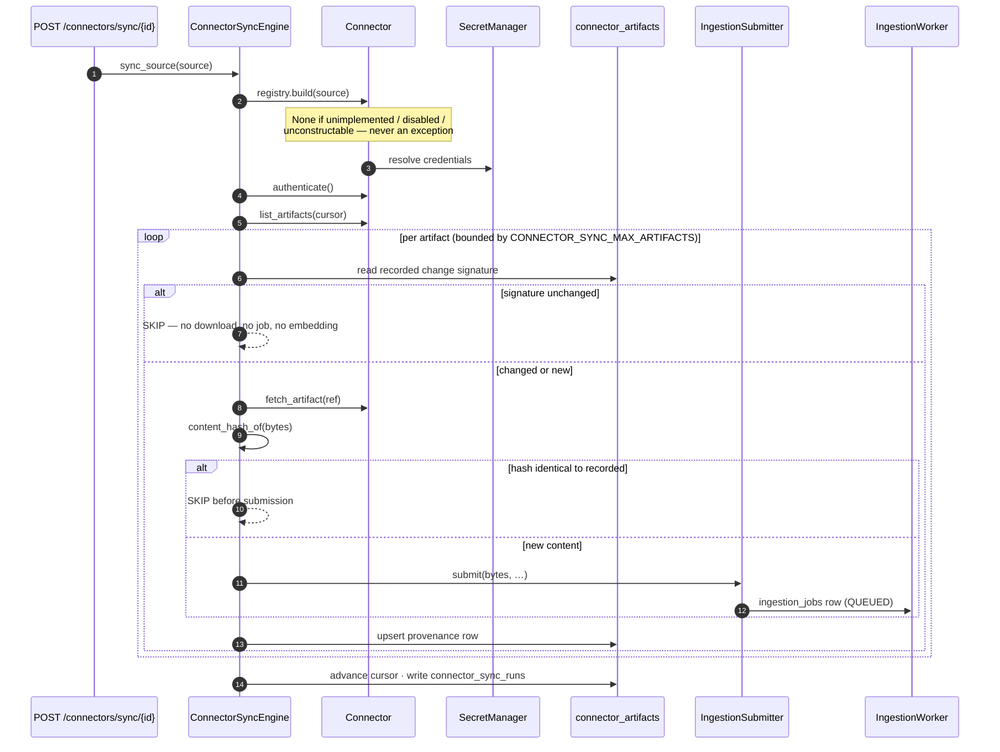

# AEAM — Enterprise Connector Framework

> Eight connectors, one contract, no per-connector branching in the sync engine. Adding a ninth is one registry entry plus one module.

---

## 1. The catalog

| Kind | Class | Capability | Required config | Flag |
|---|---|---|---|---|
| `sharepoint` | `SharePointConnector` | DOCUMENTS | `site_url`, `drive_id` | `CONNECTOR_SHAREPOINT_ENABLED` |
| `confluence` | `ConfluenceConnector` | DOCUMENTS | `base_url`, `space_key` | `CONNECTOR_CONFLUENCE_ENABLED` |
| `github` | `GitHubConnector` | DOCUMENTS | `repository`, `path` | `CONNECTOR_GITHUB_ENABLED` |
| `google_workspace` | `GoogleWorkspaceConnector` | DOCUMENTS | `folder_id` | `CONNECTOR_GOOGLE_WORKSPACE_ENABLED` |
| `sap` | `SAPConnector` | METRICS | `host`, `client`, `query` | `CONNECTOR_SAP_ENABLED` |
| `salesforce` | `SalesforceConnector` | METRICS | `instance_url`, `soql` | `CONNECTOR_SALESFORCE_ENABLED` |
| `snowflake` | `SnowflakeConnector` | METRICS | `account`, `warehouse`, `database`, `query` | `CONNECTOR_SNOWFLAKE_ENABLED` |
| `bigquery` | `BigQueryConnector` | METRICS | `project_id`, `dataset`, `query` | `CONNECTOR_BIGQUERY_ENABLED` |

**All eight default off.** `CONNECTORS_ENABLED` is a master switch: off, every connector is off regardless of its own flag. That single setting restores the pre-framework posture — manual upload plus Google Sheets.

---

## 2. Two capabilities, two destinations



**Neither capability introduces a second path.** A document connector reuses the upload pipeline end to end. A metric connector joins the same `CompositeKPISource` the Sheets connector and activated datasets already feed — `MonitorAgent` receives one object satisfying the existing `KPIRowSource` protocol and never learns a connector exists.

---

## 3. A document sync, step by step



After ingestion, **a SharePoint page is indistinguishable from an uploaded PDF** — same validator, same content-addressed blob, same `documents` row, same job type, same worker, same chunker, same embeddings, same collection. The only difference is its `connector_artifacts` provenance row.

---

## 4. Three independent idempotency layers

Re-running a sync with no upstream change performs no download, creates no document, no embedding, no metadata row and no ingestion job. Any **one** of these would be sufficient:

| Layer | Mechanism | Short-circuits before |
|---|---|---|
| **Change signature** | Upstream hash/version/timestamp matches the recorded one | `fetch_artifact` is even called |
| **Content hash** | Bytes hash identical to the recorded hash | Submission |
| **Existing dedup** | Identical bytes reuse the blob, the in-flight job and the `Document`; the processor no-ops on an already-`indexed` document | Re-embedding |

---

## 5. Failure isolation

| Scope | Guarantee |
|---|---|
| `sync_all` | Isolates **per connector**. One connector that raises, hangs on bad config, or returns garbage produces a FAILED run record and nothing else — the next connector still syncs. |
| `sync_source` | Isolates **per artifact**. One poisoned document does not abandon the other ninety-nine; each failure is recorded in `artifact_errors` with its own reason. |
| Startup | Connector composition never blocks startup. A connector that fails to authenticate is still added as a KPI member: its `fetch_rows` returns an empty list and never raises. |
| Errors | Every message passes through `sanitize_error` — credentials never reach a log line, a run record, or the API. |

**Deliberate design choice:** a connector that failed to authenticate is *still* composed into the KPI source. Excluding it would make a broken connector indistinguishable from an absent one; including it makes the failure visible in connector health while contributing the same harmless no-op the Monitor already handles.

---

## 6. Mock mode

`CONNECTOR_MOCK_MODE=true` substitutes a deterministic in-repo client for every connector, chosen by declared **capability** rather than class — so a ninth connector gets a working mock with no change to the registry.

This exists so an operator can stand the framework up and watch a full sync run end to end — real listing, real change detection, real ingestion, real retrieval — **before any credential exists**.

It is honest about itself: health reports `mock_mode: true` and `client_mode: "injected"`, so a mock sync can never be mistaken for a tenant sync.

```bash
CONNECTORS_ENABLED=true CONNECTOR_MOCK_MODE=true CONNECTOR_SHAREPOINT_ENABLED=true uvicorn aeam.main:app --port 8080
```

---

## 7. Health reporting

`GET /api/v1/connectors/health` returns the **full eight-connector catalog**, including ones nobody has configured, so an operator can see what is available without reading source.

```json
{
  "framework_enabled": false,
  "mock_mode": false,
  "stale_after_seconds": 86400,
  "catalog": [{"kind": "bigquery", "capability": "metrics", "flag": "CONNECTOR_BIGQUERY_ENABLED", "enabled": false}, "…"],
  "connectors": [],
  "summary": {"total": 0, "enabled": 0, "healthy": 0, "unhealthy": 0, "unknown": 0}
}
```

**Staleness is honest.** A connector that has *never* synced reports `stale: null` with a reason — never `false`. Unknown freshness is never reported as fresh.

---

## 8. Registering a connector

1. **Insert a `sources` row** of the connector's kind, with its `config` and a `secret_ref`.
2. **Enable the flags** — `CONNECTORS_ENABLED=true` plus the connector's own flag.
3. **Restart** (the registry composes metric connectors at startup).
4. **Sync** — `POST /api/v1/connectors/sync/{source_id}`.

```bash
curl -X POST http://localhost:8080/api/v1/connectors/sync/<source_id>
```

For a metric connector, its rows then flow into `MonitorAgent` on the next cycle — provided `ENABLE_MONITOR_AGENT=true`.

---

## 9. Scheduling — deliberately absent

**Nothing here runs on a timer.** Sync is triggered explicitly through the API.

Two reasons: it matches the repository's existing posture (the scheduler stub was removed in Phase E1 and autonomous polling is confined to `MonitorAgent`), and — more importantly — it keeps connector work **off the ingestion worker's thread**, which is what makes the failure isolation above real. A connector hanging on a bad endpoint cannot stall document indexing.

---

## 10. Configuration

| Setting | Default | Effect |
|---|---|---|
| `CONNECTORS_ENABLED` | `false` | Master switch — off disables all eight |
| `CONNECTOR_MOCK_MODE` | `false` | Deterministic in-repo clients, disclosed in health |
| `CONNECTOR_<KIND>_ENABLED` ×8 | `false` | Per-connector enable (requires the master switch) |
| `CONNECTOR_SYNC_MAX_ARTIFACTS` | `500` | Bound per run. Hitting it is reported as `truncated`; the next run resumes from the advanced cursor |
| `CONNECTOR_STALE_AFTER_SECONDS` | `86400` | Age past which a last successful sync is reported stale |

`CONNECTOR_SYNC_MAX_ARTIFACTS` is a **bound, not a preference**: an unbounded first sync against a very large library would hold a request open indefinitely and flood the ingestion queue.

---

## 11. Persistence

| Table | Contents |
|---|---|
| `sources` | Origin registry — kind, config, `secret_ref`, status |
| `connector_artifacts` | Per-artifact provenance and change signature |
| `connector_sync_runs` | Per-run outcome: counts, duration, truncation, `artifact_errors` |

Credentials are resolved through `SecretManager` at sync time and are **never** stored in these tables, logged, or returned by any endpoint.
