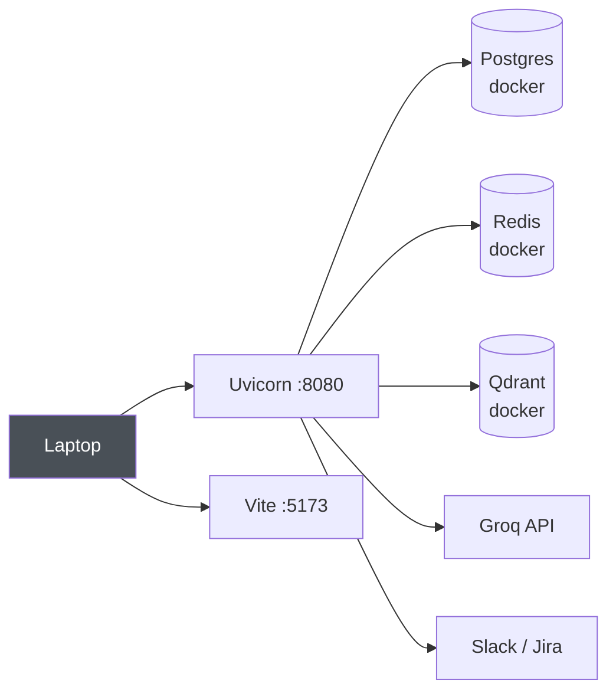
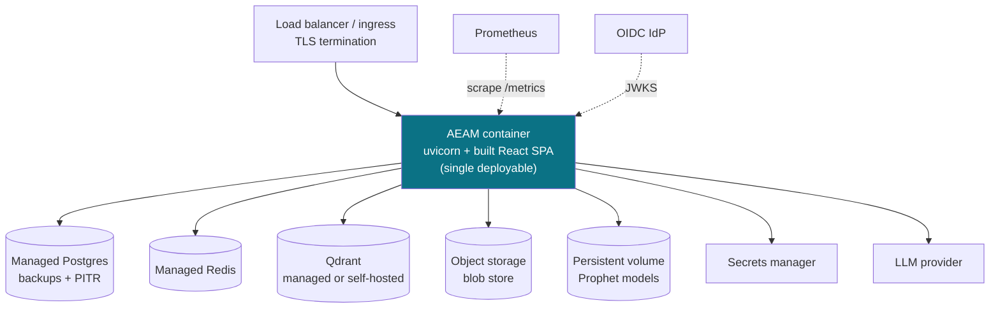

# AEAM — Demonstration Package

**Audience:** hiring managers · senior engineers · AI engineers · enterprise architects · technical interviewers · founders
**Status of the system:** feature-complete, hardened, **running locally**. Not deployed to any cloud. Say this out loud early — it costs you nothing and buys credibility for everything else.

> **Companion:** [INTERVIEW_QA.md](INTERVIEW_QA.md) — the walkthrough answers (5/10/20 min) and 100 interview questions with model answers.

---

# 1 · Project Story

## Why AEAM was built

Every company that runs on metrics has the same 3 a.m. problem. A number moves. Something fires. And then a human spends the next forty minutes doing work that is *entirely mechanical*:

- Pulling up last quarter's incidents to see if this happened before
- Checking whether a policy governs this metric
- Opening three other dashboards to see what else moved
- Deciding whether this is a spike or a real shift
- Searching Confluence for the runbook
- Writing the Jira ticket

None of that is judgement. It is retrieval, correlation, and synthesis — and it is the *slowest* part of incident response, not the detection.

AEAM was built to compress those forty minutes into six seconds, and — this is the part that matters — to show its work so a human can disagree with it.

## Why current systems are insufficient

**Monitoring systems tell you *that* something happened.** Datadog, Grafana, Prometheus, CloudWatch — all excellent at detection. All silent on causation. They hand you a red line and a timestamp, and the investigation starts from zero.

**Dashboards are not enough** because they are pull-based and undirected. A dashboard shows you what *you* thought to look at. An anomaly's cause is usually in the panel you didn't open. Dashboards also have no memory — they cannot tell you "this exact pattern happened in March and it was a payment-gateway timeout."

**Alerts are not enough** because an alert is a notification, not an explanation. Alert fatigue is the well-documented consequence: teams route alerts to a channel nobody reads because 90% of them require investigation the alert itself cannot perform. An alert that says "sales dropped 50%" and an alert that says "sales dropped 50%, this matches three prior incidents caused by checkout failures, here is the runbook section, here is the policy that says who to escalate to" are different products.

**Chatbots are not enough** because they are reactive, stateless and ungrounded. You have to know to ask. They don't watch anything. They have no notion of a policy, an approval chain, or an audit trail. And critically — a chatbot will confidently produce a root cause with no obligation to cite where it came from. In an operational context that is worse than silence, because it is *actionable* and wrong.

**"ChatGPT with a vector database" is not enough** because it inverts the trust model. It lets a probabilistic system decide whether something is wrong. AEAM's most important architectural constraint is the opposite: **deterministic components decide *whether*; the language model only helps explain *why*, and only from documents it must cite.**

## So AEAM exists to do this

Watch metrics continuously → detect anomalies with rules and statistics, not a model → investigate across six independent evidence sources → produce a priority-ordered plan with the reasoning attached → withhold anything consequential until a human approves → and persist the entire causal chain as one replayable, auditable record that makes the *next* investigation better.

---

# 2 · Problem Statement

## The pain

Enterprises have solved detection and have not solved investigation. The gap is human, expensive, and does not scale with data volume.

Three structural problems:

1. **Investigation is manual and repetitive.** The same six questions, every incident, asked by a human who is context-switching from other work.
2. **Institutional knowledge is not queryable.** The engineer who resolved the March incident may have left. Their reasoning lives in a Slack thread nobody can find.
3. **Investigation quality varies with who is on call.** A senior engineer checks correlations and prior incidents. A junior one checks the obvious thing and escalates.

## Financial impact

Downtime cost is well-studied and consistently significant; the specific number depends entirely on the business, so I won't quote one at you. What's more defensible is the *shape* of the cost:

- **MTTR is dominated by MTTI** — mean time to *investigate*, not to repair. Once you know the cause, the fix is often minutes.
- **Investigation labour is senior labour.** The people best at it are the most expensive and the most context-switched.
- **Escalations are compounding.** An investigation that stalls gets escalated, which pulls in a second and third engineer — multiplying cost for the same incident.

The value proposition is therefore not "replace engineers." It is: *arrive at the escalation with the evidence already gathered.*

## Operational impact

- Alert fatigue drives teams to raise thresholds, which delays real detection
- Knowledge decays — the same root cause gets rediscovered every few months
- Post-incident reviews rely on memory and Slack scrollback rather than a record
- Compliance and audit requirements are met retrospectively, by hand

## Why root-cause investigation is slow

Because it is a **join across systems that were never designed to be joined**: a metrics store, a ticketing system, a wiki, a data warehouse, and several people's memories. There is no query language across those. A human is the join engine.

## Why human-only workflows don't scale

Detection scales with compute — you can monitor ten thousand metrics as easily as ten. Investigation scales with *headcount*. That divergence is the whole problem. As you add metrics, you add alerts linearly and investigation capacity not at all.

---

# 3 · Solution — Capabilities

AEAM is a multi-agent investigation platform. Eight agents, one coordinator, six evidence sources.

| Capability | What it does |
|---|---|
| **Continuous monitoring** | A polling loop pulls KPI feeds, applies rule-based and statistical detection plus Prophet forecast deviation, and emits events. *Deterministic — no model involved in deciding whether something is wrong.* |
| **Autonomous investigation** | A single Orchestrator drives the incident through six evidence stages, loops up to five levels of depth, and decides when it has enough to stop. |
| **Enterprise Memory** | Every finalized incident is embedded and recalled as evidence for future investigations. Investigation nine is better informed than investigation one. It remembers failures too — what *didn't* work is useful. |
| **Hybrid RAG** | Dense vector search plus BM25 lexical search, fused by Reciprocal Rank Fusion, then multi-query expansion, cross-encoder reranking, evidence-diversity filtering, and business-relevance ranking. Six stages, each independently switchable. |
| **Grounding enforcement** | Every cause the model cites must trace to a chunk that was actually retrieved. If it can't, the whole response is rejected and recorded as failed — visibly. |
| **Policy intelligence** | Business rules are extracted from ingested documents into a governed policy table and matched against incidents at investigation time. |
| **Cross-dataset correlation** | The incident's metric is correlated against every other activated dataset to find supporting or contradicting movement. |
| **Adaptive detection** | Longer-horizon baselines and day-of-week seasonality, as a corroborating second opinion on the primary detectors. |
| **Business graph** | Bounded traversal of relationships the platform has already observed — which metrics correlate, which policies govern them, which datasets they came from. |
| **Execution planning** | Synthesises all evidence into one priority-ordered plan: policy > memory > cross-dataset > adaptive > retrieval > runbook, with conflict detection. |
| **Explainability** | Per incident: a decision graph, an evidence graph, a recommendation trace, a confidence breakdown by source, detected contradictions, missing evidence, and stated assumptions. |
| **AI self-evaluation** | Each investigation scores its own quality across ten components and publishes the formula. |
| **Action engine** | The only component permitted to call external APIs. Circuit breaker, idempotency, retries, full audit. Slack, Jira, email, diagnostics, monitoring flags. |
| **Human approval** | Consequential actions are withheld behind a configurable multi-tier chain. Notifications are never withheld. |
| **Timeline replay** | Any investigation can be reconstructed stage-by-stage from the persisted trail. Read-only — it cannot re-execute. |
| **Observability** | Prometheus metrics, optional OpenTelemetry tracing, per-incident cost attribution, heartbeat supervision, mesh health with a published formula. |
| **Connector framework** | Eight enterprise connectors — SharePoint, Confluence, GitHub, Google Drive, SAP, Salesforce, Snowflake, BigQuery — all funnelling into the same ingestion path as a manual upload. |
| **Governance** | RBAC, dual-sink audit logging, policy lifecycle management, memory correction and expunge, declared compliance posture. |

---

# 4 · Elevator Pitches

## 30 seconds

> "AEAM is an autonomous investigation platform for business anomalies. When a metric moves, it doesn't just alert — it investigates across six evidence sources: past incidents, company policies, correlated datasets, statistical baselines, and your runbooks. It produces a plan with the reasoning attached, and holds anything consequential for human approval. It's a multi-agent system where detection is deterministic and the language model is only allowed to explain, never to decide."

## 60 seconds

> "Most monitoring tells you *that* something happened. The expensive part is figuring out *why* — and that's still a human doing forty minutes of retrieval and correlation.
>
> AEAM automates that investigation. It's a multi-agent platform: a Monitor Agent watches KPI feeds with rules and statistics, and when something fires, an Orchestrator drives it through six independent evidence stages — enterprise memory of past incidents, policy matching, cross-dataset correlation, adaptive baselines, business-graph relationships, and hybrid RAG over your runbooks. It synthesises a priority-ordered plan, explains why each recommendation exists, scores its own investigation quality, and withholds consequential actions behind a human approval gate.
>
> The architectural constraint I'd highlight: the language model never decides whether something is wrong. Detection is entirely deterministic. And every cause the model cites has to trace back to a retrieved document chunk or the response is rejected. It's about 54,000 lines of Python, 1,700 tests, running locally right now."

## 2 minutes

> "I'll start with the problem. Every company with metrics has solved detection — Datadog, Grafana, Prometheus all work. What nobody has solved is investigation. When a number moves, a human spends forty minutes pulling up prior incidents, checking policies, opening other dashboards, and searching the wiki for a runbook. That work is mechanical, it's the slowest part of incident response, and it scales with headcount rather than compute.
>
> AEAM automates it. It's a multi-agent system built as a modular monolith — one FastAPI process, eight agents, Postgres, Redis and Qdrant.
>
> The flow: a Monitor Agent polls KPI feeds and applies rule-based and statistical detection plus a Prophet forecast. If signals fire, it publishes an event. A single Orchestrator picks it up and runs six evidence stages — it recalls similar past incidents from a vector store, matches enterprise policies extracted from ingested documents, correlates against other datasets, computes an adaptive baseline, traverses a business graph, and runs hybrid retrieval over runbooks. Then it synthesises one priority-ordered plan, explains why each recommendation exists, scores its own quality, and withholds consequential actions behind a human approval chain.
>
> Three design decisions I'd defend. First, detection is deterministic — a model that can trigger an investigation can hallucinate an incident. Second, grounding is enforced: every cited cause must reference a chunk that was actually retrieved, or the response fails validation. Third, honesty over capability — 'not consulted', 'insufficient data', and 'measured zero' are three distinct states in every API response, and the platform reports a 22% retrieval success rate rather than a flattering one.
>
> It's feature-complete and hardened — I ran a formal defect review and fixed everything Critical and High. It's running locally; I haven't deployed it, and the deployment configs for Docker and Cloud Run are written but unexercised."

---

# 5 · Demo Flow — page by page

## Before you start (do this 10 minutes early, off-camera)

```bash
docker start aeam-postgres aeam-redis aeam-qdrant
```
```bash
uvicorn aeam.main:app --reload --port 8080
```
```bash
cd frontend && npm run dev
```
```bash
curl -s localhost:8080/health
```

You want `"status":"healthy"`, `qdrant: ok`, `llm: ok (provider=groq…)`. **Never demo on a cold start** — the first boot downloads two transformer models.

**Strongly recommended seeding (5 min).** Your current corpus has 0 registered documents and 0 datasets, which makes Policy Hit Rate and Cross-Dataset show 0%. Upload one runbook and one policy document via Knowledge Center, and upload + **activate** one CSV in Data Center. This turns three "no signal" panels into real evidence and makes the demo dramatically stronger. It is demo preparation, not a code change.

**Tabs to have open, in order:** Dashboard · Investigation · Retrieval Explorer · Human Review · Agents · Knowledge Center · a terminal.

---

## Page 1 — Dashboard *(90 seconds)*

**Why you open it:** it establishes that this is a live system with real state, not a mockup.

**What to click:** nothing yet. Let it render.

**What the audience should notice:**
- The **Live Architecture** mesh — 14 nodes around a central Orchestrator, each with a real state
- **Monitor Agent reads "disabled"** — point at this deliberately
- **AI Health 40%** with a hoverable formula
- The **StatusBar** at the bottom — every dependency probed

**The line that lands:** *"Monitor says disabled, and that's honest — I have autonomous polling switched off in this environment. A lot of demos would show that node green. This one reads the actual health endpoint."*

---

## Page 2 — Trigger *(60 seconds)*

**Why:** the audience needs to see an investigation begin from nothing.

**What to click:** Trigger → fill in `event_type: DB_LATENCY`, `metric: checkout_db_latency_ms`, `value: 950`, `severity: HIGH`, metadata `{"service": "checkout"}` → Submit.

Or in the terminal, which is more impressive because they can see the latency:

```bash
time curl -X POST http://localhost:8080/api/v1/trigger/ -H 'Content-Type: application/json' -d '{"event_type":"DB_LATENCY","metric":"checkout_db_latency_ms","value":950,"severity":"HIGH","metadata":{"service":"checkout"}}'
```

**What they should notice:** it takes ~6 seconds and the HTTP call blocks the whole time.

**The line:** *"That's deliberate. The call returns when the investigation is actually done. I could return a 202 immediately and queue it, but then the latency is hidden behind an acknowledgement. If it takes six seconds, I want the six seconds visible."*

**Say this too:** *"Severity matters here — I used HIGH. At MEDIUM or LOW the system deliberately skips document retrieval as a cost control. That's a trade-off I'll come back to."*

---

## Page 3 — Investigation Workspace *(4 minutes — this is the centrepiece)*

**Why:** this is where the product actually is. Spend the most time here.

**What to click:** Investigation → newest incident (top of the left list).

### 3a. The header and Intelligence Pipeline

Point at the pipeline strip: Detection · Memory · Policy · Cross-Dataset · Adaptive · Retrieval · Execution Plan · Explainability · Evaluation — each labelled `evidence` or `no signal`.

**Say:** *"Six evidence sources, each isolated in its own error boundary. If cross-dataset throws an exception, the investigation continues and the record says cross-dataset failed. One source failing never costs you the investigation."*

### 3b. Overview tab — the causal chain

Walk down it: Trigger → Detection → Rule Evaluation → Statistical Analysis → Forecast → Investigation → RAG Decision → Retrieved Evidence → Validation → LLM Reasoning → Confidence → Recommended Action → Human Review → Execution Status → Jira → Slack → Email.

**Say:** *"This is the causal chain. Note that some steps say 'idle' — no governed rule triggered, no forecast deviation. Those aren't failures, they're stages that ran and found nothing. The system distinguishes 'didn't run', 'ran and found nothing', and 'ran and failed'."*

### 3c. Evidence tab

Show the five chunks. For each: source document, confidence, business relevance, and the plain-language ranking reasons.

**Say:** *"Every chunk carries why it ranked where it did — 'authoritative source because the document type is runbook', 'recent, within 30 days', 'kept for evidence diversity'. That's not a similarity score, it's an explanation."*

If a chunk shows `similarity n/a`: *"That chunk came in through lexical search, so there's no cosine similarity for it. It would be easy to display 0% — but 0% implies it matched nothing, and the model cited it at 80% confidence. So it says n/a."*

### 3d. Plan & Why tab — **the strongest 45 seconds of the demo**

Scroll to **Confidence Breakdown**. If a contradiction fired:

**Say:** *"Look at this. It found two candidate causes 0.1 apart in confidence, flagged that as ambiguous causation, and then reduced its own confidence from 0.85 down to 0.50 because of it — and recorded the reason. It argued against itself. Most systems would report 0.85 and move on."*

Then **Recommended Actions**: *"Ordered by evidence priority — policy first, then memory, then cross-dataset, then adaptive, then retrieval, and standard runbook guidance last. When only low-priority evidence exists, the plan says so explicitly rather than dressing up generic advice as evidence-derived."*

### 3e. Quality tab

**Say:** *"This is the investigation scoring itself. Ten components, and it lists its own weaknesses: 'Policy Coverage is weak — no enterprise policy matched'. It's telling you where not to trust it."*

---

## Page 4 — Retrieval Explorer *(3 minutes)*

**Why:** this is what separates you from every "RAG app" candidate.

**What to click:** Retrieval Explorer → select the incident → let the trace run.

**Walk the funnel out loud:** Query expansion (4 variants) → Dense (16 chunks) → BM25 (20) → RRF fusion (20) → Reranked (15) → Business ranked (5) → Selected (5).

**Say:** *"Dense embedding search misses exact identifiers — a metric name like `checkout_db_latency_ms`, an error code, a service name. Those are the highest-signal tokens in an operational corpus and cosine similarity smooths them away. BM25 catches them exactly and misses paraphrase. So you need both.
>
> They're fused with Reciprocal Rank Fusion, which uses only rank position, not score. That matters because cosine similarity and BM25 scores are on completely incompatible scales — blending them needs per-corpus calibration that drifts as the corpus grows. RRF needs none."*

Then point at **Where chunks were dropped**: survived 5, dropped at fusion 4, by reranker 5, by diversity filter 10.

**Say:** *"The diversity filter is why you don't see five near-identical chunks from one runbook section. Without it the model sees unanimous evidence that was never unanimous."*

Point at **Prompt Context — not persisted**: *"It tells you it doesn't store the assembled prompt, rather than reconstructing something that might not byte-match what was actually sent."*

---

## Page 5 — Human Review *(2 minutes)*

**Why:** this is the enterprise credibility moment.

**What to click:** Human Review → the newest incident.

**Say:** *"Slack and Jira went out. Diagnostics and monitoring were withheld. And the parameters for those withheld actions are stored verbatim — so approving executes exactly the call that was held, never a re-planned one.
>
> Notice notifications weren't gated. That's deliberate: withholding the Slack alert would suppress the very message telling a reviewer that an approval is waiting. Gating the notification makes the gate self-defeating."*

**Click Approve** on one. Show the verdict appearing in history with attribution and a timestamp.

---

## Page 6 — Replay *(90 seconds)*

**Why:** demonstrates auditability, which enterprise architects care about more than anything else on screen.

**What to click:** Replay → the incident → step through stages 1, 2, 3.

**Say:** *"This is reconstructed from the persisted audit trail — it does not re-execute. The replay module imports no detector, no agent, no LLM client, so it structurally can't. Replaying an incident a thousand times leaves the database bit-identical.
>
> And see 'Historical gaps' — Business Graph wasn't wired when this incident ran, so it's shown as an explicit gap naming the phase that introduced it, rather than being invented or silently omitted."*

Point at the timeline: *"Durations are measured, not estimated. Where measured stage time doesn't add up to the measured total, the remainder is disclosed as unattributed rather than spread across stages to make it look tidy."*

---

## Page 7 — Memory Center *(2 minutes)*

**Why:** shows the system compounds rather than being stateless.

**Say:** *"Every finalized incident is embedded into a second Qdrant collection and recalled as evidence for future investigations. Memory hit rate is 100% across nine investigations.
>
> It remembers failures too — a failed investigation tells you what didn't work, which is genuinely useful. The one exception is placeholder-derived output from an earlier development phase, which is quarantined so synthetic content can't poison future recalls."*

---

## Page 8 — Analytics *(2 minutes)*

**Why:** proves the platform measures itself honestly.

**Say, pointing at the low numbers:** *"Retrieval success 22%. Resolution rate 11%. AI health 40%. Those aren't flattering and they're real — most of these incidents had no matching documents in the corpus. A system reporting 95% on this corpus would be lying to you.
>
> And every rate shows its numerator and denominator — nine of nine consultations, two of nine successes. The overall health score publishes its own formula."*

**Hover the bar chart:** *"Fourteen-day incident trend, real dates, real counts."*

---

## Page 9 — Agents *(2 minutes)*

**Why:** demonstrates the multi-agent claim is real and instrumented.

**Say:** *"Eight agents in the roster. The roster is honest — it lists only agents this process actually constructed, so the count varies by environment rather than being hardcoded.
>
> Forecast Agent shows no activity, and that's correct: it only runs inside monitor cycles, and I have the monitor disabled.
>
> The Supervisor observes the mesh and recommends. It cannot coordinate — it imports no Orchestrator, no ActionAgent, no EventBus, and has no execute method. The single-coordinator rule is enforced by what it can't reach, not by what it declines to do."*

---

## Page 10 — Knowledge Center & Data Center *(2 minutes)*

**Why:** shows the ingestion and connector story.

Upload a markdown runbook. Watch the job go EXTRACTING → INDEXING → DONE.

**Say:** *"Content-addressed storage, so identical bytes reuse the same blob and never re-embed. After indexing it runs an LLM pass extracting business rules into a governed policy table — that's what the Policy Registry matches against later."*

Then Data Center → connectors.

**Say:** *"Eight enterprise connectors. All off by default. The architectural point is that connector content doesn't travel a connector path — it travels the upload path. Same validator, same blob store, same deduplication, same worker, same chunker, same collection. After ingestion a SharePoint page is indistinguishable from an uploaded PDF except for its provenance row.
>
> There's a mock mode that runs a complete, honest sync against in-repo fixtures before any credential exists — and health reports `mock_mode: true` so a mock sync can never be mistaken for a real one."*

---

## Page 11 — Settings & Admin *(60 seconds, optional)*

**Say:** *"Every intelligence-engine threshold is manageable here. The defaults shown are imported from the owning engine's own module — the literal lives in exactly one place, and this page reads it rather than restating it.
>
> Two settings are deliberately *not* on this page: the human-approval enforcement flag and the approval chain. An approval gate that a single API call can switch off isn't a governance control. Changing those is a deployment act, auditable in the deployment record."*

**Admin page:** *"This is honest about what isn't built. RBAC exists but is bypassed in development. User management isn't built, and it says so rather than showing placeholder data."*

---

## Closing move *(30 seconds)*

Return to the Dashboard.

**Say:** *"Everything you saw came from one FastAPI process, three data stores, and about 54,000 lines of Python with 1,700 tests. It's running on this laptop — I haven't deployed it. The Docker and Cloud Run configs are written and the compose file validates, but I'd be overstating things if I called it cloud-hosted."*

---

# 6 · Demo Script — word for word

> Pace: ~140 words/minute. This is roughly 12 minutes spoken. Pause where marked.

---

**[Dashboard open. Don't touch anything yet.]**

"This is AEAM — an autonomous investigation platform for business anomalies.

The problem it solves is narrow and specific. Every company with metrics has already solved detection. Datadog, Grafana, Prometheus — they all work. What nobody has solved is what happens in the forty minutes *after* the alert fires, when a human pulls up prior incidents, checks whether a policy applies, opens three other dashboards, and searches the wiki for a runbook.

That work is mechanical. It's the slowest part of incident response. And it scales with headcount rather than compute — which is the actual problem, because detection scales with compute.

**[pause]**

What you're looking at is the live state of the system. This mesh in the middle is fourteen components around a single Orchestrator. Each node shows a real state read from the health endpoint.

I want to point at one thing immediately. The Monitor Agent reads *disabled*. That's honest — I have autonomous polling switched off in this environment, and the system says so rather than showing a green light. That pattern is going to repeat all the way through this demo, and it's the thing I'd most want you to notice.

AI health is 40%. Not a flattering number. I'll come back to why it's low and why I'm showing it to you anyway.

**[Switch to terminal]**

Let me trigger an investigation.

**[Run the curl command]**

While that runs — the call is blocking. It'll take about six seconds and it won't return until the investigation is actually finished. That's deliberate. I could return a 202 immediately and process it on a queue, but then the six seconds is hidden behind an acknowledgement. If it takes six seconds I want the six seconds visible.

One thing about the input: I set severity to HIGH. At MEDIUM or LOW the system deliberately skips document retrieval as a cost control. I'll come back to that too, because it's a trade-off with a consequence I didn't fully design for.

**[Done. Switch to Investigation]**

**[Investigation Workspace]**

Here's the investigation.

This strip is the intelligence pipeline — six evidence sources. Enterprise memory of past incidents. Policy matching. Cross-dataset correlation. Adaptive statistical baselines. Business-graph relationships. And document retrieval.

Each one runs inside its own error boundary. If cross-dataset correlation throws an exception, the investigation continues and the record says cross-dataset failed. One evidence source failing never costs you the investigation.

**[Overview tab]**

This is the causal chain, top to bottom. Trigger, detection, rule evaluation, statistical analysis, forecast, then the investigation loop, the RAG decision, retrieved evidence, validation, confidence, recommended action, human review, and execution.

Notice some steps say *idle* — no governed rule triggered, no forecast deviation. Those aren't failures. They're stages that ran and found nothing. The system distinguishes three different things: didn't run, ran and found nothing, and ran and failed. Most systems collapse all three into a blank.

**[Evidence tab]**

Five chunks retrieved. Each one shows its source document, the confidence the model assigned it, a business relevance score, and — this is the part I care about — plain-language reasons for why it ranked where it did. 'Authoritative source, because the document type is runbook.' 'Recent, within thirty days.' 'Kept for evidence diversity, distinct from higher-ranked chunks.'

That's not a similarity number. That's an explanation.

**[If a chunk shows similarity n/a]**

This one says similarity 'n/a'. That chunk came in through lexical search, so there's no cosine similarity for it. It would be easy to render that as 0% — but 0% implies it matched nothing, and the model cited it at 80% confidence. So it says n/a instead.

**[Plan & Why tab — slow down here]**

This is the part I'd point at if I only had thirty seconds.

Look at the confidence breakdown. The investigation found two candidate causes that were 0.1 apart in confidence. It flagged that as ambiguous causation, and then it reduced its *own* confidence from 0.85 down to 0.50 because of it — and recorded the reason.

It argued against itself. Most systems would report 0.85 and move on.

Below that, the recommended actions are ordered by evidence priority: policy first, then memory, then cross-dataset, then adaptive, then retrieval, and standard runbook guidance last. When only low-priority evidence is available, the plan says so explicitly rather than dressing up generic advice as though it were derived from evidence.

**[Quality tab]**

And here the investigation scores itself. Ten components. It lists its own weaknesses — 'Policy Coverage is weak, no enterprise policy matched this incident.' It's telling you where not to trust it.

**[Retrieval Explorer]**

This is the retrieval pipeline, traced stage by stage.

The query gets expanded into four variants. Dense vector search returns sixteen chunks. BM25 lexical search returns twenty. They're fused, reranked down to fifteen, business-ranked to five, and five are selected.

Why both dense and lexical? Dense embedding search misses exact identifiers — a metric name, an error code, a service name. Those are the highest-signal tokens in an operational corpus and cosine similarity smooths them away. BM25 catches them exactly, and misses paraphrase completely. You need both.

They're fused with Reciprocal Rank Fusion, which uses only rank position — not score. That matters because cosine similarity and BM25 scores live on completely incompatible scales. Blending them requires per-corpus calibration that drifts as the corpus grows. RRF needs none. It's the boring choice, which is usually the right one.

Down here — where chunks were dropped. Five survived every stage. Four dropped at fusion, five by the reranker, ten by the diversity filter.

That diversity filter is why you don't see five near-identical chunks from the same runbook section. Without it, the model sees unanimous evidence that was never unanimous.

And this line — 'prompt context not persisted'. The system tells you it doesn't store the assembled prompt, rather than reconstructing something that might not byte-match what was actually sent.

**[Human Review]**

Slack and Jira went out. Diagnostics and monitoring were withheld pending approval.

The parameters for those withheld actions are stored verbatim — so when I approve, it executes exactly the call that was held, never a re-derived or re-planned one.

And notice notifications weren't gated. That's deliberate. Withholding the Slack alert would suppress the very message that tells a reviewer an approval is waiting. Gating the notification makes the gate self-defeating.

**[Approve one]**

Approved, with attribution and a timestamp in the verdict history.

**[Replay]**

This is replay. It reconstructs the investigation stage by stage from the persisted audit trail — and it does not re-execute. The replay module imports no detector, no agent, no LLM client, so it structurally *can't*. Replaying an incident a thousand times leaves the database bit-identical.

See 'historical gaps' — the Business Graph stage wasn't wired when this incident ran, so it appears as an explicit gap naming the phase that introduced it. Not invented, not silently omitted.

The timeline uses measured durations only. Where measured stage time doesn't add up to the measured total, the remainder is disclosed as 'unattributed' rather than spread across the stages to make the chart look tidy.

**[Analytics]**

Now the uncomfortable slide, and the one I'd most want a senior engineer to see.

Retrieval success: 22%. Resolution rate: 11%. AI health: 40%.

Those are real. Most of these incidents had no matching documents in the corpus — I've deliberately kept it small. A system reporting 95% on this corpus would be lying to you.

Every rate shows its numerator and denominator. Nine of nine memory consultations found a match. Two of nine retrievals succeeded. And the overall health score publishes its own formula — unweighted mean of eight computable components, with the components named.

I could have shown you a green dashboard. I'd rather show you a system that measures itself accurately.

**[Agents]**

Eight agents in the roster, and the roster is honest — it lists only the agents this process actually constructed, so the count varies by environment rather than being a hardcoded number.

Forecast Agent shows no activity. That's correct — it only runs inside monitor cycles and I have the monitor disabled.

The Supervisor Agent observes the mesh and recommends. It cannot coordinate. It imports no Orchestrator, no Action Agent, no event bus, and it has no execute method. The single-coordinator rule is enforced by what it can't reach, not by what it declines to do. That distinction matters — a convention can be broken by the next contributor. An import graph can't be, accidentally.

**[Dashboard — closing]**

To close: one FastAPI process, three data stores, eight agents, about fifty-four thousand lines of Python, seventeen hundred tests passing.

It's running on this laptop. I haven't deployed it. The Docker Compose and Cloud Run configurations are written and the compose file validates, but I'd be overstating things if I told you it was cloud-hosted.

The thing I'd want you to take away is the constraint that shaped it: detection is deterministic. The language model never decides whether something is wrong — only helps explain why, and only from documents it has to cite. If the model can't ground a cause in a chunk that was actually retrieved, the response gets rejected.

That constraint cost real effort. It's why the health endpoint runs an actual query instead of returning 'ok', and why a chunk with no cosine similarity says 'n/a' instead of zero. But it's what makes the output trustworthy enough to hand to a human and ask them to approve it."

---

# 7 · Demo Scenarios

> All six run against the real system. A–E use `POST /api/v1/trigger/`; F is the honest one.

## Scenario A — Simple KPI anomaly

**What happened:** a monitored metric deviates from its statistical baseline.

```bash
curl -X POST http://localhost:8080/api/v1/trigger/ -H 'Content-Type: application/json' -d '{"event_type":"KPI_ANOMALY","metric":"daily_active_users","value":41000,"severity":"HIGH"}'
```

**How AEAM reacts:** DecisionEngine routes HIGH → `[KPI, RAG]` at confidence 0.90. All six evidence stages run.

**Investigation:** KPI Agent computes deviation against the event's expected value, checks persistence and trend from history. Memory recalls similar incidents. Retrieval searches the corpus for the metric name.

**Recommendations:** default runbook — Jira, Slack, diagnostics. Because `KPI_ANOMALY` has no specific runbook entry, it falls to the default plan, and the platform says so.

**Actions:** Jira + Slack execute. Diagnostics withheld.

**Talking point:** *"Notice the runbook is the generic one. The catalog is table-driven — unknown event types get the default rather than an error, and the plan discloses that the guidance is standard rather than evidence-derived."*

## Scenario B — Sales drop

```bash
curl -X POST http://localhost:8080/api/v1/trigger/ -H 'Content-Type: application/json' -d '{"event_type":"SALES_DROP","metric":"revenue_daily","value":41000,"severity":"CRITICAL","metadata":{"region":"emea","channel":"web"}}'
```

**Different behaviour to point at:** `SALES_DROP` has its own runbook — `marketing_slack, jira, diagnostics`. The Slack message routes to `#marketing-alerts` instead of the default channel, via an alias that maps to the same handler with different parameters.

**Also:** the metadata (`region`, `channel`) drives entity extraction, so retrieval applies a metadata-aware filter — with automatic relaxation if the filter matches nothing.

**Talking point:** *"Same handler, different audience. One registered Slack action, two logical steps, distinct audit labels. And business events get an analytics snapshot rather than a technical diagnostics one."*

## Scenario C — Infrastructure degradation

```bash
curl -X POST http://localhost:8080/api/v1/trigger/ -H 'Content-Type: application/json' -d '{"event_type":"CPU_HIGH","metric":"web01_cpu_percent","value":97,"severity":"HIGH","metadata":{"service":"web","host":"web-01"}}'
```

**Runbook:** `jira, slack, diagnostics, monitoring` — four steps, two of which get withheld.

**Talking point:** *"This is the fullest runbook. Two actions execute, two are held. The monitoring flag would set elevated monitoring on that metric for two hours — reversible, local, and still gated, because 'safe' and 'an operator is content for it to happen unasked' are different properties."*

## Scenario D — Policy violation

**Setup required:** upload a policy document first (Knowledge Center) containing something like *"If database query latency exceeds the critical threshold for more than five minutes, the on-call Database Engineer must be notified and a P1 incident raised."*

```bash
curl -X POST http://localhost:8080/api/v1/trigger/ -H 'Content-Type: application/json' -d '{"event_type":"DB_LATENCY","metric":"latency_ms","value":8200,"severity":"CRITICAL"}'
```

**What to show:** the **Policy** stage now says `evidence` instead of `no signal`. In Plan & Why, `chain_source` becomes `policy` rather than `configuration` — the approval chain is now derived from the matched policy's responsible roles.

**Talking point:** *"This is the highest-priority evidence source. A matched policy is a rule someone wrote down and approved — it outranks a statistical correlation. And it changes who has to approve: the chain came from the policy, not from config."*

## Scenario E — Database latency *(the flagship — use this one for recording)*

```bash
curl -X POST http://localhost:8080/api/v1/trigger/ -H 'Content-Type: application/json' -d '{"event_type":"DB_LATENCY","metric":"checkout_db_latency_ms","value":950,"severity":"HIGH","metadata":{"service":"checkout"}}'
```

**Why this one:** the startup runbook has a rich Database Latency section, so retrieval returns 5 strong chunks, validation passes, and you get a chunk-cited root cause. This is the scenario that produced a `RESOLVED` outcome in ~6 seconds with 12 cited causes.

**Expected:** root cause `"Inefficient queries"` or `"Missing indexes"`, source `rag`, validation `PASSED`, an evidence contradiction flagged, confidence adjusted downward.

## Scenario F — False positive / failed investigation

```bash
curl -X POST http://localhost:8080/api/v1/trigger/ -H 'Content-Type: application/json' -d '{"event_type":"KPI_ANOMALY","metric":"widget_frobnication_rate","value":7,"severity":"HIGH"}'
```

**What happens:** nothing in the corpus matches. Retrieval tries all three query variants — original, rewritten, broadened — each returns zero chunks. RAG then becomes a no-op for the rest of the incident rather than repeating a search that cannot succeed. The investigation runs to depth 5 and escalates.

**What to say — and do NOT skip this scenario:**

> *"This is the failure case, and I'm showing it deliberately.
>
> Retrieval found nothing. It tried three query variants and stopped rather than repeating a search that can't succeed. Validation is marked FAILED with the reason 'all three query variants exhausted'. The investigation escalated to human review instead of producing a confident answer.
>
> The root cause here comes from the KPI Agent, and look at how it's phrased: 'widget_frobnication_rate is X% below its expected value. No detector recorded a breach.' That's a statement of measured fact. It is not a causal claim. The KPI Agent is structurally forbidden from asserting *why* — inferring causation from a z-score would be exactly the fabricated traceability this system exists to avoid.
>
> A chatbot asked the same question would have produced a plausible-sounding root cause. This produced an honest 'I don't know' with the evidence trail showing why."*

---

# 10 · Project Strengths

Stated objectively, with the comparison the audience is actually making.

## vs. simple dashboards

Dashboards are pull-based and undirected — they show what you thought to look at, and have no memory. AEAM is push-based, investigates without being asked, and every finalized incident becomes evidence for the next one. Dashboards also can't act; AEAM files the ticket and sends the alert.

**Honest counterpoint:** a dashboard is far better for open-ended exploration. AEAM answers "why did *this* move", not "show me everything".

## vs. alerting systems

An alert is a notification. AEAM arrives at the escalation with the evidence already gathered, plus a plan, plus the policy that governs it, plus who has to approve. The delta is roughly the forty minutes of manual retrieval.

**Honest counterpoint:** alerting systems are vastly more mature at routing, deduplication at scale, on-call scheduling, and integration breadth.

## vs. single-agent AI

A single agent with tools has one context window, one failure mode, and no isolation — a tool failure poisons the whole trajectory. AEAM has eight agents with explicit contracts, six evidence sources each in its own error boundary, and one coordinator whose authority is structurally enforced. Failures degrade a stage, not the investigation.

## vs. basic RAG applications

Most RAG apps are: embed → search → prompt. AEAM has six retrieval stages (dense + BM25 with RRF fusion, multi-query expansion, cross-encoder reranking, diversity filtering, business-relevance ranking), two independent validation gates, deterministic query rewriting with an exhaustion guard, and per-chunk explainability of ranking decisions.

More importantly: **RAG is one of six evidence sources**, and it's the only one that touches an LLM. Remove the LLM entirely and you still have detection, correlation, adaptive baselining, memory recall, policy matching, planning, and gating.

## vs. ChatGPT wrappers

The inversion is the point. A wrapper lets a probabilistic model decide what's true. Here the model can't trigger an investigation, can't override a rule, and can't outrank a chunk-cited cause. Every cited cause must trace to a retrieved chunk or the response is rejected outright.

A wrapper also has no state, no governance and no audit trail. AEAM has an approval chain, RBAC, dual-sink audit logging, and a replay system that reconstructs any investigation from its persisted record.

## What is genuinely technically impressive

1. **The honesty architecture.** "Not consulted", "insufficient data" and "measured zero" are three distinct states in every response. This is much harder to build than it sounds and is visible in dozens of places.
2. **Composable retrieval with graceful degradation.** Six stages, each independently switchable, each falling back to the one beneath it on construction failure. Retrieval degrades; it never breaks startup.
3. **Structural enforcement over convention.** The Supervisor can't coordinate because of its import graph. Approval settings aren't admin-editable because a gate one API call can disable isn't a control.
4. **Self-evaluation.** The system scores its own investigation quality and lists its own weaknesses.
5. **Replay that cannot re-execute.** Enforced by what the module imports.
6. **Test depth** — 1,729 tests, ~27,000 lines of test code against ~54,000 lines of source.

---

# 11 · Current Limitations

Complete and honest. Volunteer these; don't wait to be asked.

## What is fully implemented

Detection (rules, statistics, Prophet forecast, optional changepoint/seasonal) · orchestration with per-incident isolation · all six evidence sources · six-stage retrieval with two validation gates · enterprise memory · policy extraction and matching · execution planning · explainability · AI self-evaluation · human approval chains · action execution with circuit breaker and idempotency · replay · observability · connector framework · RBAC/audit/governance.

## What is intentionally out of scope

- **Remediation.** AEAM diagnoses and notifies. Every executable action is safe and reversible. It will never restart your service or modify your database.
- **Multi-tenancy.** Single-tenant by declaration — there is no tenant discriminator in any table, collection or cache key. Isolation is achieved by deploying separately.
- **Horizontal scale-out.** The modular monolith is deliberately single-process.

## What is partial or conditional

- **Autonomous detection is off by default** (`ENABLE_MONITOR_AGENT=false`). Events currently enter via HTTP trigger. Turning it on requires an activated dataset or a live Sheets feed.
- **RAG doesn't run below HIGH severity.** A deliberate cost control — but because severity is derived from signal count, a single-signal autonomous detection is MEDIUM and gets no document evidence. That interaction was emergent, not designed. It's documented in the code with the consequence spelled out.
- **Most investigations escalate.** Reaching a "resolved" state needs confidence strictly above 0.8, and a fourth scoring criterion is structurally unreachable because actions execute after evaluation. Resolution rate is ~11%. This errs toward human oversight — which is the safe direction — but it's a real limitation.
- **Connectors are implemented but unexercised against real tenants.** All eight are written with a shared contract and there's a deterministic mock mode. I have not run one against a live SharePoint or Snowflake instance. Say this plainly.
- **One LLM provider.** Groq only. The provider check aborts startup rather than silently promising a vendor the code can't reach.
- **Startup knowledge bypasses the document registry**, so Knowledge Center can show 0 documents while retrieval works off 556 indexed chunks.
- **Forecast-vs-actual charting is unavailable** — the per-incident forecast history endpoint doesn't exist, and the UI says so rather than faking a chart.

## What is not yet deployed

**Nothing is deployed.** The system runs locally: Uvicorn on 8080, Vite on 5173, and Postgres/Redis/Qdrant in Docker containers on the same machine.

The Dockerfile, `docker-compose.yml` and `deploy/cloudrun.yaml` are written and the compose configuration validates — but I have not run a production deployment, so I won't claim it works end to end.

## What still requires production infrastructure

- A managed Postgres with backups (the DR drill script exists and is rehearsable; it has been rehearsed locally only)
- Managed Redis and a managed or self-hosted Qdrant
- Object storage for the blob store (`BLOB_STORAGE_BACKEND=s3`) — mandatory on ephemeral compute
- A durable volume for Prophet model artifacts
- Real RS256 JWT key material, or an OIDC issuer
- A secrets manager for LLM/Slack/Jira credentials
- Prometheus scraping and, optionally, an OTLP collector

---

# 12 · Deployment Story

> Everything below is designed and configured. None of it has been executed in production. Present it as a plan, not a track record.

## Current reality



## Target architecture (any cloud)



**The frontend ships inside the backend container.** The built Vite bundle is mounted by FastAPI with an SPA fallback, so it's one deployable rather than two — no separate CDN or reverse proxy required.

## Docker (works locally today)

```bash
POSTGRES_PASSWORD=<choose> docker compose up --build
```

Brings up all four services. The compose file defaults to a **production posture** — `ENVIRONMENT=production`, `USE_MOCK_LLM=true`, `HUMAN_APPROVAL_ENFORCED=true` — so it demands a JWT public key and refuses to start without one. That's intentional fail-closed behaviour and worth pointing out.

## Google Cloud Run

`deploy/cloudrun.yaml` is complete and annotated.

| Requirement | Why |
|---|---|
| `BLOB_STORAGE_BACKEND=s3` | Local disk evaporates on instance recycle |
| `FORECAST_MODEL_DIR` → durable mount | Otherwise Prophet retrains every cold start |
| `CONFIG_PERSISTENCE_MODE=ephemeral` | Admin config writes don't survive recycle — the API discloses this |
| `min-instances >= 1` | Two transformer models load at startup; cold starts are slow |
| `/health` as readiness | Returns 503 when a dependency is down |

**The honest caveat:** AEAM keeps in-process state — Prometheus counters, the BM25 index, thread-local cost scopes. Multiple Cloud Run instances mean per-instance metrics and per-instance BM25 indexes. It runs correctly, but observability becomes per-instance. That's a genuine consequence of the monolith and I'd flag it in an architecture review.

## AWS

**ECS Fargate** behind an ALB, with RDS Postgres, ElastiCache Redis, Qdrant on EC2 or their managed cloud, S3 for blobs, EFS for model artifacts, Secrets Manager for credentials. ALB target-group health check on `/health`.

## Azure

**Container Apps** or App Service, with Azure Database for PostgreSQL, Azure Cache for Redis, Qdrant on AKS or a container instance, Blob Storage (S3-compatible via a gateway, or swap the blob backend), and Key Vault.

## Kubernetes

Single `Deployment`, `replicas: 1` initially. Readiness probe on `/health`, liveness probe deliberately *not* on `/health` — it returns 503 for dependency failures, and restarting the pod won't fix a down database. A `PersistentVolumeClaim` for model artifacts, secrets from a `Secret` or external-secrets operator, and a `ServiceMonitor` for `/metrics`.

## Enterprise on-prem

This is where AEAM's design fits best, and worth saying:

- **Single-tenant by declaration** matches on-prem deployment naturally
- **No external dependencies except the LLM** — which can point at a self-hosted OpenAI-compatible endpoint if the provider layer is extended
- **OIDC federation** against an internal IdP
- **All data stays inside the perimeter** — documents, incidents, memory vectors
- One VM or container host with Postgres, Redis and Qdrant alongside

## Deployment order

1. Provision stores → run `alembic upgrade head`
2. Generate an RS256 keypair (or configure the OIDC issuer)
3. Populate the secrets manager
4. Deploy the container with `ENVIRONMENT=production`
5. Verify `/health` returns 200 with every check green
6. Ingest the initial corpus and register a `sources` row
7. Activate datasets, then enable `ENABLE_MONITOR_AGENT`
8. Point Prometheus at `/metrics`

---

# 13 · Video Recording Plan

**Target:** 12–14 minutes finished. **Expect** 60–90 minutes of recording for that.

## Setup

| Item | Setting |
|---|---|
| Resolution | 1920×1080, 30 fps |
| Browser zoom | **125%** — dashboard text is small at 100% on 1080p |
| Terminal font | 16–18 pt, dark theme matching the console |
| Browser | Clean profile, no bookmarks bar, no extensions, no personal tabs |
| Notifications | **Off** — OS, Slack, email, everything |
| Audio | External mic if possible; record in the quietest room you have |
| Camera | Optional. If used: small circle, bottom-right, only for the intro and outro |

## Tabs to have open, left to right

1. Dashboard · 2. Investigation · 3. Retrieval Explorer · 4. Human Review · 5. Replay · 6. Analytics · 7. Agents · 8. Knowledge Center

Plus one terminal window, sized to about a third of the screen.

## Pre-flight (off-camera, 10 minutes before)

```bash
docker start aeam-postgres aeam-redis aeam-qdrant
```
```bash
uvicorn aeam.main:app --port 8080
```
```bash
cd frontend && npm run dev
```
```bash
curl -s localhost:8080/health
```

Then **run one throwaway investigation** to warm every model and cache. Delete nothing — the existing history makes Enterprise Memory interesting.

## Recording order — record in segments, not one take

| # | Segment | Time | Notes |
|---|---|---|---|
| 1 | Intro / problem statement | 1:30 | Camera on if using. Dashboard visible behind you. |
| 2 | Dashboard tour | 1:00 | Screen only |
| 3 | Trigger (terminal) | 1:00 | **Don't cut the 6-second wait** — it's the proof |
| 4 | Investigation Workspace | 3:30 | Longest segment. Record twice, keep the better one. |
| 5 | Retrieval Explorer | 2:30 | Scroll slowly |
| 6 | Human Review + approve | 1:30 | |
| 7 | Replay | 1:00 | |
| 8 | Analytics (the honest numbers) | 1:30 | Don't rush this |
| 9 | Agents / Supervisor | 1:00 | |
| 10 | Closing + limitations | 1:00 | Camera on if using |

## Mouse and pacing

- **Move deliberately.** Slow, straight movements. Stop moving while you talk about something.
- **Never move the cursor while explaining** — it splits attention.
- **Hover, pause one full second, then speak.** Viewers need time to find what you're pointing at.
- **Don't scroll while talking.** Scroll, stop, then talk.
- **No zoom-and-pan effects.** Set 125% and leave it.

## Where to pause (2 seconds of silence — these land harder than words)

1. Right after "Monitor Agent reads *disabled*"
2. Right after the confidence drops from 0.85 to 0.50
3. Right after "Retrieval success: 22%"
4. Right after "I haven't deployed it"

## Where to emphasise (slow down ~20%)

- "The language model never decides whether something is wrong"
- "It argued against itself"
- "Enforced by what it can't reach, not by what it declines to do"
- "Every cited cause must trace to a retrieved chunk"

## What NOT to read aloud

- **Don't read JSON.** Point at it, describe what it means in one sentence.
- **Don't read the full findings array.** Say "this is the complete evidence trail" and move on.
- **Don't read the settings table.** Describe the pattern in one line.
- **Don't read log output.** Summarise it.
- **Don't read code line by line.** Name the file and state the design decision.

## Voice

- ~140 words/minute. Slower than conversation, faster than a lecture.
- Full stops, not commas. Short sentences record better than long ones.
- Down-inflect at the end of sentences. Up-inflection sounds uncertain.
- Record standing up if you can — it changes your voice audibly.
- **Do not apologise.** Not for the low numbers, not for the missing deployment. State them and continue.

## Editing

- Cut dead air over 1.5 seconds, keep the deliberate pauses
- **Don't speed up the investigation wait** — the six seconds is evidence
- Add a lower-third label per section
- Chapter markers matching the ten segments
- No background music under narration; it competes with speech

## Thumbnail and title

**Title:** `I built an autonomous AI investigation platform (multi-agent, hybrid RAG, 54k lines)`
**Thumbnail:** the Live Architecture mesh, with "8 AGENTS · 6 EVIDENCE SOURCES" overlaid.

---

# 14 · Final Presentation Script

> Memorise the shape, not the words. ~3.5 minutes spoken — the version for a panel, a LinkedIn post narration, or the opening of an interview.

---

"I'd like to show you AEAM — an autonomous investigation platform for business anomalies.

Let me start with the problem, because it's narrow and I think it's under-served.

Every company that runs on metrics has solved detection. Datadog, Grafana, Prometheus — those all work well. What nobody has solved is the forty minutes *after* the alert. A human pulls up prior incidents, checks whether a policy applies, opens three other dashboards, searches the wiki for a runbook, and writes a ticket.

That work is mechanical. It's the slowest part of incident response. And it scales with headcount rather than compute — which is the real problem, because detection scales with compute. Add ten thousand metrics and you add alerts linearly and investigation capacity not at all.

**[pause]**

AEAM automates that investigation.

It's a multi-agent system — eight agents coordinated by a single Orchestrator, built as a modular monolith. One FastAPI process, Postgres, Redis and Qdrant.

When a metric moves, a Monitor Agent detects it using rules and statistics — deterministic, no model involved. The Orchestrator then runs six independent evidence stages: it recalls similar past incidents from a vector store, matches enterprise policies extracted from your documents, correlates against other datasets, computes an adaptive baseline, traverses a graph of known relationships, and runs hybrid retrieval over your runbooks.

Then it synthesises one priority-ordered plan, explains why each recommendation exists, scores its own investigation quality, and withholds anything consequential behind a human approval chain.

**[pause]**

There are three design decisions I'd defend in any architecture review.

The first is that **detection is deterministic**. The language model never decides whether something is wrong. It only helps explain why — and only from documents it has to cite. A model that can trigger an investigation can hallucinate an incident, and in an operational context that's worse than silence, because it's actionable and wrong.

The second is **grounding enforcement**. Every cause the model cites has to reference a chunk that was actually retrieved. If it can't, the whole response is rejected and recorded as failed — visibly, in the evidence panel. That's the contract that makes 'chunk-cited' mean something.

The third is **honesty over capability**. 'Not consulted', 'insufficient data', and 'measured zero' are three different states, and the API distinguishes all three. The health endpoint runs a real query instead of returning 'ok'. A retrieved chunk with no cosine similarity says 'n/a' rather than zero percent, because zero implies it matched nothing.

That last one is why the platform reports a 22% retrieval success rate and a 40% AI health score. Those aren't flattering. They're accurate. A system reporting 95% on this corpus would be lying.

**[pause]**

On scale: it's about 54,000 lines of Python, 15,000 lines of React, and 1,729 tests passing. I ran a formal defect review near the end — triaged 22 issues by severity and fix risk, fixed everything Critical and High, and documented the rest with the reason it wasn't fixed. Several of those were things the system was reporting incorrectly about itself, which is exactly the class of bug this architecture exists to prevent.

I should be clear about what it isn't. **It's running locally — I haven't deployed it.** The Docker and Cloud Run configurations are written and the compose file validates, but I'd be overstating things if I called it cloud-hosted.

It also doesn't remediate. Every action it can take is safe and reversible — a Jira ticket, a Slack message, a diagnostic snapshot. It will never restart your service or modify your database. That's a deliberate boundary, not a missing feature.

And autonomous polling is switched off by default, so in this environment events come in through an HTTP trigger rather than a monitor loop.

**[pause]**

The thing I'd want you to take away is the constraint.

It's easy to build a system that always has an answer. This one is built so that when it doesn't know, it says so — with the evidence trail showing why. And that's what makes the output trustworthy enough to hand to a human and ask them to approve it.

Happy to go as deep as you'd like — the retrieval pipeline, the approval model, the concurrency design, or the things I'd do differently."

---

## Three closing lines, depending on the room

**Hiring manager:** *"The part I'm proudest of isn't a feature — it's that the system reports its own quality accurately, even when that's unflattering."*

**Senior engineer:** *"Happy to go into the retrieval fusion, the per-incident concurrency isolation, or the defect triage — whichever is most useful."*

**Enterprise architect:** *"The governance model is the part most relevant to you: multi-tier approval chains, verbatim parameter storage so an approval executes exactly what was withheld, dual-sink audit logging, and a replay system that structurally cannot re-execute."*
