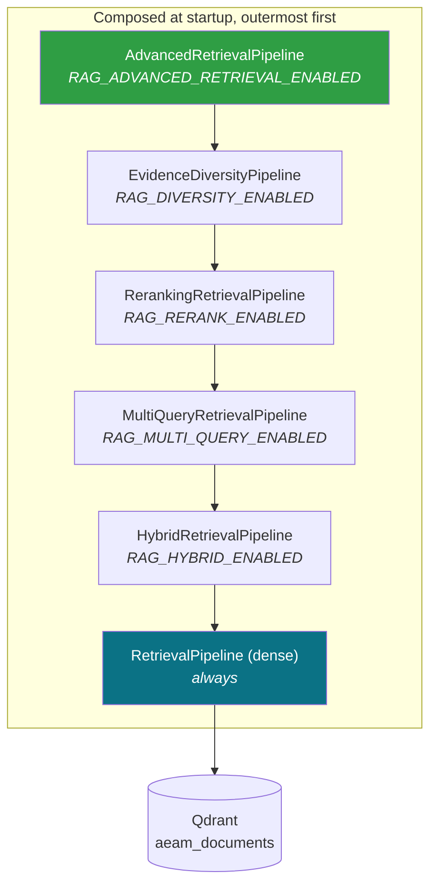
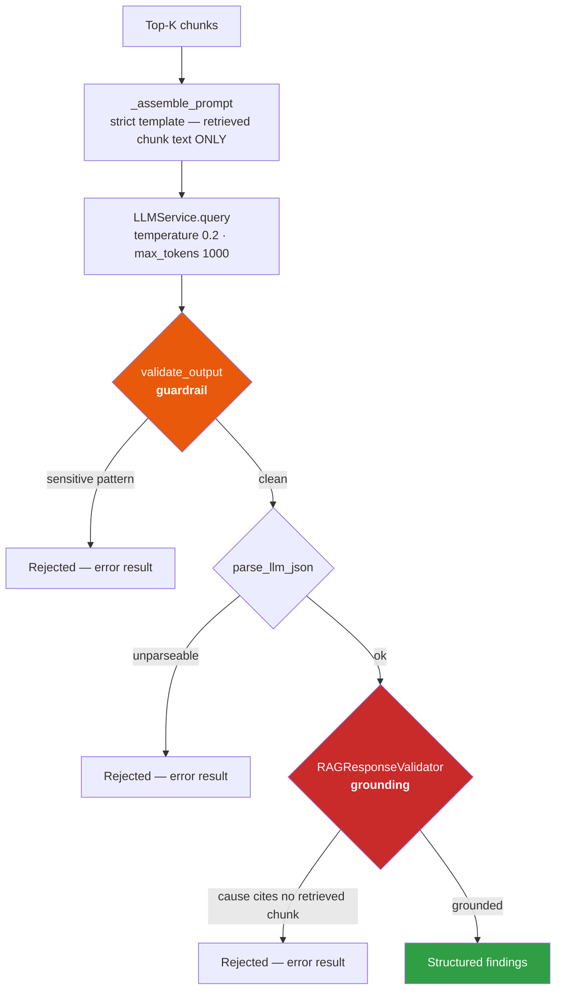
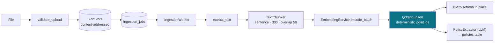

# AEAM — Retrieval Pipeline

> Six composable retrieval stages, two validation gates, and a grounding contract. Describes the implementation as it runs.

---

## 1. The stack

Each stage **wraps** the previous one and satisfies the same `search(query, filter_criteria, top_k)` contract. Each is independently flag-gated, and each falls back to the stage beneath it if construction fails — retrieval degrades, it never breaks startup.



All five optional stages default **on**. With every flag off, the system runs plain dense retrieval against Qdrant.

---

## 2. Stage detail

### Query formulation — deterministic, no LLM

`RAGAgent._formulate_query(event)` builds a query from the event type's natural-language mapping, the metric name, and metadata fragments. `_formulate_query_variant(event, attempt)` produces attempt-indexed rewrites:

| Attempt | Strategy | Example |
|---|---|---|
| 1 | `original` | `database latency slow query performance lock contention replication lag hardening probe 2 service checkout` |
| 2 | `rewritten` | narrower, metric-focused |
| 3 | `broadened` | event-type only |

**Deliberately deterministic.** A hallucinated query would silently retrieve the wrong evidence with no trace of why. The same formulation is reused by Enterprise Memory and the Policy Registry, so all three search identical vocabulary.

**Exhaustion guard:** once all variants have each returned zero chunks, RAG becomes a no-op for the remainder of the incident rather than repeating a search that cannot succeed.

### Entity extraction and metadata filtering

`IncidentEntityExtractor` reads `event.metadata` for recognised keys (`service`, `region`, `source`, …) and builds a Qdrant filter. **With automatic relaxation** — if the filter matches nothing, it is dropped and the search re-runs unfiltered, with `metadata_filter_relaxed: true` recorded on every chunk so a reader knows the filter was abandoned.

### Dense retrieval

`all-MiniLM-L6-v2`, 384-d, cosine similarity, `similarity_threshold = 0.5`, `top_k = 5`.

### BM25 + Reciprocal Rank Fusion

The BM25 index is built at startup by scrolling the same Qdrant collection, so lexical and dense views share one source of truth. It is refreshed **in place** after each runtime ingestion — no restart required.

```
RRF(d) = Σ  1 / (k + rank_i(d))        k = 60
```

**Why RRF over score blending:** cosine similarity and BM25 scores live on incompatible scales and need per-corpus calibration to combine. RRF uses only *rank*, so it needs no calibration and cannot be destabilised by one retriever's score distribution shifting.

**Why hybrid at all:** dense retrieval misses exact identifiers — a metric named `sales_f1_e2e`, an error code, a service name. BM25 misses paraphrase. Operational corpora contain both.

> **Concurrency note.** The index is rebuilt by the ingestion thread while request threads search it. Build publishes all seven parallel structures together under a lock; search takes one consistent snapshot and scores outside the lock. Before that guard existed, a reader could hold the old term-frequency list against a mid-rebuild document list and raise `IndexError` — surfacing as a spurious "Retrieval failed" whenever a document was ingested during an investigation.

### Multi-query expansion

`QueryExpansionAgent` (LLM) generates up to `RAG_MULTI_QUERY_COUNT - 1` variants; each is retrieved independently and the per-variant lists are fused by a second RRF pass. Expansion failure falls back to the original query alone.

### Cross-encoder reranking

Fetches `RAG_RERANK_TOP_N` (20) fused candidates and re-scores them with `cross-encoder/ms-marco-MiniLM-L-6-v2`, returning the caller's `top_k`. A bi-encoder embeds query and document separately; a cross-encoder sees both together and is substantially more accurate at the cost of being far slower — which is why it runs on 20 candidates, not the corpus.

### Evidence diversity

Removes near-duplicates (Jaccard ≥ `RAG_SIMILARITY_THRESHOLD` = 0.8) and caps chunks per source document at `RAG_MAX_CHUNKS_PER_DOCUMENT` = 2. Backfills if too few distinct documents exist.

**Why:** without it, five near-identical chunks from one runbook section crowd out a contradicting chunk from another document, and the LLM sees unanimous evidence that was never unanimous.

### Business relevance ranking

`BusinessRelevanceScorer` adjusts — never overrides — semantic relevance:

| Bonus | Default | Condition |
|---|---|---|
| Entity match | +0.15 each, capped +0.45 | Chunk metadata matches an extracted entity |
| Doc-type authority | +0.05 | Declared semantic type is actionable (e.g. `runbook`) |
| Recency | +0.05 | Within `RETRIEVAL_RECENCY_WINDOW_DAYS` (30) |

Every adjustment is emitted as a human-readable `ranking_reasons` string, so the console can explain why a chunk placed where it did.

---

## 3. Reasoning and the two validation gates



**Gate 1 — guardrail.** `validate_output` runs *before* the response is parsed, persisted or displayed. A response matching a sensitive-data pattern is rejected exactly like any other failure mode.

**Gate 2 — grounding.** Every cited cause must reference a chunk that was actually retrieved. This is the contract that makes the phrase "chunk-cited" mean something: a cause the model invented, with no `chunk_id` traceable to the retrieved set, fails validation and the whole pass is recorded as failed.

**Failure is recorded, not hidden.** All three rejection paths return a full-shaped result with `error` set, and the Orchestrator appends it as a `rag` finding regardless of outcome — so a failed pass appears in the Evidence panel and the timeline instead of silently vanishing.

---

## 4. Output contract

```json
{
  "possible_causes": [{"cause": "Inefficient queries", "chunk_id": "a17801f6…", "confidence": 0.9}],
  "overall_confidence": 0.85,
  "requires_human_review": false,
  "retrieved_count": 5,
  "validation_passed": true,
  "raw_llm_response": "…",
  "query": "…", "query_attempt": 1, "query_strategy": "original", "threshold": 0.5,
  "retrieved_chunks": [{
    "chunk_id": "…", "similarity": 0.571, "source": "startup_runbook.md",
    "text_preview": "…", "cited": true,
    "business_relevance_score": 1.0,
    "ranking_reasons": ["authoritative source (doc_type=startup_runbook)", "recent document (within 30 days)"],
    "retrieval_confidence": 1.0, "metadata_filter_relaxed": false
  }],
  "extracted_entities": [{"key": "service", "label": "service", "value": "checkout"}],
  "metadata_filter_applied": true
}
```

**Root-cause selection** happens in the Orchestrator, not the agent: causes are sorted by confidence and `best_meaningful_cause()` picks the first that passes a content-quality gate — so a high-confidence but content-free chunk-boundary artifact cannot become the root cause.

---

## 5. Honesty properties

| Property | Implementation |
|---|---|
| **A failed retrieval is visible** | Error results carry the real `retrieved_count`, so "the LLM failed after retrieving 5 chunks" is distinguishable from "retrieval found nothing" — two different faults with different fixes. |
| **Missing similarity is not zero** | Chunks retrieved lexically, or whose cosine is dropped during multi-query re-fusion, report `similarity n/a` rather than a misleading `0%`. |
| **Filter relaxation is disclosed** | `metadata_filter_relaxed` on every chunk. |
| **Ranking is explainable** | `ranking_reasons` in plain language, per chunk. |
| **The provider error survives** | A failed LLM call carries the real provider exception into the persisted record, not a generic "after retries" string. |

---

## 6. Ingestion — how documents get in



Deterministic point ids make re-ingestion idempotent. Policy extraction runs *after* indexing has already succeeded and never blocks or fails the job.

**Three writers, one path:** startup knowledge (`aeam/knowledge/*.md`), the upload API, and connector syncs all go through the same `IngestionPipeline`.

---

## 7. Debugging retrieval

`GET /api/v1/debug/retrieval/?query=…&top_k=5` returns a stage-by-stage trace built from the **same component references** the production pipeline uses:

```
expanded_queries · extracted_entities · metadata_filter_applied/relaxed
dense_results · bm25_results · rrf_fused · reranked · business_ranked
evidence_diversity_output · final_chunks
timings_ms{...} · stage_survival[...]
```

Requires `admin:config`. Returns **404 in production** — retrieval mechanics and corpus contents are not a public surface.

> It re-runs the query against the *current* index, so results can legitimately differ from the historical evidence recorded at investigation time if the corpus or settings changed since. The endpoint says so.

---

## 8. Configuration

| Setting | Default | Effect |
|---|---|---|
| `RAG_HYBRID_ENABLED` | `true` | BM25 + RRF fusion; also enables in-place lexical refresh |
| `RAG_MULTI_QUERY_ENABLED` | `true` | LLM query expansion |
| `RAG_MULTI_QUERY_COUNT` | `4` | Total queries including the original |
| `RAG_RERANK_ENABLED` | `true` | Cross-encoder reranking |
| `RAG_RERANK_TOP_N` | `20` | Candidates re-scored |
| `RAG_RERANK_MODEL` | `cross-encoder/ms-marco-MiniLM-L-6-v2` | |
| `RAG_DIVERSITY_ENABLED` | `true` | Near-duplicate removal + per-document cap |
| `RAG_SIMILARITY_THRESHOLD` | `0.8` | Jaccard near-duplicate threshold |
| `RAG_MAX_CHUNKS_PER_DOCUMENT` | `2` | Per-source cap |
| `RAG_ADVANCED_RETRIEVAL_ENABLED` | `true` | Entity extraction + metadata filtering + relevance ranking |
| `BM25_STALE_SECONDS` | `3600` | Informational staleness threshold on `/health` |
| `POLICY_EXTRACTION_ENABLED` | `true` | Extra LLM pass per ingested document |
