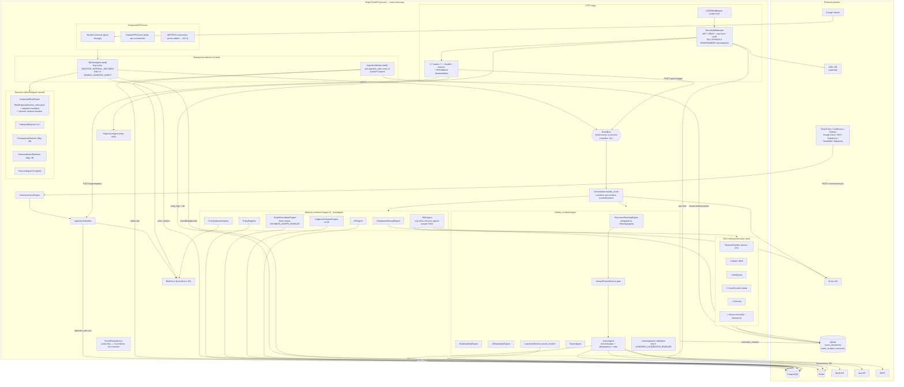

# AEAM — Runtime Architecture (Implementation Reality)

**Scope.** This document describes what the code in this repository actually does at runtime, traced from `aeam/main.py` outward. Where the implementation diverges from `ROADMAP.md`, `CLAUDE.md`, or a module's own docstrings, **the implementation is documented and the divergence is called out in §13**.

**Method.** Execution paths were followed by hand from the ASGI entry point through the event bus, orchestrator, agents, engines, persistence, and HTTP surface, plus the React console's fetch call sites. Dead code is noted only where it affects reading the live path.

**Commit context.** `main` @ `98c307c` (`feat(F7): add enterprise connector framework and ecosystem`).

---

## 1. System startup

### 1.1 Import time (before uvicorn calls anything)

`uvicorn aeam.main:app` imports `aeam/main.py`. That module ends with:

```python
app: FastAPI = create_app()
```

so **the entire application is constructed at import time**, not lazily. Import of `aeam.main` transitively imports every agent, engine, connector, API router, `qdrant_client`, `prometheus_client`, and `sentence_transformers`. An import error in any of those is a hard startup failure with no partial-service mode.

Module-level side effects that happen before any lifespan code:

| Order | What | Where |
|---|---|---|
| 1 | Logger `aeam` configured | [main.py:157](aeam/main.py:157) via `aeam.monitoring.logging_config.get_logger` |
| 2 | Prometheus collectors registered (module-level `Counter`/`Gauge`/`Histogram` singletons) | [metrics.py:34-400](aeam/monitoring/metrics.py:34) |
| 3 | `heartbeat_tracker` singleton created | [metrics.py:571](aeam/monitoring/metrics.py:571) |
| 4 | `_STARTUP_KNOWLEDGE_DIR = aeam/knowledge/` resolved | [main.py:159](aeam/main.py:159) |
| 5 | `_FRONTEND_DIST = <repo>/frontend/dist` resolved | [main.py:1701](aeam/main.py:1701) |

### 1.2 `create_app()` — [main.py:1582](aeam/main.py:1582)

Runs **synchronously at import**, before the lifespan.

1. `FastAPI(...)` constructed with `lifespan=_lifespan`, `docs_url="/docs"`, `redoc_url="/redoc"`.
2. **A second `Settings()` is instantiated here** (independent of the lifespan's own). Pydantic `BaseSettings` reads `.env` + environment; `extra="forbid"` means an unknown key in `.env` aborts startup. `ENVIRONMENT` is required and validated against `{development, staging, production, test}`.
3. **A second `RedisClient` is constructed here** — `create_app` cannot use the container's, because the container does not exist yet. This client is owned by the `RateLimiter` and is never disposed by the shutdown hook (which only closes the container's client).
4. `_build_jwt_auth(settings)` — [main.py:1295](aeam/main.py:1295):
   - If `OIDC_ENABLED` → `_build_oidc_jwt_auth`: requires `OIDC_ISSUER` + `OIDC_CLIENT_ID`, performs **OIDC discovery synchronously at startup**, and raises `RuntimeError` (aborting startup, in every environment including development) if issuer/client-id are missing, discovery fails, or no `jwks_uri` can be resolved.
   - Else PEM literal `JWT_PUBLIC_KEY` → else file at `JWT_PUBLIC_KEY_PATH` → else: **abort** unless `ENVIRONMENT == "development"`, in which case the literal placeholder `"dummy-public-key"` is used with a `WARNING`.
5. `RBAC()`, `RateLimiter(redis_client)`, `AuditLogger(log_file=settings.AUDIT_LOG_FILE)` constructed. The `AuditLogger` is stashed on `app.state.audit_logger` so the lifespan can later attach a DB sink to **the same instance**. `settings` is stashed on `app.state.settings` for the auth router.
6. `SecurityMiddleware` added, then `CORSMiddleware` (`CORS_ALLOWED_ORIGINS`, default `http://localhost:5173`).
   *Starlette applies middleware in reverse registration order, so **CORS runs outermost** and `SecurityMiddleware` inner.*
7. **17 routers** included, in this order: `incidents, system, logs, trigger, retrieval_debug, ingest, knowledge, data_center, observability, administration, review, auth, audit, learning, graph, replay, mesh, connectors`.
8. `_register_routes(app)` adds `GET /`, `GET /metrics`, `GET /health`.
9. `_mount_frontend_build(app)`: if `frontend/dist` exists, mounts `/assets` as `StaticFiles` and registers a **catch-all `GET /{full_path:path}` SPA fallback** excluding the prefixes `api/`, `health`, `metrics`, `docs`, `redoc`, `openapi.json`, `internal/`, `favicon.ico`. If `frontend/dist` is absent, this is a silent no-op and `GET /` keeps returning liveness JSON.

### 1.3 `_lifespan()` — [main.py:343](aeam/main.py:343)

Runs once when uvicorn starts serving. Strictly ordered; **this order is the dependency graph**.

```
 1. Settings()                       (a THIRD instantiation — see §13.6)
 2. configure_tracing(settings)      no-op unless OTEL_TRACING_ENABLED + endpoint + SDK present;
                                     never fails startup
 3. _build_container(settings)  ────────────────────────────────────────────────┐
      DatabaseClient(DATABASE_URL, pool_size, max_overflow, pool_timeout)       │
        └─ _create_tables_if_not_exist():  incidents, decisions, metrics,       │
           action_logs, audit_logs + 5 indexes                                  │
           then create_enterprise_tables(engine): sources, documents, datasets, │
           schemas, versions, ingestion_jobs, policies, incident_approvals,     │
           review_verdicts, forecast_backtests, calibration_models,             │
           learning_proposals, compiled_rules, graph_nodes, graph_edges,        │
           connector_artifacts, connector_sync_runs (+ ~30 indexes)            │
      RedisClient(REDIS_URL)                                                    │
      EventBus()                                                                │
      EventPriorityQueue()          ← constructed, never drained (§13.3)        │
      EventDeduplicator(redis._client)                                          │
      SheetsConnector  IF GOOGLE_SHEETS_SA_CREDENTIALS and SHEET_ID             │
      StructuredDataPipeline()                                                   │
      build_blob_store(settings, SecretManager)  → local disk or S3             │
    app.state.container = container  ───────────────────────────────────────────┘
 4. audit_logger.attach_database(container.db)     (upgrades the middleware's instance)
 5. LLMService(settings)            ← the shared instance; aborts if
                                      LLM_ENABLED and not USE_MOCK_LLM and LLM_PROVIDER != "groq"
 6. DecisionEngine(settings, llm_service)
 7. EvaluationEngine(settings)
 8. _NoOpVectorClient()             ← LongTermMemory's vector side is a NO-OP class (§13.4)
 9. LongTermMemory(db, vector_client)
10. ForecastAgent(ltm, pipeline, settings, database_client=db[, model_dir])
11. EmbeddingService()              ← loads sentence-transformers all-MiniLM-L6-v2 (384-d).
                                      Blocking model load; the slowest startup step.
12. QdrantClient(VECTOR_DB_URL)     → container.qdrant_client
13. IngestionPipeline(embed, qdrant, collection="aeam_documents")
                                      └─ _ensure_collection() creates it if absent
14. _ingest_startup_documents(...)  ← reads aeam/knowledge/*.md and chunk/embed/upserts them
                                      on EVERY startup (idempotent: deterministic point ids)
15. RetrievalPipeline(embed, qdrant, "aeam_documents", threshold=0.5)
16. IngestionPipeline + RetrievalPipeline on "aeam_incident_memories"
    EnterpriseMemoryEngine(...)     → container.enterprise_memory
17. RAG retrieval decorator stack, built inner→outer, each stage independently
    flag-gated and each falling back to the prior stage on construction error:
        RetrievalPipeline (dense, always)
        └─ HybridRetrievalPipeline        if RAG_HYBRID_ENABLED (default true)
             BM25Index.from_qdrant(...)   → container.bm25_index (None if disabled/failed)
           └─ MultiQueryRetrievalPipeline if RAG_MULTI_QUERY_ENABLED (default true)
                QueryExpansionAgent(llm_service, RAG_MULTI_QUERY_COUNT)
              └─ RerankingRetrievalPipeline  if RAG_RERANK_ENABLED (default true)
                   CrossEncoderReranker(RAG_RERANK_MODEL)  ← second model download/load
                 └─ EvidenceDiversityPipeline if RAG_DIVERSITY_ENABLED (default true)
                   └─ AdvancedRetrievalPipeline if RAG_ADVANCED_RETRIEVAL_ENABLED (default true)
                        IncidentEntityExtractor + BusinessRelevanceScorer
18. RetrievalDebugTracer(...)       → container.rag_debug_tracer
19. RAGResponseValidator(); RAGAgent(rag_retrieval, validator, llm_service, entity_extractor)
20. ReportAgent(settings)
21. ActionAgent  IF SLACK_BOT_TOKEN  (registry: slack, email, webhook, sheets,
                                      diagnostics, monitoring [, jira]);
                                      Jira additionally re-registered here if
                                      JIRA_URL and JIRA_API_TOKEN
22. DatasetRepository, VersionRepository, SchemaRepository
    DatasetIntelligenceService(dataset_repo, schema_repo)
    DatasetKPISource(blob_store, dataset_repo, version_repo, intelligence)
    RedisDatasetActivation(redis, seed=ACTIVATED_DATASET_IDS)  ← Redis SET "aeam:activated_datasets"
    CompositeKPISource()
       + add_passthrough(sheets_connector)    only if it exists
       + add_multi(dataset_kpi_source, activation.list_activated_dataset_ids)
23. container.secret_manager = SecretManager(...)   (shared credential path)
    ConnectorRegistry(settings, secret_manager)     → container.connector_registry
    IngestionSubmitter(db, blob_store)              → container.ingestion_submitter
    ConnectorSyncEngine(db, submitter, registry, max_artifacts)  → container.connector_sync
    ConnectorHealthReporter(db, registry, stale_after)           → container.connector_health
    IF registry.enabled_kinds():  build_metric_sources(...)  ← RAISES NameError, see §13.1
24. PolicyAgent(PolicyRepository, CompiledRuleRepository)  → container.policy_agent
    rule_overrides = policy_agent.active_overrides()   (read ONCE, at startup)
    CompositeRuleEngine(base=RuleEngine(overrides=rule_overrides))
       + domain provider "datasets" → dataset_intelligence.list_monitorable_metric_names(activated)
    → container.rule_engine
25. MonitorAgent  IF ENABLE_MONITOR_AGENT (default FALSE)
       └─ threading.Thread(target=monitor_agent.start, daemon=True).start()
    → container.monitor_agent (None when disabled)
26. IngestionWorker(job_repo, RoutingJobProcessor(document_processor, dataset_processor),
                    poll_interval=INGEST_WORKER_POLL_SECONDS)
       └─ threading.Thread(target=worker.start, daemon=True).start()   ← ALWAYS started
    → container.ingestion_worker
27. PolicyRegistry(PolicyRepository, RuleEngine(), embedding_service, threshold)
28. BusinessGraphStore(GraphNodeRepository, GraphEdgeRepository)  → container.business_graph_store
    TraversalBudget.clamped(GRAPH_MAX_*)
    GraphCorrelationEngine(...)  ONLY IF BUSINESS_GRAPH_ENABLED (default false), else None
29. CrossDatasetAnalyzer(activation, intelligence, dataset_kpi_source[, graph_store])
30. AdaptiveDetectionEngine(long_term_memory, ADAPTIVE_*)
31. ExecutionPlanningEngine(EXECUTION_PLAN_*, HUMAN_APPROVAL_QUALITY_LEVELS)
32. PlanningAgent(engine) IF PLANNING_AGENT_ENABLED (default true) else the bare engine
    → planning_target
33. HumanReviewService(IncidentApprovalRepository, ReviewVerdictRepository,
                       settings, action_agent)  → container.human_review_service
34. ExplainabilityEngine()          (unconditional)
35. AIEvaluationEngine(AI_EVAL_*)   (unconditional)
36. Orchestrator(event_bus, decision, evaluation, ltm, settings, rag, action, report,
                 memory_engine, policy_registry, cross_dataset, adaptive,
                 execution_planning_engine=planning_target, explainability,
                 ai_evaluation, human_review, business_graph_engine)
       └─ constructs its OWN KPIAgent unless KPI_AGENT_ENABLED is False
       └─ constructs its OWN LearningAgent only if LEARNING_CALIBRATION_ENABLED
37. event_bus.register_handler("ALL", orchestrator.handle_event)     ← the ONLY handler
38. container.agent_roster = sorted([orchestrator, rag, forecast, report]
                                    + monitor? + action? + kpi? + planning? + supervisor?)
39. SupervisorAgent(settings, roster_provider, observability_provider)
       IF SUPERVISOR_AGENT_ENABLED (default true)   → container.supervisor_agent
40. redis.ping()  → logs OK or DEGRADED; never aborts
41. "AEAM startup complete."  →  yield
```

### 1.4 What is actually *running* after startup

| Thing | Running? | Detail |
|---|---|---|
| ASGI request loop | Yes | uvicorn |
| **IngestionWorker thread** | **Always** | Daemon thread, polls `ingestion_jobs` every `INGEST_WORKER_POLL_SECONDS` (2.0s). Heartbeat key `"ingestion"`. |
| **MonitorAgent thread** | **Only if `ENABLE_MONITOR_AGENT=true`** | Default is `False`, and the repository's `.env` does not set it → **not running locally**. Daemon thread, `MONITOR_INTERVAL_SECONDS` (300s) between cycles. Heartbeat key `"monitor"`. |
| Scheduler | **No** | No scheduler exists. Removed in Phase E1; the code documents this explicitly at [main.py:1248](aeam/main.py:1248). |
| Connector sync | **No loop** | Sync is request-triggered only (`POST /api/v1/connectors/sync[/{id}]`). |
| Graph build | **No loop** | Explicit `POST /api/v1/graph/build` only. No startup build. |
| Recalibration | **No loop** | Explicit `POST /api/v1/learning/recalibrate` only. |
| Planning agent | Request-scoped | Invoked once per finalized incident; heartbeat `"planning"` means "last used", not liveness. |
| Supervisor agent | Request-scoped | Computes its report on read (`GET /api/v1/mesh/*`); heartbeat `"supervisor"`. |
| `EventPriorityQueue` | Constructed, never used | No producer (MonitorAgent's push was removed), no consumer. Only its `.size()` is read by `/health` and `/api/v1/system/status`. |

### 1.5 Shutdown

`yield` returns → `monitor_agent` is only *logged* (no `stop()` — relies on daemon-thread exit) → `ingestion_worker.stop()` (sets its `threading.Event`) → `container.db.dispose()` → `container.redis.close()`. **The `RedisClient` created inside `create_app()` for the rate limiter is never closed.**

### 1.6 Health providers

`GET /health` → `build_health_payload(container)` — [main.py:1445](aeam/main.py:1445). Returns `200` when `status == "healthy"`, else `503`.

| Check | Source | Can it degrade overall status? |
|---|---|---|
| `database` | **Hardcoded `"ok"`** inside a `try` that cannot fail — no query is executed (§13.5) | No, in practice |
| `redis` | `container.redis.ping()`, or `"disabled (no REDIS_URL)"` | Yes |
| `queue` | `container.queue.size()` | Yes |
| `monitor_agent` | `heartbeat_tracker.age_seconds("monitor")` vs `HEARTBEAT_STALE_SECONDS` (120) | **Yes** — stale ⇒ degraded. `"disabled"` when `container.monitor_agent is None` |
| `ingestion_worker` | `heartbeat_tracker.age_seconds("ingestion")` | **Yes** |
| `planning_agent`, `supervisor_agent` | Heartbeat age, **informational only** | No (by design — request-scoped) |
| `bm25_index` | `bm25_index.age_seconds` vs `BM25_STALE_SECONDS` (3600), **informational only** | No |

Note the default-configuration trap: `HEARTBEAT_STALE_SECONDS=120` but `MONITOR_INTERVAL_SECONDS=300`. If MonitorAgent is enabled with defaults, its heartbeat is only refreshed every 300s, so `/health` reports it stale and the platform `degraded` for most of every cycle. The setting's own docstring warns about this; no code enforces the relationship.

Qdrant and LLM reachability are **not** in the payload; the console shows them as explicit `"unknown"` placeholders ([HealthProvider.jsx:100](frontend/src/layout/HealthProvider.jsx:100)).

---

## 2. Runtime architecture diagram



---

## 3. Investigation flow — one complete trace

Traced for the canonical case: `POST /api/v1/trigger` with `severity: "HIGH"` (the MonitorAgent path differs only in how the `Event` is built; §3.0 covers it).

### 3.0 Entry A — autonomous detection (MonitorAgent)

Only runs when `ENABLE_MONITOR_AGENT=true`.

```
MonitorAgent.start()                                     [monitor_agent.py:263]
  loop forever:
    heartbeat_tracker.record("monitor")                  ← BEFORE the cycle body
    _run_cycle()                                         [monitor_agent.py:525]
      if self._kpi_source is None: return                (no-op tick)
      rows = CompositeKPISource.fetch_rows(self._kpi_sheet_name)
          # _kpi_sheet_name is derived from SHEET_RANGE ("Sheet1!A2:C10" → "Sheet1")
          # → SheetsConnector.fetch_rows("Sheet1")            (pass-through mode)
          # → DatasetKPISource.fetch_rows(<id>) once per activated dataset id (multi mode)
          # each member wrapped in its own try/except; a failing member is skipped
      if not rows: return
      for metric_name in rule_engine.loaded_domains:     # CompositeRuleEngine:
                                                         #   curated YAML domains
                                                         #   ∪ activated-dataset metric names
        series = _extract_series(rows, metric_name)       # case-insensitive column match
        if len(series) < 2: continue
        current, history, previous = series[-1], series[:-1], series[-2]
        LongTermMemory.store_metrics([{metric, value, timestamp}])   → DB WRITE: metrics
        process_kpi(metric_name, current, previous, history)
    time.sleep(MONITOR_INTERVAL_SECONDS)
```

```
MonitorAgent.process_kpi()                               [monitor_agent.py:300]
  1. clean_history = StructuredDataPipeline.clean_missing(history)
  2. rule_result   = CompositeRuleEngine.evaluate(metric_name, current, previous)
                     (pure pass-through to the base RuleEngine)
  3. stat_result   = StatisticalDetector.detect(current, clean_history)
  3b. changepoint_result = ChangepointDetector.detect(...)      only if enabled (default off)
      seasonal_result    = SeasonalHybridDetector.detect(...)   only if enabled (default off)
  4. signals = _collect_signals(...)   → e.g. ["rule:sales.daily_drop_percent",
                                               "statistical:z_score(-4.12)",
                                               "statistical:below_p5"]
  5. forecast_result = ForecastAgent.analyze(metric_name, current)   [timed: agent="forecast"]
        may train/load a Prophet model, read metrics history, and — if
        FORECAST_BACKTEST_ENABLED — write a row to forecast_backtests
     if forecast_result["is_deviation"]: signals.append("FORECAST")
  6. if not signals: return None                          ← no event, cycle continues
  7. event = create_event(...)
        event_type = "KPI_ANOMALY"   (ALWAYS — never SALES_DROP etc.)
        expected_value = stat_details["moving_avg"]
        severity = HIGH if len(signals) >= 2 else MEDIUM if == 1 else LOW
        metadata = {rule, statistical[, forecast][, changepoint][, seasonal_hybrid]}
  8. if EventDeduplicator.is_duplicate(event): return None          ← Redis-backed window
  9. EventBus.publish(event)          (HandlerError caught and logged, never raised on)
```

### 3.0b Entry B — manual trigger

```
POST /api/v1/trigger/  {event_type, metric, value, severity[, metadata]}
  → SecurityMiddleware (fully bypassed when ENVIRONMENT=development)
  → TriggerRequest validation (severity ∈ {CRITICAL,HIGH,MEDIUM,LOW}; non-blank strings)
  → Event(
        event_id=uuid4(), event_type=<as given>, metric=<as given>,
        current_value=value,
        expected_value=value * 2,                  ← placeholder baseline (trigger.py:171)
        detection_methods=["manual_trigger"],
        severity=<normalised>, timestamp=now(utc),
        metadata={"source": "api_trigger", **(metadata or {})})
  → request.app.state.container.event_bus.publish(event)
  → 202 {status:"accepted", event_id, event_type, metric, severity}
```

**The publish is synchronous and inline.** The whole investigation below runs on the request thread before the `202` is returned. `POST /trigger` latency == full investigation latency.

### 3.1 Dispatch

```
EventBus.publish(event)                                  [event_bus.py:121]
  specific      = handlers["KPI_ANOMALY"]   → []          (nothing registers by type)
  wildcard_star = handlers["*"]             → []
  wildcard_all  = handlers["ALL"]           → [Orchestrator.handle_event]
  for handler in specific + star + all:  _invoke(handler, event, failures)
  if failures: raise HandlerError(failures)
```

### 3.2 `Orchestrator.handle_event` — [orchestrator.py:317](aeam/agents/orchestrator/orchestrator.py:317)

```
incident_id = uuid4()                       ← the INVESTIGATION id (not the DB primary key)
ctx = IncidentContext(incident_id, event, ShortTermMemory(), IncidentStateMachine(id),
                      started_at=start_timer())
METRIC: incidents_total{event_type,severity}.inc()
METRIC: active_incidents.inc()
incident_cost_scope.start(incident_id)      ← thread-local cost accumulator
ctx.stm.initialize(task_type="anomaly_investigation", incident_id=…)
ctx.stm.set: investigation_depth=0, findings=[], hypotheses=[], evidence=[],
             confidence=None, root_cause=None, root_cause_source=None,
             action_taken=False, requires_human=False
FSM: → EVENT_RECEIVED
ctx.stm.set("event", event.model_dump(mode="json")); set("incident_id", incident_id)
with investigation_span("investigation", …):        ← root OTel span (no-op unless enabled)
    _investigate(ctx)
```

### 3.3 `_investigate(ctx)` — recursive, one pass per depth

```
FSM: → INVESTIGATING
depth += 1                                            (stored in STM)

── STAGE: decision ─────────────────────────────────────────────────────────────
with _timed_stage(ctx, "decision", depth=depth):      ← span + agent_execution_time{agent="decision"}
                                                        + ctx.stage_timings["decision"] (ACCUMULATED)
  DecisionEngine.decide(event, memory=stm)            [decision_engine.py:230]
    rule = apply_priority_rules(event)                 severity-keyed table:
        CRITICAL → INVESTIGATE, agents=[KPI,RAG], confidence 0.95
        HIGH     → INVESTIGATE, agents=[KPI,RAG], confidence 0.90
        anything else (MEDIUM/LOW/unknown)
                 → INVESTIGATE, agents=[KPI],     confidence 0.70
    if confidence >= 0.9: return rule                  ← CRITICAL/HIGH always short-circuit
    if should_use_llm(memory):                          LLM_ENABLED and llm injected and depth > 2
        return _query_llm(...)  → {…, source:"llm", llm_response:<raw>}
    return rule
if result["source"] == "llm": stm.set("llm_response", …)
stm.append("findings", {depth, decision, confidence, source})
FSM: → DECIDING
if decision == "STOP" or unrecognised: _finalize_incident(ctx); return

── ADVISORY EVIDENCE STAGES (each once per incident, guarded by _has_*_finding) ──
1. memory        if memory_engine wired
   with _timed_stage("memory", span "evidence.memory"):
     query = RAGAgent._formulate_query(event)          ← the SAME formulation RAG/policy use
     EnterpriseMemoryEngine.recall_similar_incidents(query, exclude_incident_id=…)
       → RetrievalPipeline("aeam_incident_memories").search(query, top_k=fetch_k)
       → optional extra MEMORY_SIMILARITY_THRESHOLD filter
   stm.append("findings", {type:"memory", data:{query, matches}})
   (exception → matches=[], query=None; investigation continues)

2. policy        if policy_registry wired
   with _timed_stage("policy", span "evidence.policy"):
     PolicyRegistry.match_for_incident(metric, query)   ← DB read: policies (+ embeddings)
   stm.append("findings", {type:"policy", data:{query, matches}})

3. cross_dataset if cross_dataset_analyzer wired
   with _timed_stage("cross_dataset", span "evidence.cross_dataset"):
     CrossDatasetAnalyzer.analyze(metric)
       → for each OTHER activated dataset: DatasetKPISource.fetch_rows → correlate (Pearson)
       → consults BusinessGraphStore ONLY if BUSINESS_GRAPH_ENABLED
   stm.append("findings", {type:"cross_dataset", data:{…}})

4. graph         ONLY if BUSINESS_GRAPH_ENABLED (engine is None otherwise)
   with _timed_stage("graph", span "evidence.business_graph"):
     GraphCorrelationEngine.analyze(metric)             ← READ-ONLY traversal of
                                                          graph_nodes/graph_edges within
                                                          TraversalBudget(depth/nodes/edges/conf)
   stm.append("findings", {type:"graph", data:{…}})

5. adaptive      if adaptive_detection_engine wired
   with _timed_stage("adaptive", span "evidence.adaptive_detection"):
     AdaptiveDetectionEngine.analyze(metric, current_value, event.metadata)
       → LongTermMemory.get_metric_history (DB read: metrics), StatisticalDetector w=30
       → reads event.metadata["statistical"]/["forecast"]; never re-invokes a detector
   stm.append("findings", {type:"adaptive", data:{…}})

── STAGE: rag ──  ONLY IF "RAG" ∈ decision_result["agents"] AND rag_agent wired
   ⇒ in practice ONLY for severity CRITICAL or HIGH (§13.7)
   t = start_timer(); with investigation_span("evidence.rag"):
     RAGAgent.investigate(event, memory=stm)            [rag_agent.py:345]
       0. exhaustion check: if all prior attempts this incident returned 0 chunks
          and count >= _MAX_QUERY_ATTEMPTS → return _exhausted_result (no search)
       1. attempt = min(len(prior)+1, MAX); (query, strategy) = _formulate_query_variant(...)
       1b. entities = IncidentEntityExtractor.extract(event.metadata)
           filter_criteria = to_filter_criteria(entities)
       2. chunks = <decorator stack>.search(query, filter_criteria, top_k=5)
          → Advanced → Diversity → Rerank → MultiQuery → Hybrid(BM25+dense RRF) → Qdrant
          on exception → _error_result;  if empty → _no_context_result (LLM skipped)
       3. prompt = _assemble_prompt(event, chunks, memory)   ← chunks-only, strict template
       4. raw = LLMService.query(prompt, temperature=0.2, max_tokens=1000)
          METRICS: llm_calls_total, llm_call_duration_seconds, llm_tokens_total,
                   llm_cost_usd_total; incident_cost_scope.record_llm(...)
       4b. validate_output(raw) — LLM guardrail; failure → _error_result
       5. parse_llm_json(raw) — fence/prose tolerant; failure → _error_result
       6. RAGResponseValidator.validate(parsed, chunks) — grounding check; failure → _error_result
       7. return {findings:{possible_causes, overall_confidence, requires_human_review,
                            retrieved_count, validation_passed, raw_llm_response, query,
                            query_attempt, query_strategy, threshold, retrieved_chunks,
                            extracted_entities, metadata_filter_applied},
                  confidence, memory_updates}
   _accumulate_stage_timing(ctx, "rag", end_timer(agent_execution_time{agent="rag"}, t))
   rag_root_cause = best_meaningful_cause(sorted possible_causes by confidence desc)
   stm.append("findings", {type:"rag", depth, confidence, root_cause, data})   ← ALWAYS, even on failure
   stm.set("llm_response", json.dumps(rag_result))
   if rag_root_cause and not no_knowledge:
       stm.set("root_cause", rag_root_cause); stm.set("root_cause_source", "rag")
       stm.set("confidence", max(existing, rag_confidence))
   for h in memory_updates["hypotheses"]: stm.append("hypotheses", h)
   for cause in possible_causes: stm.append("evidence", {source:"rag", chunk_id, cause, confidence})
   if findings["requires_human_review"] is True: stm.set("requires_human", True)
   incident_cost_scope.record_retrieval(retrieved_count)

── STAGE: kpi_analysis ──  runs on EVERY depth  [orchestrator.py:2014]
   if kpi_agent is None:  append {type:"kpi_analysis", data:{not_consulted:…}}; return
   with _timed_stage("kpi_analysis", span "evidence.kpi_analysis"):
     KPIAgent.analyze(metric, current_value, expected_value, event.metadata, depth)
       history  = LongTermMemory.get_metric_history(metric, limit=KPI_AGENT_HISTORY_LIMIT=90)
       baseline = event.expected_value if non-zero else median(history);  source disclosed
       deviation (percent + robust sigmas via MAD), persistence, trend (OLS over last 14),
       detectors_fired read from event.metadata — NEVER re-detected
       root_cause = a literal statement of measured fact, or None. Never a causal claim.
       NEVER raises: any failure returns a structured result with analysis_failed set.
   stm.append("findings", {type:"kpi_analysis", depth, confidence, root_cause, data})
   stm.append("evidence", {source:"kpi_analysis", depth, metric, current_value,
                           expected_value, baseline_source, history_points_used,
                           deviation, persistence, trend, detectors_fired, insufficient_data})
   if depth == 1 and root_cause: stm.append("hypotheses", root_cause)
   confidence = max(existing, agent_confidence)
   root_cause written ONLY if none set → source "kpi_analysis"   (RAG/LLM always win)

── STAGE: forced LLM reasoning ──  IF depth >= 3 AND LLM_ENABLED
   llm = LLMService(settings=self._settings)             ← a NEW client, not the injected one (§13.8)
   raw = llm.query(<incident + STM snapshot prompt>, temperature=0.2, max_tokens=500)
   insight = parse_llm_json(raw)
   if insight is None: append {type:"llm_reasoning_error", depth, reason, raw_response}
   else: stm.set root_cause / root_cause_source="llm_reasoning" / confidence / llm_response
   (exception → warning only; the KPI characterisation stands)

_evaluate(ctx)
```

### 3.4 `_evaluate(ctx)` — [orchestrator.py:893](aeam/agents/orchestrator/orchestrator.py:893)

```
EvaluationEngine.evaluate(memory=stm)             [evaluation_engine.py:102]
  score = 0.0
    + 0.4  if stm["root_cause"] truthy
    + 0.3  if len(stm["evidence"]) >= 3
    + 0.2  if float(stm["confidence"]) > 0.8
    + 0.1  if stm["action_taken"] is True         ← never True before finalize (§13.9)
  if depth >= MAX_INVESTIGATION_DEPTH (5):  → ESCALATE   (depth overrides score)
  elif score >= 0.8:                        → STOP
  else:                                     → CONTINUE
stm.append("findings", {type:"evaluation", decision, score, reasons})
CONTINUE  → _investigate(ctx)                     ← direct recursion, same thread/stack
STOP      → _finalize_incident(ctx)
ESCALATE  → stm.set("requires_human", True)
            append {type:"escalation", reason:"Max investigation depth reached…"}
            _finalize_incident(ctx)
other     → _finalize_incident(ctx)
```

The practical ceiling on score without an executed action is `0.4 + 0.3 + 0.2 = 0.9`, so STOP is reachable; but it requires ≥3 evidence entries **and** confidence > 0.8. A KPI-only pass contributes exactly one evidence entry per depth, so a typical no-RAG investigation runs to depth 5 and ESCALATEs.

### 3.5 `_finalize_incident(ctx)` — [orchestrator.py:952](aeam/agents/orchestrator/orchestrator.py:952)

```
if FSM state == COMPLETE: return                  ← idempotency guard
FSM: → COMPLETE
METRIC: active_incidents.dec()
investigation_duration_seconds = end_timer(investigation_duration, ctx.started_at)   ← measured once

read from STM: event_data, incident_id, root_cause, root_cause_source,
               requires_human, confidence

── calibration (Phase F2) ── only if learning_agent wired (LEARNING_CALIBRATION_ENABLED)
   confidence, calibration_disclosure = calibrate_confidence(confidence,
                                            learning_agent.active_calibration())
   raw value always retained in the disclosure; failure → raw stands, reason recorded

── derive reporting state ──
   latest_rag = last findings entry of type "rag"
   validation_status = SKIPPED (no RAG) | PASSED | FAILED(+reason)
   investigation_status = derive_investigation_status(root_cause, requires_human, had_error)
   possible_causes / evidence_count / top_confidence / chunk_ids from latest_rag
   runbook = get_runbook(event_data["event_type"])          ← table lookup; unknown → default
       KPI_ANOMALY is NOT in the table → default runbook ["jira","slack","diagnostics"]

── STAGE: execution_plan ──  with _timed_stage("execution_plan", span "planning")
   PlanningAgent.plan(...)  →  ExecutionPlanningEngine.plan(event_type, metric, severity,
       current_value, expected_value, findings, root_cause, confidence, requires_human,
       runbook_recommended_actions)
   (PlanningAgent forwards unchanged and returns the engine's own object; it also records
    heartbeat "planning", agent_execution_time{agent="planning"}, span agent.planning)
   → {executive_summary, recommended_actions, order_rationale, supporting_evidence,
      business_risk_assessment, expected_impact, confidence, evidence_quality,
      evidence_conflicts, human_approval_required, explanation, insufficient_evidence,
      sources_consulted, sources_with_signal}
   exception → a structured failure plan with human_approval_required=True
   stm.append("findings", {type:"execution_plan", data:plan})

── STAGE: explainability ──  timed via explicit start/end pair
   ExplainabilityEngine.explain(findings, execution_plan (re-read from findings), confidence)
   stm.append("findings", {type:"explainability", data:{decision_graph, evidence_graph,
      recommendation_trace, confidence_breakdown, evidence_contribution, contradictions,
      missing_evidence, assumptions, evidence_quality, lower_priority_justification,
      insufficient_evidence}})

── STAGE: ai_evaluation ──
   AIEvaluationEngine.assess(findings, execution_plan, explainability, root_cause, confidence)
   stm.append("findings", {type:"ai_evaluation", data:{overall_score,
      overall_score_formula, component_scores, strengths, weaknesses, missing_evidence,
      improvement_opportunities, quality_summary}})

── approval gate ──  _resolve_approval_gate(ctx, event_data)   [orchestrator.py:1695]
   ACTIVE only if ALL THREE hold:
      human_review_service is wired
      AND service.enforced  (HUMAN_APPROVAL_ENFORCED, default true)
      AND execution_plan["human_approval_required"] is True
   required_tiers = HumanReviewService.resolve_chain(severity, findings)
      precedence: matched policy roles > APPROVAL_TIER_CHAIN_OVERRIDES[severity] > APPROVAL_TIER_CHAIN
      resolution failure → fall back to ["reviewer"] (never releases the gate)
   approval_id = uuid4();  chain_source = "policy" | "configuration"

── action execution, PASS 1: non-notification steps ──
   for step in runbook["action_plan"] where step ∉ {jira, slack, marketing_slack}:
      params = {incident_id}
        diagnostics → + kind ("analytics_snapshot" for SALES_DROP/SALES_SPIKE else
                       "diagnostics"), metric, current_value, expected_value, root_cause
        monitoring  → + metric, window_minutes=120, reason
      if gate["active"] and is_gated_step(step):        ← gated = NOT in
                                                          {jira,slack,marketing_slack,email}
          pending_actions.append({step, params})        ← params recorded VERBATIM
          skipped_actions.append({action, reason:"Withheld pending human approval (…)"})
          continue                                      ← NOT executed
      _run_step(step, params)

── action execution, PASS 2: notification steps (never gated) ──
   notify_payload = {incident_id, metric, severity, current_value, expected_value,
                     investigation_status, root_cause, confidence, evidence_count,
                     recommended_actions, requires_human, executed_actions}
   jira            → _run_step("jira", {summary, description=format_jira_description(...),
                                        priority=priority_map[severity]})
   slack / marketing_slack → _run_step(step, {message=format_slack_message(...), severity})

── report + email (always attempted, independent of the runbook) ──
   report = ReportAgent.generate_report(memory=stm)      [timed: agent="report"]
   _run_step("email", {to:["ops@company.com"], subject, body:report["detailed_report"]})
                                                         ← hardcoded recipient
```

`_run_step` — the only path to `ActionAgent`:

```
if action_agent is None: skipped_actions.append({action, reason:"ActionAgent not available."})
registry_type, extra = resolve_action_step(step)   # marketing_slack → ("slack",{channel:"#marketing-alerts"})
with investigation_span("action", …):
    result = ActionAgent.execute(action_type=registry_type, parameters=merged, incident_id=…)
_accumulate_stage_timing(ctx, f"action.{step}", end_timer(agent_execution_time{agent=f"action:{type}"}))
if result["status"] == "SUCCESS": action_success_total.inc(); executed_actions.append(step)
else:                            action_failure_total.inc(); skipped_actions.append({action, reason})
raised exception                → action_failure_total.inc(); skipped_actions.append({action, str(exc)})
```

Closing sequence:

```
if gate["active"]:
   stm.append("findings", {type:"human_approval", data:{approval_id, required:True,
      enforced:True, status:"pending", required_tiers, current_tier:0, chain_source,
      pending_actions:[steps], gate_reason}})

incident_cost_scope.record_action("executed"|"skipped"|"withheld") ×N
cost_snapshot = incident_cost_scope.snapshot(); incident_cost_scope.clear()

stm.append("findings", audit_summary = {
   type:"audit_summary", investigation_status, root_cause, root_cause_source,
   validation_status, validation_reason, reranking:"not_applicable", escalation_reason,
   query_attempts, evidence_count, top_confidence, chunk_ids, recommended_actions,
   executed_actions, skipped_actions, calibration,
   [investigation_duration_seconds], [stage_durations], [cost], [trace_id]})
   ← this entry is the single source of truth the console reads

payload = {event_id, event_type, metric, severity, current_value, expected_value,
           detection_methods, timestamp, investigation_depth, root_cause, confidence,
           action_taken=bool(executed_actions), requires_human,
           findings=<the whole array>, llm_response}

DB WRITE 1:  db_incident_id = LongTermMemory.record_incident(payload)
               → DatabaseClient.insert_incident → INSERT INTO incidents RETURNING incident_id
               → the DB generates its own primary key; ctx.incident_id is the investigation id
               (failure logged, NOT raised — the incident is then lost but finalization continues)

DB WRITE 2:  if gate["active"]:
               HumanReviewService.record_pending_approval(approval_id,
                  incident_id=db_incident_id or ctx.incident_id, investigation_id=ctx.incident_id,
                  event_type, metric, severity, required_tiers, pending_actions)
               → INSERT INTO incident_approvals
               (failure logged loudly — withheld actions become unreleasable)

VECTOR WRITE: if root_cause_source == "placeholder": SKIP (ENG-5 quarantine, pre-F1 records only)
              else EnterpriseMemoryEngine.remember_incident({incident_id, event_type, metric,
                   severity, timestamp, root_cause, confidence, investigation_status,
                   recommended_actions, executed_actions, chunk_ids})
                   → chunk + embed + upsert into Qdrant "aeam_incident_memories"
              (failure logged, never raised)

ctx.stm.clear()
```

### 3.6 Complete DB/vector write inventory for one investigation

| # | Store | Table / collection | Written by | Conditional |
|---|---|---|---|---|
| 1 | Postgres | `metrics` | `MonitorAgent._run_cycle` → `LongTermMemory.store_metrics` | Monitor path only |
| 2 | Postgres | `forecast_backtests` | `ForecastAgent._record_backtest` | `FORECAST_BACKTEST_ENABLED` |
| 3 | Redis | dedup key | `EventDeduplicator.is_duplicate` | Monitor path only |
| 4 | Redis | idempotency key (24h TTL) | `ActionAgent.execute` | Per action |
| 5 | Postgres | `action_logs` | `ActionAgent._log_to_database` | Per action attempt |
| 6 | Postgres | `incidents` | `LongTermMemory.record_incident` | Always at finalize |
| 7 | Postgres | `incident_approvals` | `HumanReviewService.record_pending_approval` | Gate active |
| 8 | Qdrant | `aeam_incident_memories` | `EnterpriseMemoryEngine.remember_incident` | Not placeholder-sourced |
| 9 | Postgres + file | `audit_logs` | `SecurityMiddleware` → `AuditLogger` | Non-development requests |

**`decisions` is never written.** `DatabaseClient.insert_decision` / `LongTermMemory.log_decision` exist and are correct, but no production call site invokes them — decisions live inside `incidents.findings` instead.

---

## 4. Agent map

### Orchestrator — `aeam/agents/orchestrator/orchestrator.py`
- **Purpose.** The single coordinator (ARCH-1). Drives `EVENT_RECEIVED → INVESTIGATING → DECIDING → COMPLETE`, sequences every evidence stage, and owns finalization.
- **Inputs.** An `Event` (from `EventBus`). Injected: `DecisionEngine`, `EvaluationEngine`, `LongTermMemory`, `Settings`, `RAGAgent`, `ActionAgent`, `ReportAgent`, `EnterpriseMemoryEngine`, `PolicyRegistry`, `CrossDatasetAnalyzer`, `AdaptiveDetectionEngine`, planning target, `ExplainabilityEngine`, `AIEvaluationEngine`, `HumanReviewService`, `GraphCorrelationEngine`.
- **Outputs.** An `incidents` row; `incident_approvals` row; a memory vector; action executions; Prometheus metrics; OTel spans.
- **Dependencies.** Everything above. Builds its own `KPIAgent` and (conditionally) `LearningAgent`.
- **When.** Synchronously, on every published event.
- **Invoked by.** `EventBus` `"ALL"` handler registration — the only registration in the process.
- **On failure.** An exception propagates to `EventBus._invoke`, is captured, and re-raised as `HandlerError` to the publisher. `MonitorAgent` catches and logs it. `POST /trigger` catches it and returns `500`. **The incident row is then never written** — the investigation is lost. Every *internal* stage is individually wrapped, so a stage failure degrades that stage only.
- **Concurrency.** Reentrant: all per-incident state lives on a stack-local `IncidentContext`. Collaborators are shared deliberately.

### MonitorAgent — `aeam/agents/monitor/monitor_agent.py`
- **Purpose.** The only autonomous detection loop.
- **Inputs.** `CompositeKPISource.fetch_rows(sheet_name)`; `CompositeRuleEngine.loaded_domains`.
- **Outputs.** `metrics` rows; `KPI_ANOMALY` events published to the bus.
- **Dependencies.** `EventBus`, `EventPriorityQueue` (only for `repr`), `EventDeduplicator`, `CompositeRuleEngine`, `StatisticalDetector`, optional Changepoint/Seasonal detectors, `ForecastAgent`, `StructuredDataPipeline`, `Settings`, `KPIRowSource`, `LongTermMemory`.
- **When.** Every `MONITOR_INTERVAL_SECONDS` (300) in its own daemon thread — **only if `ENABLE_MONITOR_AGENT=true`. Default false.**
- **Invoked by.** Its own thread; also called directly by `run_simulation.py` and tests.
- **On failure.** Heartbeat is recorded *before* the cycle, so liveness survives a bad cycle. Cycle exceptions are caught and logged; per-metric `process_kpi` exceptions are caught per metric; `store_metrics` failure is caught; a `ForecastAgent` failure just drops the FORECAST signal. The loop never dies from a cycle error.

### KPIAgent — `aeam/agents/kpi/kpi_agent.py`
- **Purpose.** Grounded characterisation of *what* changed. Replaced the deleted `_run_kpi_investigation_placeholder`.
- **Inputs.** `metric`, `current_value`, `expected_value`, `event.metadata`, `depth`; history from `LongTermMemory` (limit 90).
- **Outputs.** A findings entry, an evidence entry, a hypothesis (depth 1), and possibly `root_cause` + `confidence` in STM.
- **Dependencies.** `LongTermMemory` only. No LLM, no detector re-invocation, no `RuleEngine`.
- **When.** Every investigation depth.
- **Invoked by.** `Orchestrator._run_kpi_investigation`.
- **On failure.** Declared never-raise: returns a structured result with `analysis_failed` set. Disabled (`KPI_AGENT_ENABLED=false`) records an explicit `not_consulted` finding.

### ForecastAgent — `aeam/agents/forecast/forecast_agent.py`
- **Purpose.** Prophet time-series forecast + deviation detection.
- **Inputs.** `metric_name`, `actual_value`; history via `LongTermMemory`; models on disk (`FORECAST_MODEL_DIR` or `models/forecasting`).
- **Outputs.** `{is_deviation, …}` for `MonitorAgent`; `forecast_backtests` rows when backtesting is on.
- **When.** Inside `MonitorAgent.process_kpi`, once per metric per cycle. **Never called during an investigation** — `AdaptiveDetectionEngine` and `KPIAgent` read the already-computed `event.metadata["forecast"]`.
- **On failure.** Caught inside `process_kpi`; the FORECAST signal is simply absent. With `FORECAST_BACKTEST_ENABLED` + `FORECAST_MAX_HOLDOUT_MAPE > 0`, a model failing its holdout is **refused** and the refusal is recorded rather than served.

### RAGAgent — `aeam/agents/rag/rag_agent.py`
- **Purpose.** Retrieve document evidence and produce chunk-cited causal hypotheses.
- **Inputs.** `Event`, STM (read-only). Retrieval via the decorator stack; LLM via the shared `LLMService`.
- **Outputs.** `{findings, confidence, memory_updates}` — the Orchestrator does all STM writing.
- **Dependencies.** Retrieval stack → Qdrant `aeam_documents`; `RAGResponseValidator`; `IncidentEntityExtractor`; `LLMService`.
- **When.** Once per depth, **only when the decision's `agents` list contains `"RAG"`** — i.e. severity `CRITICAL` or `HIGH` (§13.7). Becomes a no-op once all query variants have returned zero chunks.
- **On failure.** Never raises. Every failure mode (retrieval error, empty retrieval, LLM error, guardrail rejection, unparseable JSON, validation failure) returns a full-shaped dict with `error` set, and the Orchestrator records it as a `rag` finding regardless.

### ActionAgent — `aeam/agents/action/action_agent.py`
- **Purpose.** The **sole** component permitted to call external APIs.
- **Inputs.** `action_type`, `parameters`, `incident_id`.
- **Outputs.** `{status, action_id, result}`; an `action_logs` row; a Redis idempotency record (24h).
- **Dependencies.** `SecretManager`, `RedisClient`, `DatabaseClient`, `IdempotencyManager`, `Settings`; handlers `slack`, `email`, `webhook`, `sheets`, `diagnostics`, `monitoring`, and `jira` when configured.
- **When.** Only from `Orchestrator._finalize_incident._run_step` and `HumanReviewService._execute_pending`.
- **On failure.** Per-`action_type` circuit breaker (3 failures → open 60s; `CIRCUIT_OPEN` short-circuit). Retries with exponential backoff + jitter, except `NonRetryableActionError` (config/validation) which fails fast. Never raises on handler failure. **Existence is conditional on `SLACK_BOT_TOKEN`** — with no Slack token there is no `ActionAgent` at all, and every step is recorded as skipped with `"ActionAgent not available."`

### ReportAgent — `aeam/agents/report/report_agent.py`
- **Purpose.** Human-readable investigation summary.
- **Inputs.** STM. **Outputs.** `{detailed_report, …}` used as the email body.
- **When.** Once per finalize, immediately before the email step. **On failure.** Caught; body becomes `"Report generation failed: …"`.

### PolicyAgent — `aeam/agents/policy/policy_agent.py`
- **Purpose.** Surfaces adopted compiled-rule overrides for the `RuleEngine`.
- **When.** **Once, at startup**, via `active_overrides()`. Changing an adopted rule requires a restart to take effect on detection.
- **On failure.** Caught in the lifespan; `rule_overrides = {}`, which `RuleEngine` treats as no overrides.

### LearningAgent — `aeam/agents/learning/learning_agent.py`
- **Purpose.** Fits and serves an isotonic confidence calibration.
- **When.** `active_calibration()` at every finalize (only when `LEARNING_CALIBRATION_ENABLED`); recalibration only via `POST /api/v1/learning/recalibrate`.
- **On failure.** Construction failure → `None` → raw confidence with a stated reason. Calibration failure at finalize → raw confidence, reason recorded in `audit_summary.calibration`.

### PlanningAgent — `aeam/agents/planning/planning_agent.py`
- **Purpose.** Promotion-by-composition of the C7 engine: adds roster standing, heartbeat, metric label, and span. `plan()` forwards kwargs unchanged and returns the engine's own object.
- **When.** Once per finalize. **On failure.** Nothing is caught here; the Orchestrator's `try/except` around the planning stage produces a structured failure plan with `human_approval_required=True`.

### SupervisorAgent — `aeam/agents/supervisor/supervisor_agent.py`
- **Purpose.** Read-only whole-mesh observation. **Advisory only** — enforced structurally: it imports no `Orchestrator`, `ActionAgent`, `PlanningAgent`, `EventBus`, `RuleEngine`, or LLM client, and has no `handle_event`/`execute`/`dispatch`/`plan` method.
- **Inputs.** Two callables from the lifespan: a roster reader and a bounded observability summariser (`SELECT * FROM incidents ORDER BY timestamp DESC LIMIT OBSERVABILITY_RETENTION_LIMIT or 500`). Plus `heartbeat_tracker` and the Prometheus collector objects.
- **When.** On read of `GET /api/v1/mesh/{health,roster,issues}`. No loop.
- **On failure.** Observability provider failure → `None` and the report names what it could not compute. Observation exception → `500`. Not wired → the API returns an honest `supervisor_enabled: false` payload with the *same key set* as a live report.

---

## 5. Data flow

### 5.1 Where data comes from

Five distinct entry points, and no others:

1. **`POST /api/v1/trigger/`** — a synthetic `Event`. `expected_value` is hardcoded `value * 2`.
2. **Google Sheets** — `SheetsConnector.fetch_rows(<tab from SHEET_RANGE>)`. Created only if `GOOGLE_SHEETS_SA_CREDENTIALS` **and** `SHEET_ID` are set. Returns `[]` on any failure, never raises.
3. **`POST /api/v1/ingest/upload`** — a file → `BlobStore` → `documents`/`datasets` row → `ingestion_jobs` row.
4. **`POST /api/v1/connectors/sync[/{source_id}]`** — enterprise connectors, which funnel into the same `IngestionSubmitter` as (3).
5. **Startup knowledge dir** — `aeam/knowledge/*.md` (currently one file, `startup_runbook.md`) chunked and upserted into Qdrant on every boot.

### 5.2 Datasets

`IngestionSubmitter.submit()` routes by format: structured formats (CSV/TSV/XLSX) become **datasets**; prose becomes **documents**. Dataset ingestion (`DatasetIngestJobProcessor`) reads the tabular blob, infers a schema (`schema_inference`), writes a `schemas` row, and finalizes the `datasets` + `versions` rows. **Datasets never enter Qdrant.**

### 5.3 Dataset activation — the gate

Registration makes a dataset *eligible*, never *monitored*. Activation is an explicit act:

- Store: Redis SET `aeam:activated_datasets` (`RedisDatasetActivation`). Seeded once from `ACTIVATED_DATASET_IDS` **only if the key does not already exist**.
- Mutated at runtime by `POST /api/v1/data-center/datasets/{id}/activate|deactivate`.
- Read live (re-evaluated every cycle, no restart needed) by **two** consumers that share the same instance:
  - `CompositeKPISource.add_multi(dataset_kpi_source, activation.list_activated_dataset_ids)` — decides what is **fetched**;
  - `CompositeRuleEngine` domain provider `"datasets"` → `DatasetIntelligenceService.list_monitorable_metric_names(activated_ids)` — decides what is **monitored**.
- Also read by `CrossDatasetAnalyzer` for correlation candidates.

### 5.4 KPI generation

```
MonitorAgent asks CompositeKPISource for ONE selector (the Sheets tab name).
CompositeKPISource fans out:
   pass-through member : SheetsConnector.fetch_rows(<that selector>)          → rows
   multi member        : DatasetKPISource.fetch_rows(<dataset_id>) per activated id → rows
   (metrics connectors would be multi members here — see §13.1)
Rows are CONCATENATED (not time-merged). Each member is isolated in its own try/except.
MonitorAgent._extract_series then picks, per metric domain, only rows carrying a
matching column header (case-insensitive) and parseable as float.
```

`DatasetKPISource.fetch_rows(dataset_id)` resolves the dataset's active version → reads the blob from `BlobStore` → uses the `DatasetIntelligenceService` profile (measures / dimensions / timestamp column) to project, sort chronologically, and window the rows.

`CompositeRuleEngine.loaded_domains` = curated YAML domains (`sales`, `complaints`, `inventory`, … from `aeam/config/detection_rules.yaml`, minus the `version` key) **∪** activated-dataset metric names. `evaluate()` is a pure pass-through to the base `RuleEngine` — only the *domain set* is widened.

### 5.5 Document ingestion

```
upload (or connector sync)
  → validate_upload(filename, content_type, size)         → 422 on rejection
  → IngestionSubmitter.submit(bytes, …)
       BlobStore.put(bytes)             ← content-addressed; identical bytes reuse the blob
       get_or_create_document/dataset   ← content-hash dedup
       IngestionJobRepository.create(status=QUEUED)
  → 202 {job_id, status, duplicate_of_content, asset_created, …}

IngestionWorker (daemon thread, 2s poll)
  heartbeat_tracker.record("ingestion")
  job = job_repo.next_queued()                → None ⇒ sleep
  job_repo.update_progress(VALIDATING, 10)
  RoutingJobProcessor dispatches on parent type:
     document → DocumentIngestJobProcessor
         if doc.status == INDEXED: mark done, no re-embedding      (idempotent no-op)
         EXTRACTING(25): BlobStore.get(hash) → extract_text(...)
         INDEXING(60):  metadata = {source, date, doc_type=semantic_type or format,
                                    format, semantic_type, doc_id, version_id, job_id,
                                    title, content_hash}
                        IngestionPipeline.ingest_document(text, metadata)
                            TextChunker(sentence, 300, overlap 50)
                            EmbeddingService.encode_batch  (384-d, all-MiniLM-L6-v2)
                            Qdrant upsert with DETERMINISTIC point ids  → aeam_documents
         versions.chunk_ids updated; documents → INDEXED, chunk_count set
         (97) BM25Index.refresh_from_qdrant(...)   ← in-place lexical refresh, no restart
              failure logged and swallowed; /health then discloses staleness
         POLICY EXTRACTION if POLICY_EXTRACTION_ENABLED (default true):
              PolicyExtractor(llm_service) over the SAME extracted text
              → policies rows (+ embedding computed once with the shared EmbeddingService)
              never blocks or fails the job
     dataset  → DatasetIngestJobProcessor (schema inference; no Qdrant)
  job_repo.update_progress(DONE, 100)
  processor exception → job FAILED with a structured error; document set to ERROR;
                        the worker thread survives
```

### 5.6 How data reaches RAG

Only through Qdrant `aeam_documents`, and only through the `IngestionPipeline` — three writers, one path:

1. Startup ingestion of `aeam/knowledge/*.md`;
2. `DocumentIngestJobProcessor` (uploads **and** connector artifacts);
3. `scripts/ingest_runbook.py` (manual/offline).

Enterprise Memory uses the *same two pipeline classes* pointed at a second collection, `aeam_incident_memories`. There is one embedding model instance and one Qdrant client for both.

---

## 6. Enterprise Memory flow

| Phase | Where | What happens |
|---|---|---|
| **Construction** | [main.py:466-485](aeam/main.py:466) | `IngestionPipeline` + `RetrievalPipeline` on `collection="aeam_incident_memories"`, sharing the startup `EmbeddingService` and `QdrantClient`. `similarity_threshold=MEMORY_SIMILARITY_THRESHOLD` (default `None` = no extra filter). |
| **Write** | `Orchestrator._finalize_incident` → `remember_incident` | One entry per finalized incident, **regardless of outcome** (a FAILED/ESCALATED investigation is still useful memory). Payload: `incident_id, event_type, metric, severity, timestamp, root_cause, confidence, investigation_status, recommended_actions, executed_actions, chunk_ids`. Failure is logged, never raised. |
| **Quarantine** | Same site | `root_cause_source == "placeholder"` ⇒ **skipped loudly**. Phase F1 deleted the only producer of that marker, so this only fires on re-investigation/replay of pre-F1 records. |
| **Search** | `Orchestrator._investigate`, memory stage | `recall_similar_incidents(query=RAGAgent._formulate_query(event), exclude_incident_id=<this one>)`. Same query formulation as document RAG and policy matching, so all three search on identical vocabulary. |
| **Curation** | `POST /api/v1/knowledge/curate/memory/{expunge,correct}` | Requires `admin:config` and `KNOWLEDGE_CURATION_ENABLED` (default true, else `503`). Locates the payload by scrolling the collection on `incident_id`. |
| **Consumption** | Downstream stages | The `memory` finding feeds `ExecutionPlanningEngine` (`sources_consulted`/`sources_with_signal`), `ExplainabilityEngine`, and `AIEvaluationEngine` (`AI_EVAL_MEMORY_MIXED_OUTCOME_PENALTY`). It is **never** fed back into `RuleEngine`, `DecisionEngine`, or `ActionAgent`. |
| **Console** | `/memory` page | Reads memory findings out of `GET /api/v1/incidents/` plus `GET /api/v1/observability/`. There is **no dedicated memory read endpoint**. |

---

## 7. RAG flow

```
QUERY FORMULATION  (deterministic, no LLM)
  RAGAgent._formulate_query(event)            — event_type natural-language mapping
                                                (_EVENT_TYPE_NL) + metric + metadata fragments
  RAGAgent._formulate_query_variant(event, attempt) — attempt-indexed strategies via
                                                _QUERY_STRATEGY_NAMES: "original" → progressively
                                                broader rewrites. Deterministic by design:
                                                no LLM, therefore no hallucinated query.
  Exhaustion: once _MAX_QUERY_ATTEMPTS attempts have each returned 0 chunks, RAG returns
              _exhausted_result and performs no further search this incident.

ENTITY EXTRACTION / FILTER
  IncidentEntityExtractor.extract(event.metadata) → entities
  to_filter_criteria(entities) → filter_criteria (or None)

RETRIEVAL  (outermost → innermost, each stage flag-gated with graceful fallback)
  AdvancedRetrievalPipeline        RAG_ADVANCED_RETRIEVAL_ENABLED=true
      metadata-aware filtering with AUTOMATIC RELAXATION when the filter matches nothing;
      BusinessRelevanceScorer adds entity/doc_type/recency bonuses and emits
      business_relevance_score, ranking_reasons, retrieval_confidence
  EvidenceDiversityPipeline        RAG_DIVERSITY_ENABLED=true
      drops near-duplicates (Jaccard ≥ RAG_SIMILARITY_THRESHOLD=0.8), caps
      RAG_MAX_CHUNKS_PER_DOCUMENT=2 per source (backfills if too few documents exist)
  RerankingRetrievalPipeline       RAG_RERANK_ENABLED=true
      fetches RAG_RERANK_TOP_N=20 candidates, re-scores with
      cross-encoder/ms-marco-MiniLM-L-6-v2, returns caller's top_k
  MultiQueryRetrievalPipeline      RAG_MULTI_QUERY_ENABLED=true
      QueryExpansionAgent (LLM) produces up to RAG_MULTI_QUERY_COUNT-1=3 variants;
      per-variant results fused by RRF; expansion failure → original query only
  HybridRetrievalPipeline          RAG_HYBRID_ENABLED=true
      dense + BM25 fused by Reciprocal Rank Fusion; BM25Index built at startup by
      scrolling aeam_documents, refreshed in place after each runtime ingestion
  RetrievalPipeline (dense)        always
      Qdrant search on aeam_documents, similarity_threshold 0.5, top_k=5

REASONING
  _assemble_prompt(event, chunks, memory) — strict template; ONLY retrieved chunk text
  LLMService.query(prompt, temperature=0.2, max_tokens=1000)
      USE_MOCK_LLM or not LLM_ENABLED → fixed mock string, metered as status="mock"
      else Groq (the ONLY implemented provider), LLM_TIMEOUT_SECONDS enforced

VALIDATION  (two independent gates, both before anything is persisted or displayed)
  1. validate_output(raw)  — aeam.security.llm_guardrails; a sensitive-data pattern match
                             rejects the response exactly like any other LLM failure
  2. parse_llm_json(raw)   — fence/prose tolerant
  3. RAGResponseValidator.validate(parsed, chunks) — grounding: causes must cite retrieved chunks

FINAL ANSWER
  {possible_causes[{cause, chunk_id, confidence}], overall_confidence,
   requires_human_review, retrieved_count, validation_passed, raw_llm_response,
   query, query_attempt, query_strategy, threshold,
   retrieved_chunks[{chunk_id, similarity, source, text_preview, cited,
                     business_relevance_score, ranking_reasons, retrieval_confidence,
                     metadata_filter_relaxed}],
   extracted_entities, metadata_filter_applied}

ROOT-CAUSE SELECTION (in the Orchestrator, not the agent)
  causes sorted by confidence desc → best_meaningful_cause() picks the first that passes
  the content-quality gate, so a high-confidence but content-free chunk artifact cannot win.

DEBUG SURFACE
  GET /api/v1/debug/retrieval — RetrievalDebugTracer, built from the SAME component
  references. Requires admin:config; returns 404 when ENVIRONMENT=production.
```

---

## 8. Action flow

### Catalog and gating

`aeam/agents/orchestrator/runbooks.py` is a pure lookup table.

| `event_type` | `action_plan` |
|---|---|
| `DB_LATENCY`, `CPU_HIGH`, `MEMORY_HIGH`, `DISK_IO`, `NETWORK_ERROR`, `CACHE_MISS`, `QUEUE_BACKLOG`, `AUTH_FAILURE` | `jira, slack, diagnostics, monitoring` |
| `SALES_DROP`, `SALES_SPIKE` | `marketing_slack, jira, diagnostics` |
| `DEPLOYMENT_FAILURE` | `jira, slack, diagnostics` |
| **anything else — including `KPI_ANOMALY`** | `jira, slack, diagnostics` (default) |

`NEVER_GATED_STEPS = {jira, slack, marketing_slack, email}` — informing humans is never withheld. **Everything else is gated**, and `is_gated_step` defaults *unknown* steps to gated.

`resolve_action_step` maps aliases: `marketing_slack → ("slack", {"channel": "#marketing-alerts"})`.

### Execution order at finalize

1. Non-notification steps (`diagnostics`, `monitoring`, …) — withheld here if the gate is active.
2. Notification steps (`jira`, then `slack`/`marketing_slack`), each carrying `executed_actions` so far, so they honestly report what already ran.
3. `email` — always attempted, outside the runbook, to `["ops@company.com"]` (hardcoded).

### Per-action pipeline (`ActionAgent.execute`)

```
1. action_type ∈ registry?            no → raises ValueError
2. CircuitBreaker.allow_request()     open → CIRCUIT_OPEN, no call made
3. idempotency_key = f(incident_id, action_type, parameters)
4. IdempotencyManager.check(key)      hit → ALREADY_EXECUTED (24h window)
5. log ATTEMPT
6. retry loop (_MAX_ATTEMPTS, exponential backoff + jitter):
     handler.execute(parameters) → SUCCESS (validation_result="PASSED"), break
     NonRetryableActionError     → FAILED, no retry
                                   validation_result = "FAILED" (ActionValidationError)
                                                     | "SKIPPED" (configuration error)
     other Exception             → retry
7. CircuitBreaker.record_success/failure   (3 failures → OPEN 60s; HALF_OPEN probe)
8. Redis idempotency record, 24h TTL
9. INSERT INTO action_logs (action_id, incident_id, action_type, parameters, status,
                            result{execution_duration_ms, retry_count, failure_reason,
                                   validation_result}, executed_at)
```

### Channels

- **Slack** — `SlackActions`, prefers `Settings` over `SecretManager`; default channel `SLACK_CHANNEL` (`#aeam-alerts`); `marketing_slack` overrides to `#marketing-alerts`. Message body from `format_slack_message(notify_payload)` — explicit named fields, never a findings dump.
- **Jira** — `JiraActions`; registered when `JIRA_URL` is set (inside `ActionAgent.__init__`) *and* again in the lifespan when both `JIRA_URL` and `JIRA_API_TOKEN` are set, which also installs a dedicated circuit breaker. Priority via `{HIGH:High, CRITICAL:Highest, MEDIUM:Medium, LOW:Low}`. Description from `format_jira_description(...)`.
- **Email** — `EmailActions`; a missing-credentials failure is expected and returns a structured reason.
- **Others registered but never in any runbook:** `webhook`, `sheets`. Reachable only via a hand-built `ActionAgent.execute` call — no runbook lists them.

### Human approval

```
Gate armed at finalize (all three required):
   HumanReviewService wired  AND  HUMAN_APPROVAL_ENFORCED (default true)
   AND execution_plan["human_approval_required"] is True
      ← set by ExecutionPlanningEngine when evidence_quality ∈
        HUMAN_APPROVAL_QUALITY_LEVELS (default "insufficient,low"), or on conflicts

Chain resolution precedence (HumanReviewService.resolve_chain):
   matched policy responsible roles  >  APPROVAL_TIER_CHAIN_OVERRIDES[severity]
                                     >  APPROVAL_TIER_CHAIN (default "reviewer")
   resolution failure → ["reviewer"]   (never releases the gate)

Withheld steps: full params recorded VERBATIM in incident_approvals.pending_actions,
so a later approval runs exactly that call — never a re-derived one.

Release: POST /api/v1/review/incidents/{id}/approve   (admin:config tier)
   → HumanReviewService.submit_verdict → tier advances → when the chain is satisfied,
     _execute_pending() calls the SAME ActionAgent.execute with the recorded params.
   POST .../reject halts the chain; POST .../verdict records any verdict in the vocabulary.
   Verdicts persist to review_verdicts.
```

`HUMAN_APPROVAL_ENFORCED` and the two chain settings are **deliberately absent from `config_registry.py`**, so the D5 admin API cannot switch the gate off — changing it is a deployment-time act.

---

## 9. Connector flow

Eight connectors, one contract, **no per-connector branching in the sync engine**.

| Kind | Class | Capability | Flag |
|---|---|---|---|
| `sharepoint` | `SharePointConnector` | DOCUMENTS | `CONNECTOR_SHAREPOINT_ENABLED` |
| `confluence` | `ConfluenceConnector` | DOCUMENTS | `CONNECTOR_CONFLUENCE_ENABLED` |
| `github` | `GitHubConnector` | DOCUMENTS | `CONNECTOR_GITHUB_ENABLED` |
| `google_workspace` | `GoogleWorkspaceConnector` | DOCUMENTS | `CONNECTOR_GOOGLE_WORKSPACE_ENABLED` |
| `sap` | `SAPConnector` | METRICS | `CONNECTOR_SAP_ENABLED` |
| `salesforce` | `SalesforceConnector` | METRICS | `CONNECTOR_SALESFORCE_ENABLED` |
| `snowflake` | `SnowflakeConnector` | METRICS | `CONNECTOR_SNOWFLAKE_ENABLED` |
| `bigquery` | `BigQueryConnector` | METRICS | `CONNECTOR_BIGQUERY_ENABLED` |

`CONNECTORS_ENABLED` is a master switch — off (the default) disables all eight regardless of their own flags. `CONNECTOR_MOCK_MODE` substitutes the deterministic in-repo client and is disclosed honestly in health (`mock_mode: true`, `client_mode: "injected"`).

### Document connector — the full path

```
POST /api/v1/connectors/sync/{source_id}          (admin:config; no timer anywhere)
  ConnectorSyncEngine.sync_source(source)
    registry.build(source) → None if unimplemented/disabled/unconstructable  (never raises)
    connector.authenticate()                       ← credentials ONLY via SecretManager
    connector.list_artifacts(cursor=<last recorded cursor>)
    for each artifact (bounded by CONNECTOR_SYNC_MAX_ARTIFACTS = 500):
        compare change signature (upstream hash / version / timestamp)
          against the recorded connector_artifacts row
            unchanged → SKIP: no download, no document, no embedding, no job
        connector.fetch_artifact(ref) → bytes
        content_hash_of(bytes)
            identical to the recorded hash → SKIP before submission
        IngestionSubmitter.submit(bytes, …)         ← THE SAME entry point as upload
            BlobStore.put → get_or_create_document → ingestion_jobs (QUEUED)
        upsert connector_artifacts provenance row
    advance cursor; INSERT connector_sync_runs (status, listed/changed/processed/
        skipped/failed, duration, truncated, artifact_errors[])
  → the ordinary IngestionWorker picks the job up within one 2s poll and runs the
    IDENTICAL DocumentIngestJobProcessor path as an upload (§5.5)
```

**After ingestion, a SharePoint page is indistinguishable from an uploaded PDF** except for its `connector_artifacts` provenance row. Same validator, same `BlobStore`, same content-addressed dedup, same `documents` row, same job type, same worker, same chunker, same embeddings, same Qdrant collection.

Three independent idempotency layers: change signature → content hash → the existing blob/job/document dedup plus the processor's already-`INDEXED` no-op.

Failure isolation: `sync_all` isolates per connector, `sync_source` isolates per artifact. Errors are credential-sanitized (`sanitize_error`).

### Metric connector — intended vs actual

*Intended:* each enabled METRICS connector joins the **same `CompositeKPISource`** as a `multi` member with its own `default_selector()`, so `MonitorAgent` receives one object and never learns a connector exists.

*Actual:* **that composition never happens.** See §13.1.

### Health

`GET /api/v1/connectors/health` → `ConnectorHealthReporter`: the full eight-connector catalog (including unconfigured ones), per-connector enabled/flag state, `client_mode`, `mock_mode`, last sync run, and staleness against `CONNECTOR_STALE_AFTER_SECONDS` (86400). A connector that has **never** synced reports `stale: null` with a reason — never `false`.

---

## 10. Frontend flow

React 18 + Vite. Dev server on `:5173` proxies `/api`, `/metrics`, and `/health` to `:8080`. In production the same build is served by FastAPI from `frontend/dist` via the SPA fallback.

**Auth plumbing.** `lib/api.js` monkey-patches `window.fetch` **once** at module import: same-origin `/api/*`, `/health`, `/metrics` requests get `Authorization: Bearer <token>`, and a `401` invokes the registered handler. `AuthProvider` is the only caller of `setAuthToken`/`setUnauthorizedHandler`. Every page therefore uses plain `fetch`/`fetchJSON` and gets auth for free.

**Route guarding.** `config/nav.js` is the single source of truth for both sidebar visibility and `App.jsx`'s route guard, keyed on RBAC permission strings mirrored from `aeam/security/rbac.py` into `lib/rbac.js`.

| Page | Endpoints consumed | Refresh |
|---|---|---|
| `Dashboard` | `/api/v1/system/status`, `/metrics`, `/api/v1/observability/`, `/api/v1/incidents/` | **30s** |
| `Analytics` | `/api/v1/incidents/`, `/api/v1/system/status`, `/metrics`, `/api/v1/logs/agents`, `/api/v1/knowledge/datasets`, `/api/v1/data-center/activation`, `/api/v1/observability/` | on mount |
| `Agents` | `/api/v1/incidents/`, `/api/v1/system/status`, `/metrics`, `/api/v1/logs/agents`, `/api/v1/knowledge/documents`, `/api/v1/data-center/activation`, `/api/v1/system/rule-engine`, `/api/v1/mesh/health` | on mount |
| `Actions` | `/api/v1/logs/agents`, `/api/v1/incidents/`, `/metrics` | on mount |
| `Incidents` | `/api/v1/incidents/` via `fetchPage` (`limit`/`offset`, reads `X-Total-Count`) | on mount / paging |
| `Investigation` | `/api/v1/incidents/` (all panels derive from `findings`) | on mount |
| `HumanReview` | `/api/v1/review/queue`, `/api/v1/review/verdicts?limit=50`, `/api/v1/incidents/`, `POST /api/v1/review/incidents/{id}/verdict` | on mount / after action |
| `Replay` | `/api/v1/incidents/`, `/api/v1/replay/{id}`, `/api/v1/replay/{id}/timeline` | on mount; playback timer is UI-only |
| `Memory` | `/api/v1/incidents/`, `/api/v1/observability/`, `POST /api/v1/knowledge/curate/memory/{expunge,correct}` | on mount |
| `RetrievalExplorer` | `/api/v1/incidents/`, `/api/v1/debug/retrieval/?query=&top_k=` | on submit |
| `KnowledgeCenter` | `/api/v1/knowledge/{documents,datasets,schemas,versions,policies,rules}` (+ detail/preview/policies/reindex/delete), `/api/v1/ingest/jobs`, `POST /api/v1/ingest/upload` (XHR, for progress), curation endpoints | **15s** |
| `DataCenter` | `/api/v1/data-center/activation`, `/api/v1/data-center/datasets/{id}/profile`, activate/deactivate, `/api/v1/connectors/health`, `POST /api/v1/connectors/sync/{id}`, shared upload helpers | on mount / after action |
| `Settings` | `/api/v1/admin/config/` (GET/PUT), `/validate`, `/reset` | on mount |
| `Trigger` | `POST /api/v1/trigger/` | on submit |
| `Welcome` | `/health`, `/api/v1/observability/`, `/api/v1/incidents/` | once (1.2s step animation is cosmetic) |
| `Login` / `SsoCallback` | `/api/v1/auth/sso/config`, `POST /api/v1/auth/sso/callback`, `POST /api/v1/auth/dev-token` | on demand |
| `Admin` | — | `status: "soon"` in nav; placeholder |

**Cross-cutting providers**

| Provider | Endpoints | Refresh |
|---|---|---|
| `HealthProvider` → `StatusBar`, `TopBar` | `/health` + `/api/v1/system/status` in parallel | **15s** |
| `CommandPalette` | `/api/v1/incidents/` | on open |
| `AuthProvider` | SSO config / callback / dev-token | on mount |

**Widget → endpoint map for the notable panels**

| Widget | Source |
|---|---|
| `EvidencePanel`, `PolicyMatchPanel`, `CrossDatasetPanel`, `AdaptiveDetectionPanel`, `ExecutionPlanPanel`, `ExplainabilityPanel`, `AIEvaluationPanel`, `MemoryPanel`, `BusinessGraphPanel` | `findings[]` inside `GET /api/v1/incidents/` — **no per-panel endpoint** |
| `ConnectorPanel` | `GET /api/v1/connectors/health` |
| `MeshHealthPanel`, `three/AgentMesh` | `GET /api/v1/mesh/health` |
| `Timeline` (`ReplayTimeline`) | `GET /api/v1/replay/{id}/timeline` |
| `AgentLogCard` | `GET /api/v1/logs/agents` |
| `PipelineStepper`, `charts.jsx` | derived client-side |

Consequence worth stating plainly: **the console's investigation detail is one big `GET /api/v1/incidents/` fetch.** Every intelligence panel parses `findings` client-side. `audit_summary` is the contract they rely on.

---

## 11. Database map

Two DDL sources that must stay in lock-step: `DatabaseClient._create_tables_if_not_exist` (dev convenience, `CREATE IF NOT EXISTS`, runs at every startup) and `migrations/0001…0010` (the production truth). `aeam/tests/test_phase_e5_migrations.py::test_migrated_schema_matches_startup_ddl` asserts they agree.

### Core (`aeam/integrations/database.py`)

| Table | Stores | Written by | Read by |
|---|---|---|---|
| `incidents` | The finalized investigation: event fields, `investigation_depth`, `root_cause`, `confidence`, `action_taken`, `requires_human`, **`findings` (JSON text — every stage's output, incl. `audit_summary`)**, `llm_response` | `LongTermMemory.record_incident` (finalize) — the only writer | `GET /api/v1/incidents/`, `/observability/`, `/replay/*`, graph build, `LearningAgent` recalibration, Supervisor summary, `HumanReview` page |
| `decisions` | `incident_id, decision, confidence` | **Nobody.** `insert_decision`/`log_decision` exist and are unused | Nobody |
| `metrics` | `metric, value, timestamp` (ISO-8601 TEXT) | `MonitorAgent._run_cycle` → `store_metrics` | `KPIAgent`, `ForecastAgent`, `AdaptiveDetectionEngine` via `fetch_metric_history` (newest-N, returned ascending) |
| `action_logs` | Per-attempt action record incl. duration / retry count / failure reason / validation result | `ActionAgent._log_to_database` | `GET /api/v1/logs/agents` → Actions, Agents, Analytics pages |
| `audit_logs` | `entry_id, timestamp, user_id, action, endpoint, status_code, hash, extra` | `AuditLogger` (DB sink attached in the lifespan; file sink at `AUDIT_LOG_FILE` always) | `GET /api/v1/audit/*` |

### Enterprise registry (`aeam/integrations/enterprise_schema.py`)

| Table | Stores | Written by | Read by |
|---|---|---|---|
| `sources` | Origin registry (`upload`, `gsheet`, 8 connector kinds) + `config`, `secret_ref`, status | `get_or_create_upload_source`, connector admin, sync engine | Registry, sync engine, health, graph build |
| `documents` | Prose asset: title, `origin_path`, `doc_type`, `semantic_type`, `content_hash`, `status`, `chunk_count` | `IngestionSubmitter`, `DocumentIngestJobProcessor` | Knowledge API, RAG provenance, Agents page |
| `datasets` | Tabular asset + `metric_columns` | `IngestionSubmitter`, `DatasetIngestJobProcessor` | `DatasetKPISource`, `DatasetIntelligenceService`, Knowledge/DataCenter APIs, graph build |
| `schemas` | Inferred columns/types/metrics | `DatasetIngestJobProcessor` | `DatasetIntelligenceService` |
| `versions` | Per-asset version + `content_hash` + `chunk_ids` (Qdrant point ids) | Both processors | `DatasetKPISource`, Knowledge API, delete/reindex |
| `ingestion_jobs` | The queue: `job_type`, `status`, `progress`, `stage`, `error`, `content_hash` | Upload API, connector sync, `IngestionWorker` | `IngestionWorker.next_queued`, `GET /api/v1/ingest/jobs*`, KnowledgeCenter (15s poll) |
| `policies` | LLM-extracted business rules + status + embedding | `DocumentIngestJobProcessor._extract_and_store_policies` | `PolicyRegistry` (investigation), Knowledge policy API, graph build, curation |
| `compiled_rules` | Deterministic rules compiled from policies + approval lifecycle | Policy compilation API | `PolicyAgent.active_overrides()` — **read once at startup** |
| `incident_approvals` | Approval record: `required_tiers`, `current_tier`, `status`, `pending_actions` (verbatim params) | `HumanReviewService.record_pending_approval`, `submit_verdict` | `GET /api/v1/review/*`, HumanReview page |
| `review_verdicts` | Verdict history per approval | `HumanReviewService.submit_verdict` | `GET /api/v1/review/verdicts` |
| `forecast_backtests` | Holdout MAPE, refusal flag/reason | `ForecastAgent._record_backtest` | `docs/PERFORMANCE_BASELINES.md` workflow, tests |
| `calibration_models` | Fitted confidence calibrations + status/version | `LearningAgent` (recalibrate/restore) | `active_calibration()` at finalize, `GET /api/v1/learning/{state,history}` |
| `learning_proposals` | Proposals awaiting a human decision | `LearningAgent` | `GET /api/v1/learning/proposals`, `POST /decisions/{id}` |
| `graph_nodes` / `graph_edges` | Business graph derived from datasets, sources, policy `related_metrics`, and incident history | `BusinessGraphBuilder` — **only** via `POST /api/v1/graph/build` | `GraphCorrelationEngine` (if flag on), `CrossDatasetAnalyzer` (if flag on), `GET /api/v1/graph/*` |
| `connector_artifacts` | Per-artifact provenance + change signature | `ConnectorSyncEngine` | Next sync's change detection, `GET /api/v1/connectors/{id}/artifacts` |
| `connector_sync_runs` | Per-run outcome, counts, duration, truncation, errors | `ConnectorSyncEngine` | `ConnectorHealthReporter`, `GET /api/v1/connectors/{id}/runs` |

Hot-path indexes: `idx_incidents_timestamp`, `idx_metrics_metric_timestamp`, `idx_action_logs_executed_at`, `idx_audit_logs_{timestamp,user_id}`, plus ~30 registry indexes.

### Non-relational stores

| Store | Keys / collections | Purpose |
|---|---|---|
| Qdrant | `aeam_documents` | Document chunks, 384-d, `all-MiniLM-L6-v2` |
| Qdrant | `aeam_incident_memories` | Incident memory summaries (same model, same client) |
| Redis | `aeam:activated_datasets` (SET) | Dataset activation |
| Redis | dedup keys | `EventDeduplicator` window |
| Redis | idempotency keys | `ActionAgent`, 24h TTL |
| Redis | rate-limit keys | `RateLimiter` |
| BlobStore | content-addressed (local `data/blobs` or S3) | Original ingested bytes |
| Filesystem | `models/forecasting` (or `FORECAST_MODEL_DIR`) | Prophet artifacts |
| Filesystem | `AUDIT_LOG_FILE` (default `/tmp/audit.log`) | Audit file sink |

---

## 12. Configuration map

`aeam/config/settings.py` — Pydantic `BaseSettings`, `env_file=".env"`, `case_sensitive=False`, **`extra="forbid"`**.

**Required (no default — startup fails without them):** `DATABASE_URL`, `REDIS_URL`, `VECTOR_DB_URL`, `ENVIRONMENT`.

### Boolean feature flags

| Flag | Default | This repo's `.env` | Where used | Effect when on |
|---|---|---|---|---|
| `ENABLE_MONITOR_AGENT` | `false` | **unset ⇒ off** | [main.py:886](aeam/main.py:886) | Constructs `MonitorAgent` and starts its daemon thread. Sole gate, no environment backdoor. Off ⇒ no autonomous detection at all. |
| `LLM_ENABLED` | `false` | `true` | `DecisionEngine.should_use_llm`, `_investigate` depth≥3, `LLMService.generate` | Permits real LLM calls |
| `USE_MOCK_LLM` | `true` | `false` | `LLMService` | On ⇒ fixed mock string, metered `status="mock"` |
| `KPI_AGENT_ENABLED` | **`true`** | unset ⇒ on | `Orchestrator.__init__` | Real KPI pass. Off records `not_consulted`; it does **not** restore the deleted placeholder |
| `RAG_HYBRID_ENABLED` | `true` | unset ⇒ on | [main.py:493](aeam/main.py:493) | BM25 index + RRF fusion; also enables in-place lexical refresh after ingestion |
| `RAG_MULTI_QUERY_ENABLED` | `true` | unset ⇒ on | [main.py:535](aeam/main.py:535) | LLM query expansion + RRF |
| `RAG_RERANK_ENABLED` | `true` | unset ⇒ on | [main.py:563](aeam/main.py:563) | Cross-encoder rerank of `RAG_RERANK_TOP_N` candidates |
| `RAG_DIVERSITY_ENABLED` | `true` | unset ⇒ on | [main.py:589](aeam/main.py:589) | Near-duplicate removal + per-document cap |
| `RAG_ADVANCED_RETRIEVAL_ENABLED` | `true` | unset ⇒ on | [main.py:621](aeam/main.py:621) | Entity extraction, metadata filtering with relaxation, relevance ranking |
| `POLICY_EXTRACTION_ENABLED` | `true` | unset ⇒ on | `DocumentIngestJobProcessor` | Extra LLM pass per ingested document → `policies` rows |
| `KNOWLEDGE_CURATION_ENABLED` | `true` | unset ⇒ on | Knowledge curation endpoints | Off ⇒ `503` on curation writes; reads unaffected |
| `HUMAN_APPROVAL_ENFORCED` | **`true`** | unset ⇒ on | `HumanReviewService.enforced` | Gated steps withheld. **Not in `config_registry`** — cannot be switched off via the admin API |
| `PLANNING_AGENT_ENABLED` | **`true`** | unset ⇒ on | [main.py:1083](aeam/main.py:1083) | Wraps the C7 engine; output byte-identical either way |
| `SUPERVISOR_AGENT_ENABLED` | **`true`** | unset ⇒ on | [main.py:1198](aeam/main.py:1198) | Constructs the Supervisor; `/mesh/*` reports real data instead of `supervisor_enabled: false` |
| `DETECTION_CHANGEPOINT_ENABLED` | `false` | off | `MonitorAgent.__init__` | Adds `ChangepointDetector` + `statistical:changepoint(...)` signal + `metadata["changepoint"]` |
| `DETECTION_SEASONAL_HYBRID_ENABLED` | `false` | off | `MonitorAgent.__init__` | Adds `SeasonalHybridDetector` + `statistical:seasonal_residual(...)` |
| `FORECAST_BACKTEST_ENABLED` | `false` | off | `ForecastAgent.load_or_train` | Holdout backtest + `forecast_backtests` row; with `FORECAST_MAX_HOLDOUT_MAPE > 0` a bad model is **refused** |
| `FORECAST_MODEL_SELECTION_ENABLED` | `false` | off | `ForecastAgent` | Backtests candidates, lowest MAPE serves (requires backtesting on) |
| `LEARNING_CALIBRATION_ENABLED` | `false` | off | `Orchestrator.__init__`, finalize | Constructs `LearningAgent`; calibrated confidence with raw retained in `audit_summary.calibration` |
| `BUSINESS_GRAPH_ENABLED` | `false` | off | [main.py:1012](aeam/main.py:1012) | `GraphCorrelationEngine` constructed → `graph` finding appended; `CrossDatasetAnalyzer` consults the graph. Off ⇒ graph tables inert, read API still honest |
| `CONNECTORS_ENABLED` | `false` | off | `ConnectorRegistry.is_enabled` | Master switch for all eight connectors |
| `CONNECTOR_MOCK_MODE` | `false` | off | `ConnectorRegistry._mock_client_for` | Deterministic in-repo clients; disclosed in health |
| `CONNECTOR_<KIND>_ENABLED` ×8 | `false` | off | `ConnectorRegistry` | Per-connector enable (requires the master switch) |
| `OIDC_ENABLED` | `false` | off | `_build_jwt_auth` | JWKS-backed verification; **startup aborts** if issuer/client-id/JWKS are missing, in every environment |
| `OTEL_TRACING_ENABLED` | `false` | off | `configure_tracing` | Emits OTel spans; requires a real endpoint + the optional SDK, else stays off with a warning |

### Behaviour-shaping non-boolean settings

`MONITOR_INTERVAL_SECONDS` 300 · `MAX_INVESTIGATION_DEPTH` 5 · `KPI_AGENT_HISTORY_LIMIT` 90 · `INGEST_WORKER_POLL_SECONDS` 2.0 · `HEARTBEAT_STALE_SECONDS` 120 · `BM25_STALE_SECONDS` 3600 · `RAG_RERANK_TOP_N` 20 · `RAG_MULTI_QUERY_COUNT` 4 · `RAG_MAX_CHUNKS_PER_DOCUMENT` 2 · `RAG_SIMILARITY_THRESHOLD` 0.8 · `API_MAX_PAGE_SIZE` 1000 · `DB_POOL_SIZE` 5 / `DB_MAX_OVERFLOW` 10 / `DB_POOL_TIMEOUT_SECONDS` 30 · `GRAPH_MAX_DEPTH` 2 / `MAX_NODES` 100 / `MAX_EDGES` 300 / `MIN_EDGE_CONFIDENCE` 0.0 / `BUILD_INCIDENT_LIMIT` 5000 / `MIN_CORRELATION` 0.7 · `CONNECTOR_SYNC_MAX_ARTIFACTS` 500 · `CONNECTOR_STALE_AFTER_SECONDS` 86400 · `LEARNING_*` (history 5000, min samples 60, holdout 0.3, min ECE gain 0.01) · `FORECAST_*` (window 7, min history 30, retrain 7, deviation 20%, CI 0.95) · `LLM_TIMEOUT_SECONDS` 30 · `LLM_COST_PER_1K_*` 0.0 · `APPROVAL_TIER_CHAIN` `"reviewer"` · `CORS_ALLOWED_ORIGINS` `http://localhost:5173` · `AUDIT_LOG_FILE` `/tmp/audit.log` · `BLOB_STORAGE_BACKEND` `local` · `TENANCY_MODEL` `single-tenant` · `DATA_CLASSIFICATION` `internal` · `PII_POSTURE` `not-expected` · `CONFIG_PERSISTENCE_MODE` `durable`.

### Two-tier override design

The 21 Phase-D4 fields are `X | None = None`. `None` means *unconfigured*, and the engine's own module constant is used — the literal is never duplicated in `Settings`. `config_registry.py` imports each real default from its owning module and exposes it via `GET /api/v1/admin/config/` (Settings page). **`CONFIG_FIELDS` contains exactly 21 keys** — the memory/policy/cross-dataset/adaptive/retrieval/planning/AI-eval/observability tunables. Every boolean feature flag in the table above is deliberately **not** admin-editable.

`ENVIRONMENT` is the highest-leverage single setting: `development` makes `SecurityMiddleware` return `call_next(request)` before any check ([security_middleware.py:352](aeam/middleware/security_middleware.py:352)) — **all** JWT, RBAC, and rate-limit enforcement is bypassed, and the JWT placeholder key is accepted.

---

## 13. Known runtime inconsistencies

Each item below was verified against the code, not inferred.

### 13.1 Metric connectors can never join the KPI source — `NameError` in the composition root

[main.py:806-820](aeam/main.py:806):

```python
if connector_registry.enabled_kinds():
    try:
        _metric_connectors = connector_registry.build_metric_sources(
            SourceRepository(container.db).list_all()      # ← SourceRepository is NOT imported
        )
    except Exception as exc:
        logger.error("Connector metric composition failed (continuing): %s", exc)
        _metric_connectors = []
```

`SourceRepository` is never imported, assigned, or defined anywhere in `aeam/main.py` (the `from aeam.registry.repositories import (...)` block at lines 38–49 omits it; verified by AST analysis of the module's bindings). The name resolves at call time to a `NameError`, which the broad `except Exception` swallows.

**Consequence.** SAP / Salesforce / Snowflake / BigQuery connectors are *never* added to `CompositeKPISource`. `container.metric_connectors` is always `[]`, and the startup log always reports `metric_members=0`. The connector still appears **enabled** in `GET /api/v1/connectors/health` and its document-side sync works, so the failure presents as "the metrics connector is on but no KPI rows ever arrive", with the real cause visible only in one `ERROR` line at startup.

**Why it is latent.** The block is guarded by `enabled_kinds()`, which is empty unless `CONNECTORS_ENABLED=true` **and** a per-connector flag is set. Both default off, so no current default deployment reaches it. `aeam/api/connectors.py` imports `SourceRepository` locally inside its handlers, which is why the API surface is unaffected.

### 13.2 `run_simulation.py` publishes each event twice

`MonitorAgent.process_kpi` already ends with `self._bus.publish(event)` ([monitor_agent.py:443](aeam/agents/monitor/monitor_agent.py:443)). `run_simulation.py` then does:

```python
event = monitor.process_kpi(...)
if event:
    container.event_bus.publish(event)      # second publish
```

The second publish bypasses `EventDeduplicator` entirely (dedup happens *inside* `process_kpi`, before its own publish). One simulated anomaly therefore produces **two full investigations and two `incidents` rows**. The script is the documented end-to-end demo path in both `CLAUDE.md` and the console's empty states.

The script also injects a `DummyForecastAgent` that always returns `is_deviation: False`, so the simulation never exercises the forecast signal.

### 13.3 `EventPriorityQueue` is a live object with no producer and no consumer

Constructed at [main.py:267](aeam/main.py:267). `MonitorAgent`'s push was removed in Phase E1; nothing else writes to it and nothing drains it. It survives only because `.size()` is reported by `/health` (`queue: "ok (size=0)"`) and by `GET /api/v1/system/status`, and because `MonitorAgent.__repr__` reads `queue_depth`. The code documents this deliberately ([main.py:260-265](aeam/main.py:260)). It is a permanently-zero gauge that reads as a real queue depth.

Related: `GET /api/v1/system/status`'s `last_event_time` is derived from that always-empty queue and falls back to "now", so the field never carries a real last-event timestamp.

### 13.4 `LongTermMemory`'s vector client is a no-op stub

[main.py:405-415](aeam/main.py:405) defines `_NoOpVectorClient` (`upsert`/`query`/`delete` all pass) and injects it. `LongTermMemory`'s entire documented vector-storage capability — "vector storage to support embedding-based retrieval of historical incidents and decisions" — is therefore inert. This is not a defect in practice, because `EnterpriseMemoryEngine` provides real incident vectors via its own Qdrant collection, but the `LongTermMemory` docstring and `VectorClient` protocol describe a capability the running system does not have.

### 13.5 `/health`'s `database` check does not check the database

[main.py:1477-1481](aeam/main.py:1477):

```python
try:
    status["checks"]["database"] = "ok"
except Exception as e:
    status["status"] = "degraded"
    status["checks"]["database"] = f"error: {str(e)}"
```

The `try` body is a dictionary assignment. No connection is acquired, no query is issued. `database: "ok"` is unconditional, and a fully unreachable Postgres still yields `status: "healthy"` from this check. Redis and the queue *are* genuinely probed, so the payload's other fields are honest — which makes the database field the one entry a reader would most reasonably trust and least should.

The console's StatusBar renders this value directly as backend/DB status.

### 13.6 `Settings()` is instantiated three times per startup

Once in `create_app()` ([main.py:1617](aeam/main.py:1617)), once inside `_build_jwt_auth` → `SecretManager(settings=settings)` reuses that one, and once again at the top of `_lifespan` ([main.py:371](aeam/main.py:371)). The lifespan's instance is the one every agent and engine receives; the `create_app` instance is what `SecurityMiddleware` (and thus the `development` bypass) and `app.state.settings` hold. Two independent `RedisClient` instances follow from the same split, and only the container's is closed at shutdown. In practice both `Settings` read the same `.env`, so values agree — but the platform has two configuration objects and two Redis connection pools where the architecture describes one of each.

### 13.7 RAG is unreachable for `MEDIUM` and `LOW` severity, and the docstring says otherwise

`DecisionEngine.apply_priority_rules` ([decision_engine.py:171](aeam/agents/orchestrator/decision_engine.py:171)) maps only `CRITICAL → agents=["KPI","RAG"], 0.95` and `HIGH → ["KPI","RAG"], 0.90`. Everything else falls to `agents=["KPI"], 0.70`. `_investigate` gates the RAG stage on `"RAG" in agents`, so **a `MEDIUM` or `LOW` incident never performs document retrieval** — no chunks, no grounded cause, `validation_status: "SKIPPED"`, and a root cause that can only come from `KPIAgent` (a characterisation, never a causal claim) or from forced LLM reasoning at depth ≥ 3.

Two consequences worth naming:

- Since `_derive_severity` assigns `HIGH` only at ≥ 2 signals, a **single-signal autonomous detection is `MEDIUM` and therefore never sees RAG**.
- The method's own docstring table still shows the pre-change values (`agents [KPI]` for CRITICAL/HIGH, `0.70` for MEDIUM/LOW) and a code comment reads `# <-- restored to original value`. The table is stale relative to the dict directly beneath it.

Because `CRITICAL`/`HIGH` return at `confidence >= 0.9`, `DecisionEngine`'s own LLM path is reachable **only** for `MEDIUM`/`LOW` at depth > 2 — the exact severities for which RAG is skipped.

### 13.8 The forced depth-≥3 LLM call constructs its own `LLMService`

[orchestrator.py:839](aeam/agents/orchestrator/orchestrator.py:839): `llm = LLMService(settings=self._settings)` inside `_investigate`. `Settings.LLM_TIMEOUT_SECONDS`'s own documentation states that all six call sites "share one LLMService instance, so one setting governs all six". They do not — this is a seventh, per-investigation-pass instance. Behaviour is largely equivalent (the new instance re-reads the same `Settings`, and the Prometheus collectors are module-level so metering still works), and the provider-support check re-runs. The divergence is architectural, not functional: a per-instance concern such as a circuit-breaker state (`LLMService._check_circuit`) is not shared with the injected client.

Note also that this call path writes `root_cause` **unconditionally** from the parsed insight, overwriting a grounded, chunk-cited RAG cause when both are present — `stm.set("root_cause", insight.get("root_cause", "Unknown"))` with no "only if unset" guard, unlike `KPIAgent`'s deliberately deferential write.

### 13.9 The `action_taken` evaluation criterion can never fire

`EvaluationEngine` awards `+0.1` for `memory.get("action_taken") is True` ([evaluation_engine.py:182](aeam/agents/orchestrator/evaluation_engine.py:182)). `handle_event` initialises `action_taken = False`, and **no code writes it again during the investigation loop** — actions run only in `_finalize_incident`, after evaluation is over, and the result is written to the *persistence payload* (`"action_taken": bool(executed_actions)`) rather than back into STM. The criterion is structurally dead: the maximum achievable evaluation score is 0.9, not 1.0. It does not break STOP (threshold 0.8) but it does mean the documented 4-criterion scoring model is really a 3-criterion one.

### 13.10 `decisions` table is created and never used

`_create_tables_if_not_exist` creates it, `DatabaseClient.insert_decision` and `LongTermMemory.log_decision` implement writes to it, and migration `0001` includes it. No production call site invokes either method — decisions are recorded as entries inside `incidents.findings`. The table exists in every deployment and is permanently empty.

### 13.11 `PlaceholderJobProcessor` remains the `IngestionWorker` default

[worker.py:106](aeam/ingestion/worker.py:106): `self._processor = processor or PlaceholderJobProcessor()`. The real composition root always passes a `RoutingJobProcessor`, so the placeholder is unreachable in production — but it is the default for any caller that constructs `IngestionWorker` without a processor, and it marks jobs 100% complete with the stage text `"placeholder — no extraction/embedding implemented yet (Phase B1.2)"`. A job so processed would report success having indexed nothing.

### 13.12 `EventBus` supports two wildcard keys; the docstring documents one

`register_handler`'s docstring says to use `"*"` for a catch-all. `publish` dispatches `handlers[event_type] + handlers["*"] + handlers["ALL"]`, and the composition root registers under `"ALL"` ([main.py:1161](aeam/main.py:1161)). Both work; the documented one is not the one used. A reader following the docstring would register a second catch-all under `"*"` and get correct-but-differently-ordered dispatch.

### 13.13 `POST /api/v1/ingest/upload` builds its own submitter instead of the container's

The lifespan constructs `container.ingestion_submitter` and hands it to the sync engine as "the ONE ingestion entry point, shared with the upload API" ([main.py:783](aeam/main.py:783)). The upload endpoint instead constructs a fresh `IngestionSubmitter(db=container.db, blob_store=container.blob_store)` per request ([ingest.py](aeam/api/ingest.py)). Same class, same dependencies, identical behaviour — but the shared instance is not in fact shared, so a future stateful change to `IngestionSubmitter` would silently apply to connector syncs and not to uploads.

### 13.14 Default `HEARTBEAT_STALE_SECONDS` is shorter than the default monitor interval

120s vs 300s. Enabling `ENABLE_MONITOR_AGENT` with otherwise-default settings makes `/health` return `503 degraded` with `monitor_agent: "stale (last heartbeat ~Ns ago)"` for roughly 60% of every cycle, and the console StatusBar shows a degraded platform. The setting's docstring flags the relationship and asks operators to tune it; nothing validates it at startup.

### 13.15 Adopted compiled rules and extracted-policy overrides require a restart

`PolicyAgent.active_overrides()` is called exactly once, in the lifespan, and merged into the base `RuleEngine`'s config ([main.py:852-864](aeam/main.py:852)). Approving a compiled rule through `POST /api/v1/knowledge/rules/...` writes `compiled_rules` but does **not** change detection until the process restarts. This is a deliberate, documented trade-off (it reuses D4's restart-applied configuration posture) — recorded here because the console's rule-approval flow gives no indication that the approval is not yet in force. By contrast, *dataset activation* is re-read every cycle and does take effect immediately; the two governance surfaces behave differently.

### 13.16 Hardcoded values on the outbound path

- Email recipient: `["ops@company.com"]` ([orchestrator.py:1455](aeam/agents/orchestrator/orchestrator.py:1455)) — not configurable.
- Startup-ingested knowledge documents carry `"date": "2026-07-04"` ([main.py:317](aeam/main.py:317)) — a fixed literal that feeds `BusinessRelevanceScorer`'s recency bonus.
- `webhook` and `sheets` action handlers are registered but appear in no runbook, so they are unreachable from the investigation path.

### 13.17 `ENVIRONMENT=development` disables all security, and that is the local configuration

Not a defect — the behaviour is explicit, documented in `CLAUDE.md`, and the settings docstrings warn about it. Recorded here because it is the single most consequential runtime fact about this deployment: with `ENVIRONMENT=development` in `.env`, `SecurityMiddleware` returns before any JWT, RBAC, or rate-limit check, and `JWTAuth` runs on the literal placeholder key `"dummy-public-key"`. Every "requires `admin:config`" statement elsewhere in this document is unenforced in the local posture. `.env` also holds live-looking Slack, Jira, and Groq credentials; it is `.gitignore`d and untracked, which is the correct posture.

---

## 14. README improvements (recommendations only — no file was modified)

`README.md` is currently 14 bytes: `# AEAM-Project`. `CLAUDE.md` carries the operational knowledge, and `docs/` holds 19 topic documents, but there is no entry point that orients a newcomer. Recommended additions, in priority order:

**1. What AEAM is** — one paragraph: an autonomous business-anomaly investigation platform that detects KPI anomalies, investigates them with layered evidence (statistics, forecast, document RAG, incident memory, policies, cross-dataset correlation, business graph), plans and gates remediation, and records an auditable trail.

**2. Runtime shape, stated up front** — a single FastAPI process (`aeam.main:app`) plus two daemon threads (`IngestionWorker` always; `MonitorAgent` flag-gated), backed by PostgreSQL, Redis, and Qdrant. **No scheduler exists.** State this explicitly; it is the most common wrong assumption about this codebase.

**3. Quick start that actually produces an incident**
```
docker compose up -d postgres redis qdrant
cp .env.example .env          # then fill DATABASE_URL / REDIS_URL / VECTOR_DB_URL / ENVIRONMENT
pip install -r requirements.txt
uvicorn aeam.main:app --reload --port 8080
cd frontend && npm install && npm run dev        # http://localhost:5173
curl -X POST http://localhost:8080/api/v1/trigger/ \
  -H 'Content-Type: application/json' \
  -d '{"event_type":"DB_LATENCY","metric":"api_latency_ms","value":950,"severity":"HIGH"}'
```
Note that `severity` must be `HIGH` or `CRITICAL` for the RAG stage to run at all (§13.7) — otherwise a first-time user sees an investigation with no evidence and concludes RAG is broken.

**4. First-run expectations** — startup downloads and loads two models (`all-MiniLM-L6-v2`, and `cross-encoder/ms-marco-MiniLM-L-6-v2` when reranking is enabled), so the first boot is slow; `frontend/dist` absence is normal in dev; Qdrant must be reachable or RAG returns nothing with no fallback.

**5. The flags that decide whether the system does anything**
- `ENABLE_MONITOR_AGENT` (default **false**) — nothing is detected autonomously without it.
- `ENVIRONMENT` — `development` disables all auth.
- `LLM_ENABLED` + `USE_MOCK_LLM` + `LLM_PROVIDER` — the three-way interaction, and that `groq` is the only implemented provider.
- `SLACK_BOT_TOKEN` — **no `ActionAgent` at all** without it; every action is recorded as skipped.
- `GOOGLE_SHEETS_SA_CREDENTIALS` + `SHEET_ID` — required together for the Sheets KPI feed.
- The default-on set (`KPI_AGENT_ENABLED`, all five `RAG_*`, `POLICY_EXTRACTION_ENABLED`, `HUMAN_APPROVAL_ENFORCED`, `PLANNING_AGENT_ENABLED`, `SUPERVISOR_AGENT_ENABLED`) vs the default-off set (detection extras, forecast backtesting, learning calibration, business graph, connectors, OIDC, tracing).

**6. Data has to be activated, not just uploaded** — the two-step model (`POST /api/v1/ingest/upload` registers; `POST /api/v1/data-center/datasets/{id}/activate` makes it a live KPI feed). This is the second most common wrong assumption.

**7. Which stores hold what** — `incidents.findings` is the whole investigation record and the frontend's contract; `audit_summary` is its single source of truth; the two Qdrant collections; Redis's four distinct key spaces; the blob store.

**8. Schema management** — Alembic (`migrations/`, `alembic upgrade head`) is the production truth; `DatabaseClient._create_tables_if_not_exist` is dev convenience only and must be kept in lock-step (a test asserts it).

**9. Testing map** — `pytest` overall; `test_phase4_rag.py` needs a live Qdrant and is not mocked; `test_phase_e13_certification.py` re-verifies the evidence pack and fails on a rotted link; performance budgets in `aeam/tests/fixtures/performance_budgets.json` gate CI; frontend tests via Vitest (`vite.config.js`'s `test` key). Utility scripts live in `scripts/`, not the project root.

**10. Endpoint index** — a one-line-per-router table of the 17 routers plus `/`, `/health`, `/metrics`, and the SPA fallback, each with its RBAC grant. There is currently no place to see the API surface without reading `main.py`.

**11. Console map** — the 17 pages, what each reads, and the two real refresh loops (`HealthProvider` 15s, `Dashboard` 30s, `KnowledgeCenter` 15s). Note that every intelligence panel is derived client-side from `GET /api/v1/incidents/`.

**12. Honest limitations section** — the platform's own documentation philosophy favours stating these; the README is where a reader looks first:
- no scheduler; autonomous detection is one polling thread;
- `EventPriorityQueue` is reported but unused (§13.3);
- `/health`'s `database` check is unconditional (§13.5);
- RAG does not run below `HIGH` severity (§13.7);
- metric connectors are currently not composed into the KPI source (§13.1);
- `run_simulation.py` double-publishes (§13.2);
- adopted compiled rules need a restart; dataset activation does not (§13.15);
- `decisions` table is unused (§13.10);
- `HEARTBEAT_STALE_SECONDS` (120) < `MONITOR_INTERVAL_SECONDS` (300) by default (§13.14).

**13. Pointers into `docs/`** — a short table mapping each of the 19 documents to the question it answers, so the reader knows `SECURITY_POSTURE.md`, `autonomous_operations.md`, `human_in_the_loop.md`, `connectors.md`, `business_graph.md`, `investigation_replay.md`, `adaptive_learning.md`, `ai_governance.md`, `policy_compilation.md`, `retrieval_debugging.md`, `agent_mesh.md`, `knowledge_governance.md`, `persistence_and_retention.md`, `DISASTER_RECOVERY.md`, `PERFORMANCE_BASELINES.md`, `ALERT_CATALOG.md`, `SRE_RUNBOOK.md`, and `ENTERPRISE_CERTIFICATION.md` exist at all.

**14. Canonical configuration reference** — point at `deploy/env.yaml` as the full variable manifest and `.env.example` as the starting template, so `settings.py` is not the only complete list.
