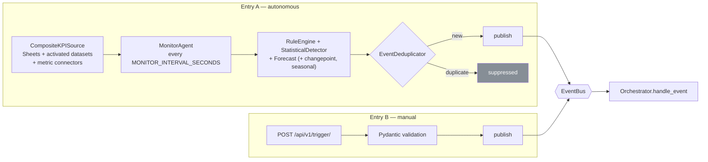
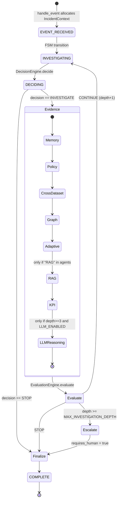
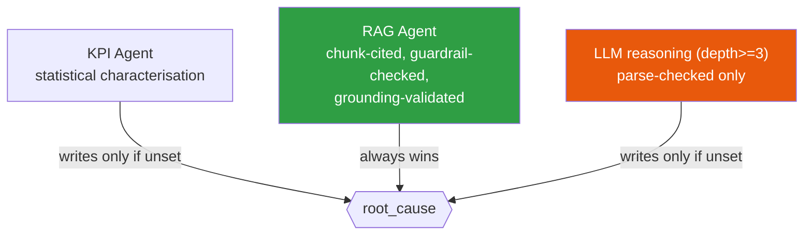
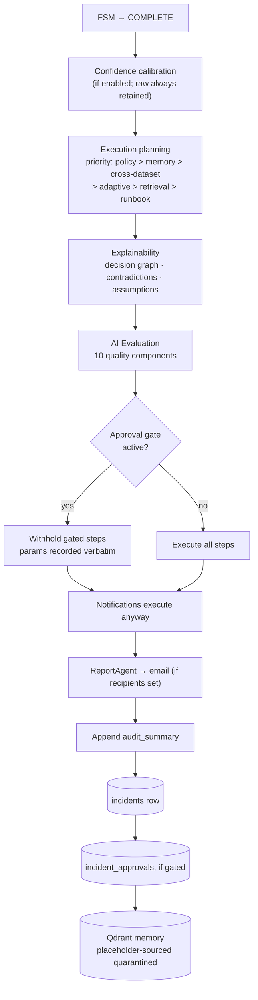
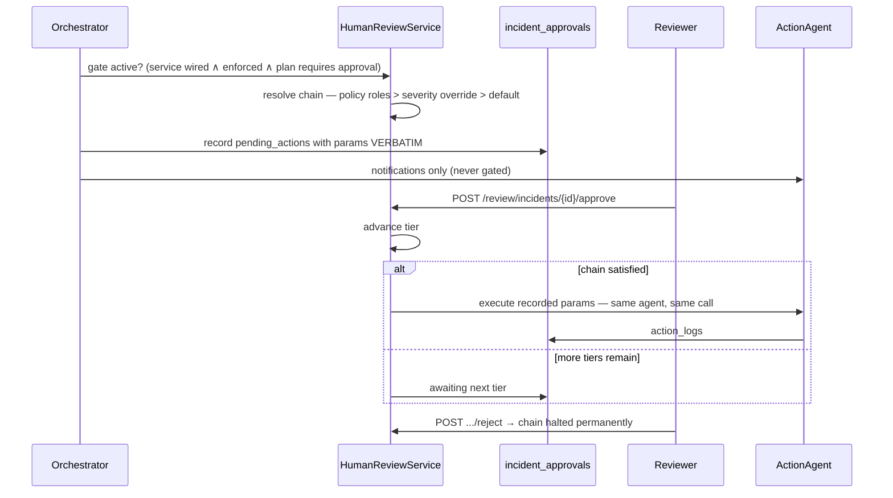
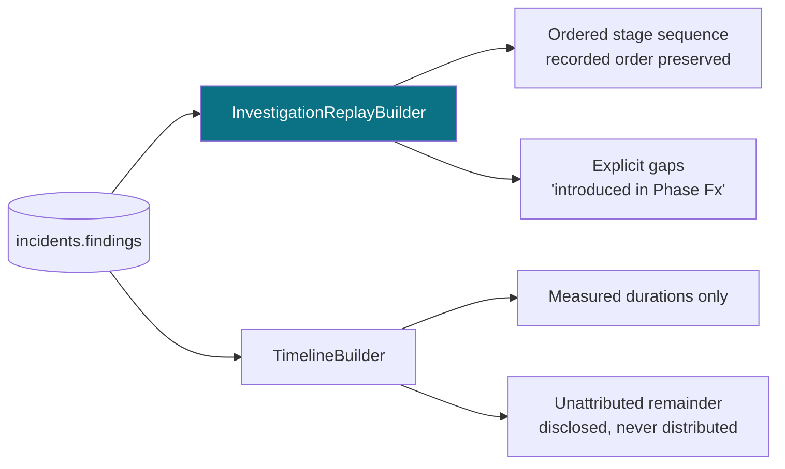
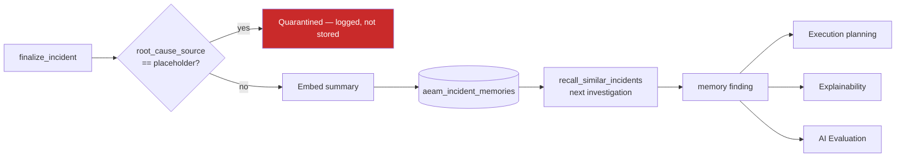
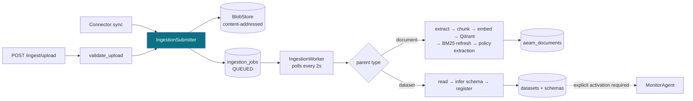

# AEAM — System Flow

> One complete investigation, from signal to persisted record. Every stage below exists in the implementation.

---

## 1. The two entry points

There are exactly two ways an event enters AEAM. There is no scheduler and no third path.



**Entry A** requires `ENABLE_MONITOR_AGENT=true` *and* a live KPI source. Off by default.
**Entry B** is always available. `expected_value` is set to `value * 2` — a placeholder baseline used only for manual triggers, never in real detection paths.

**Dispatch is synchronous.** `EventBus.publish` calls handlers on the caller's thread, so `POST /trigger` returns only after the entire investigation and all actions have completed. That is deliberate: an immediate `202` with work still pending would hide latency behind an acknowledgement.

---

## 2. Full investigation lifecycle



---

## 3. Stage-by-stage

### 3.1 Decision — deterministic routing

```
DecisionEngine.apply_priority_rules(event)
  CRITICAL → INVESTIGATE · agents [KPI, RAG] · confidence 0.95
  HIGH     → INVESTIGATE · agents [KPI, RAG] · confidence 0.90
  else     → INVESTIGATE · agents [KPI]      · confidence 0.70

if confidence >= 0.9  → return immediately (no LLM)
elif LLM_ENABLED and depth > 2 → LLM augmentation
else → rule decision stands
```

**Two consequences worth knowing.** RAG is reachable only at `CRITICAL`/`HIGH`; since `MonitorAgent` assigns `HIGH` only at ≥2 detection signals, a single-signal autonomous detection is `MEDIUM` and receives no document evidence. And because `CRITICAL`/`HIGH` short-circuit at ≥0.9, the DecisionEngine's own LLM path is reachable *only* for the severities where RAG is skipped. Both are documented in `decision_engine.py`.

### 3.2 Evidence stages — advisory, isolated, once per incident

Each runs at most once per incident (guarded by a `_has_*_finding` check), each in its own `try/except`, each appending exactly one findings entry. A stage that fails records a structured failure and the investigation continues.

| Stage | Reads | Produces |
|---|---|---|
| **Memory** | Qdrant `aeam_incident_memories` | Similar resolved incidents + outcomes |
| **Policy** | `policies` table (+ embeddings) | Matched enterprise policies |
| **Cross-Dataset** | Activated datasets via `DatasetKPISource` | Pearson correlations: supporting / contradicting |
| **Graph** | `graph_nodes` / `graph_edges` | Known relationships within a traversal budget |
| **Adaptive** | `metrics` history + event metadata | Longer-horizon baseline, seasonality |
| **RAG** | Qdrant `aeam_documents` | Chunk-cited possible causes |
| **KPI** | `metrics` history + detector metadata | Deviation, persistence, trend, detectors fired |

All three of Memory, Policy and RAG use the **same query formulation** (`RAGAgent._formulate_query`) so they search on identical vocabulary.

### 3.3 Root-cause precedence

Three components may write `root_cause`. The rule is precedence, not recency:



`root_cause_source` records which one won (`rag` | `llm_reasoning` | `kpi_analysis`). The KPI Agent never asserts causation — it states measured fact ("X is 50% below expected") and defers to any real explanation.

### 3.4 Evaluation — when to stop

```
score  = 0.4  root_cause present
       + 0.3  >= 3 evidence items
       + 0.2  confidence strictly > 0.8
       + 0.1  action_taken  ← structurally unreachable (actions run after evaluation)

depth >= MAX_INVESTIGATION_DEPTH (5) → ESCALATE   (overrides score)
score >= 0.8                          → STOP
otherwise                             → CONTINUE (recurse)
```

**The achievable maximum is 0.9, not 1.0.** Reaching `STOP` therefore requires confidence above 0.8, which is why most investigations escalate to a human. This errs toward oversight; changing it is a product decision, documented in `evaluation_engine.py`.

### 3.5 Finalization



---

## 4. Every write one investigation performs

| # | Store | Table / collection | Condition |
|---|---|---|---|
| 1 | PostgreSQL | `metrics` | Monitor path only |
| 2 | PostgreSQL | `forecast_backtests` | `FORECAST_BACKTEST_ENABLED` |
| 3 | Redis | dedup key | Monitor path only |
| 4 | Redis | idempotency key (24 h) | Per action |
| 5 | PostgreSQL | `action_logs` | Per action attempt |
| 6 | PostgreSQL | `incidents` | Always, at finalize |
| 7 | PostgreSQL | `incident_approvals` | Gate active |
| 8 | Qdrant | `aeam_incident_memories` | Unless placeholder-sourced |
| 9 | PostgreSQL + file | `audit_logs` | Non-development requests |

`decisions` is created by the schema and **never written** — decisions live inside `incidents.findings`.

---

## 5. Human approval flow



Parameters are stored **verbatim** so an approval later executes exactly the withheld call — never a re-derived or re-planned one.

---

## 6. Replay flow



**Replay reconstructs; it never re-executes.** The module imports no detector, no agent, no LLM. Replaying an incident a thousand times leaves the database bit-identical.

Three honesty rules: recorded order *is* the order (a stage recorded twice appears twice); absence is reported as a gap, never filled; time is measured or absent, and the remainder between measured stage time and the measured total is disclosed as unattributed.

---

## 7. Enterprise Memory flow



Every incident is remembered **regardless of outcome** — a failed investigation is still useful memory. The one exception is placeholder-derived output, quarantined so synthetic content never poisons future recalls.

---

## 8. Ingestion flow



**Registration is not activation.** A dataset becomes a live KPI feed only when its id is added to the Redis activation set via `POST /api/v1/data-center/datasets/{id}/activate`.

---

## 9. Frontend data flow

| Surface | Source | Refresh |
|---|---|---|
| StatusBar / TopBar | `/health` + `/api/v1/system/status` | 15 s |
| Dashboard | `/system/status`, `/metrics`, `/observability/`, `/incidents/` | 30 s |
| Knowledge Center | `/knowledge/*`, `/ingest/jobs` | 15 s |
| Every intelligence panel | `incidents.findings`, parsed client-side | on mount |
| Replay timeline | `/replay/{id}/timeline` | on mount |
| Mesh health | `/mesh/health` | on mount |

**The console's investigation detail is one `GET /api/v1/incidents/` fetch.** Evidence, Policy, Cross-Dataset, Execution Plan, Explainability, AI Evaluation and Memory panels all derive from that single response. `audit_summary` is the contract they depend on.
